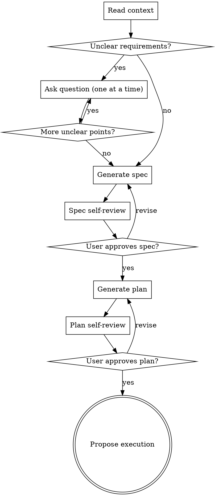
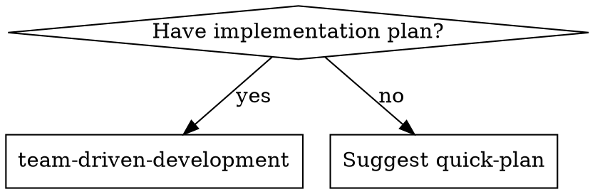

# Quick-Plan Skill Implementation Plan

> **For agentic workers:** Use team-driven-development to execute this plan.

**Goal:** Add a `quick-plan` skill that generates full-quality spec and plan documents with minimal user interaction, self-contained within the team-driven-development plugin.

**Architecture:** Single SKILL.md file under `skills/quick-plan/` defining the lightweight planning process. Minor addition to `skills/team-driven-development/SKILL.md` for auto-routing when no plan exists. Documents saved to `docs/team-dd/specs/` and `docs/team-dd/plans/`.

**Tech Stack:** Markdown (SKILL.md prompt engineering). No runtime dependencies.

---

## File Structure

| File | Action | Responsibility |
|------|--------|---------------|
| `skills/quick-plan/SKILL.md` | Create | Skill definition — process, checklist, document formats, self-review rules |
| `skills/team-driven-development/SKILL.md` | Modify | Add quick-plan routing to "When to Use" section |

---

### Task 1: Create quick-plan SKILL.md

**Files:**
- Create: `skills/quick-plan/SKILL.md`

- [ ] **Step 1: Create the skill file with frontmatter and overview**

```markdown
---
name: quick-plan
description: Lightweight planning skill — generates full-quality spec and plan with minimal dialogue. Use when requirements are mostly clear but need a spec + plan before execution.
---

# Quick Plan

Generate a full-quality spec and implementation plan with minimal dialogue. Unlike brainstorming (deep-dive questions, approach comparison, section-by-section approval), quick-plan infers what it can from context and only asks about genuinely ambiguous points.

**Announce at start:** "I'm using quick-plan to generate a spec and implementation plan."

<HARD-GATE>
Do NOT write any implementation code or invoke any execution skill until the user has approved both the spec and the plan.
</HARD-GATE>
```

- [ ] **Step 2: Add the checklist section**

```markdown
## Checklist

1. **Read context** — check relevant files, docs, recent commits related to the request
2. **Clarify unknowns** — ask only genuinely ambiguous points, one at a time (0 questions is valid)
3. **Generate spec** — save to `docs/team-dd/specs/YYYY-MM-DD-<topic>-design.md`, commit
4. **Spec self-review** — placeholder/consistency/scope/ambiguity check, fix inline
5. **User confirms spec** — wait for approval, revise if requested
6. **Generate plan** — save to `docs/team-dd/plans/YYYY-MM-DD-<topic>.md`, commit
7. **Plan self-review** — spec coverage/placeholder/type consistency check, fix inline
8. **User confirms plan** — wait for approval, revise if requested
9. **Propose execution** — offer team-driven-development handoff
```

- [ ] **Step 3: Add the process flow section**

```markdown
## Process Flow


```

- [ ] **Step 4: Add the clarification logic section**

```markdown
## Clarification Logic

Do NOT deep-dive every aspect of the request. Instead:

- Read the user's request and explore the codebase for relevant context (files, patterns, conventions, recent changes).
- Infer what can be inferred — obvious technology choices, existing patterns to follow, standard approaches.
- Ask ONLY about genuinely ambiguous points — one question at a time, multiple-choice preferred.
- Zero questions is valid. If the requirements are clear from the request + codebase context, proceed directly to spec generation.

**What counts as "genuinely ambiguous":**
- The request can be interpreted in two meaningfully different ways
- A design choice would significantly affect implementation and there's no clear default
- The codebase has no existing pattern to follow for this type of change

**What does NOT need a question:**
- Technology choice when the codebase already uses a specific stack
- File location when existing conventions make it obvious
- Error handling approach when the codebase has an established pattern
- Testing strategy when the project has existing test patterns
```

- [ ] **Step 5: Add the spec generation section**

```markdown
## Spec Generation

Save to: `docs/team-dd/specs/YYYY-MM-DD-<topic>-design.md`

The spec covers the same ground as a brainstorming-produced spec — full quality, not abbreviated. Scale each section to the complexity it deserves.

### Spec Structure

```markdown
# [Feature Name] Design

## Overview
[What this feature does and why — 2-3 sentences]

## Motivation
[Why this change is needed — bullet points]

## Design

### [Section per major component or decision]
[Architecture, components, data flow, interfaces — scaled to complexity]

### Error Handling
[How errors are handled — omit if trivial]

### Testing Strategy
[What to test and how — types of tests, key scenarios]

## File Changes
[New files, modified files, not modified — table format]
```

### Spec Self-Review

After writing the spec, review with fresh eyes:

1. **Placeholder scan** — No TBD, TODO, incomplete sections, or vague requirements. Fix them.
2. **Internal consistency** — No contradictions between sections. Architecture matches feature descriptions.
3. **Scope check** — Focused enough for a single implementation plan. If not, flag for decomposition.
4. **Ambiguity check** — No requirement interpretable two ways. Pick one and make it explicit.

Fix issues inline immediately. Then commit and ask the user to confirm.

### User Spec Gate

> "Spec written and committed to `<path>`. Please review — any changes before I generate the plan?"

Wait for user response. Revise if requested. Only proceed to plan generation after approval.
```

- [ ] **Step 6: Add the plan generation section**

```markdown
## Plan Generation

Save to: `docs/team-dd/plans/YYYY-MM-DD-<topic>.md`

The plan follows the same standards as a writing-plans-produced plan — full quality, bite-sized TDD tasks, no placeholders.

### Plan Header

```markdown
# [Feature Name] Implementation Plan

> **For agentic workers:** Use team-driven-development to execute this plan.

**Goal:** [One sentence describing what this builds]

**Architecture:** [2-3 sentences about approach]

**Tech Stack:** [Key technologies/libraries]

---
```

### File Structure

Before defining tasks, map out which files will be created or modified and what each one is responsible for. Follow existing codebase patterns.

### Task Structure

Each task is a self-contained unit with bite-sized TDD steps:

````markdown
### Task N: [Component Name]

**Files:**
- Create: `exact/path/to/file`
- Modify: `exact/path/to/existing`
- Test: `tests/exact/path/to/test`

- [ ] **Step 1: Write the failing test**
[Actual test code]

- [ ] **Step 2: Run test to verify it fails**
Run: `exact command`
Expected: FAIL with "specific error"

- [ ] **Step 3: Write minimal implementation**
[Actual implementation code]

- [ ] **Step 4: Run test to verify it passes**
Run: `exact command`
Expected: PASS

- [ ] **Step 5: Commit**
```bash
git add [specific files]
git commit -m "feat: description"
```
````

### No Placeholders

Every step must contain actual content. These are plan failures — never write them:
- "TBD", "TODO", "implement later", "fill in details"
- "Add appropriate error handling" / "add validation" / "handle edge cases"
- "Write tests for the above" (without actual test code)
- "Similar to Task N" (repeat the content)
- Steps that describe what to do without showing how

### Plan Self-Review

After writing the plan:

1. **Spec coverage** — Every spec requirement maps to a task. List any gaps and add missing tasks.
2. **Placeholder scan** — Search for red flags from the No Placeholders list. Fix them.
3. **Type consistency** — Types, method signatures, and property names match across tasks.

Fix issues inline immediately. Then commit and ask the user to confirm.

### User Plan Gate

> "Plan written and committed to `<path>`. Please review — any changes before we proceed?"

Wait for user response. Revise if requested.
```

- [ ] **Step 7: Add the execution handoff section**

```markdown
## Execution Handoff

After plan confirmation:

> **Plan complete and saved to `<path>`. Execute with team-driven-development?**
> - **Yes** — Invoke team-driven-development to execute the plan
> - **No** — End here (plan is saved for later)

If Yes: invoke the team-driven-development skill. Do NOT invoke any superpowers skill.
```

- [ ] **Step 8: Add the key principles and red flags section**

```markdown
## Key Principles

- **Infer, don't interrogate** — Use codebase context to fill in gaps. Only ask what you truly cannot infer.
- **Full-quality output** — The process is light; the documents are not. Spec and plan meet the same standard as brainstorming + writing-plans.
- **One question at a time** — When you do need to ask, keep it focused. Multiple-choice preferred.
- **YAGNI** — Don't design features the user didn't ask for.
- **Self-contained** — This skill does not depend on or invoke superpowers skills.

## Red Flags

**Never:**
- Write implementation code during quick-plan (spec + plan only)
- Skip user confirmation gates (both spec and plan require approval)
- Ask questions that could be answered by reading the codebase
- Generate abbreviated or "lite" documents — output quality is always full
- Invoke superpowers:brainstorming or superpowers:writing-plans
- Proceed to plan generation before spec is approved
```

- [ ] **Step 9: Assemble the complete SKILL.md file**

Combine all sections from Steps 1-8 into a single `skills/quick-plan/SKILL.md` file. Verify the file reads coherently end-to-end.

- [ ] **Step 10: Commit**

```bash
git add skills/quick-plan/SKILL.md
git commit -m "feat: add quick-plan skill for lightweight spec + plan generation"
```

---

### Task 2: Add quick-plan routing to team-driven-development SKILL.md

**Files:**
- Modify: `skills/team-driven-development/SKILL.md` (lines 14-39, "When to Use" section)

- [ ] **Step 1: Update the "When to Use" flow diagram**

Replace the existing `when_to_use` digraph (lines 16-24) with:



- [ ] **Step 2: Add the no-plan routing text**

After the existing "**Use when:**" bullet list (line 29), add:

```markdown
**No plan available:**
- If invoked without an implementation plan, suggest using the `quick-plan` skill first
- Message: "No implementation plan found. Use quick-plan to generate a spec and plan first?"
- If the user accepts, invoke the quick-plan skill with the user's original request
- If the user declines, exit gracefully
```

- [ ] **Step 3: Verify no other sections are affected**

Read through the rest of SKILL.md to confirm:
- Phase A-0 (Triage) still assumes a plan exists as input — no changes needed
- Integration section at the bottom references superpowers skills — add quick-plan there

- [ ] **Step 4: Update the Integration section**

At the end of the "**Works with:**" list (line 628), add:

```markdown
- **quick-plan** — Generates spec + plan for this skill to execute (lightweight alternative to superpowers brainstorming + writing-plans)
```

- [ ] **Step 5: Commit**

```bash
git add skills/team-driven-development/SKILL.md
git commit -m "feat: add quick-plan routing to team-driven-development When to Use"
```
