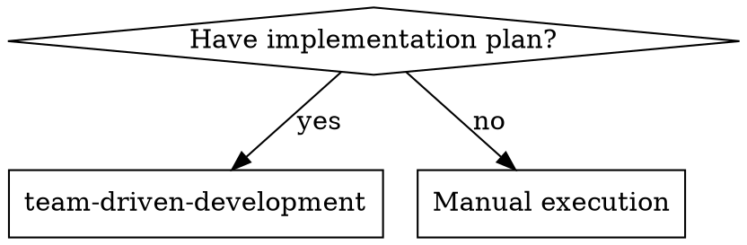

```dot
digraph process {
    rankdir=TB;

    "Phase A-0: Triage" [shape=box style=filled fillcolor=lightyellow];
    "Quick Score <= 1?" [shape=diamond];
    "User accepts Lite?" [shape=diamond];
    "Lite Mode" [shape=box style=filled fillcolor=palegreen];
    "Phase A: Pre-delegate" [shape=box style=filled fillcolor=lightyellow];
    "Phase B: Delegate" [shape=box style=filled fillcolor=lightblue];
    "Phase C: Post-delegate" [shape=box style=filled fillcolor=lightgreen];

    subgraph cluster_triage {
        label="Phase A-0: Triage";
        "A0: Read plan, count tasks/files/domains" [shape=box];
        "A0: Calculate Quick Score" [shape=box];

        "A0: Read plan, count tasks/files/domains" -> "A0: Calculate Quick Score";
    }

    "A0: Calculate Quick Score" -> "Quick Score <= 1?";
    "Quick Score <= 1?" -> "User accepts Lite?" [label="yes"];
    "Quick Score <= 1?" -> "Phase A: Pre-delegate" [label="no"];
    "User accepts Lite?" -> "Lite Mode" [label="yes"];
    "User accepts Lite?" -> "Phase A: Pre-delegate" [label="no"];

    subgraph cluster_phase_a {
        label="Phase A: Pre-delegate (Full Mode)";
        "A1: Extract all tasks" [shape=box];
        "A2: Analyze dependencies" [shape=box];
        "A3: Score effort per task" [shape=box];
        "A4: Select reviewer_profile" [shape=box];
        "A5: Generate Sprint Contracts" [shape=box];
        "A6: Determine team composition" [shape=box];

        "A1: Extract all tasks" -> "A2: Analyze dependencies";
        "A2: Analyze dependencies" -> "A3: Score effort per task";
        "A3: Score effort per task" -> "A4: Select reviewer_profile";
        "A4: Select reviewer_profile" -> "A5: Generate Sprint Contracts";
        "A5: Generate Sprint Contracts" -> "A6: Determine team composition";
    }

    subgraph cluster_lite {
        label="Lite Mode";
        "L1: Execute tasks sequentially (Lead)" [shape=box];
        "L2: Commit after each task" [shape=box];
        "L3: Dispatch Reviewer (full diff)" [shape=box];
        "L4: Approved?" [shape=diamond];
        "L4a: Lead fixes (max 2 rounds)" [shape=box];
        "L5: Brief summary" [shape=box];

        "L1: Execute tasks sequentially (Lead)" -> "L2: Commit after each task";
        "L2: Commit after each task" -> "L3: Dispatch Reviewer (full diff)";
        "L3: Dispatch Reviewer (full diff)" -> "L4: Approved?";
        "L4: Approved?" -> "L5: Brief summary" [label="yes"];
        "L4: Approved?" -> "L4a: Lead fixes (max 2 rounds)" [label="no"];
        "L4a: Lead fixes (max 2 rounds)" -> "L3: Dispatch Reviewer (full diff)";
    }

    subgraph cluster_phase_b {
        label="Phase B: Delegate (Full Mode, per task)";
        "B1: Architect review?" [shape=diamond];
        "B2: Dispatch Worker" [shape=box];
        "B3: Review" [shape=box];
        "B4: Cherry-pick to main" [shape=box];

        "B1: Architect review?" -> "B2: Dispatch Worker";
        "B2: Dispatch Worker" -> "B3: Review";
        "B3: Review" -> "B4: Cherry-pick to main";
    }

    subgraph cluster_phase_c {
        label="Phase C: Post-delegate (Full Mode)";
        "C1: Collect results" [shape=box];
        "C2: Completion report" [shape=box];
        "C3: Verify" [shape=box];

        "C1: Collect results" -> "C2: Completion report";
        "C2: Completion report" -> "C3: Verify";
    }

    "Phase A: Pre-delegate" -> "Phase B: Delegate";
    "Phase B: Delegate" -> "Phase C: Post-delegate";
}
```

# Triage Gate + Lite Mode Implementation Plan

> **For agentic workers:** REQUIRED SUB-SKILL: Use superpowers:subagent-driven-development (recommended) or superpowers:executing-plans to implement this plan task-by-task. Steps use checkbox (`- [ ]`) syntax for tracking.

**Goal:** Add adaptive process selection to the team-driven-development skill so simple plans trigger a Lite Mode suggestion instead of the full team orchestration.

**Architecture:** Insert a Triage Gate (Phase A-0) at the start of the existing process flow. When the plan's Quick Score is ≤ 1, the Lead proposes Lite Mode to the user. Lite Mode executes tasks directly (Lead implements) with a single Reviewer pass at the end. All changes are in SKILL.md — no agent definitions, prompt templates, or sprint contract changes.

**Tech Stack:** Markdown only (skill definition file).

---

### Task 1: Update "When to Use" section

**Files:**
- Modify: `skills/team-driven-development/SKILL.md:14-44`

- [ ] **Step 1: Replace the "When to Use" section**

In `skills/team-driven-development/SKILL.md`, replace lines 14-44 (the entire "When to Use" section including the dot graph) with:

```markdown
## When to Use



**Use when:**
- You have an implementation plan to execute
- Simple plans automatically trigger a Lite Mode suggestion — no need to avoid this skill for small tasks

**Lite Mode is suggested when:**
- Plan has 1-2 tasks with ≤ 3 files total
- No design keywords or multi-domain spread

**Full Mode is used when:**
- Plan has 3+ tasks with varying complexity
- Tasks span multiple domains (frontend + backend, infra + app, etc.)
- Design decisions are needed before or during implementation
- You want parallel execution of independent tasks
- Quality gates need to vary by task type (static review vs browser testing)
```

- [ ] **Step 2: Verify the edit**

Run: `head -50 skills/team-driven-development/SKILL.md`

Expected: The "When to Use" section should show the simplified dot graph and the new bullet points including Lite Mode mention. No "Don't use when" list should remain.

- [ ] **Step 3: Commit**

```bash
git add skills/team-driven-development/SKILL.md
git commit -m "feat: update When to Use section for Lite Mode support"
```

---

### Task 2: Add Phase A-0 Triage and Lite Mode section

**Files:**
- Modify: `skills/team-driven-development/SKILL.md:69-137` (process dot graph and Phase A)

- [ ] **Step 1: Replace the process dot graph**

In `skills/team-driven-development/SKILL.md`, replace the entire `## The Process` section's dot graph (the ```dot code block starting at line 69) with:

```markdown
## The Process


```

- [ ] **Step 2: Add Phase A-0 Triage section before the existing Phase A**

Insert the following new section immediately before the line `## Phase A: Pre-delegate` (currently around line 135):

```markdown
## Phase A-0: Triage

**Announce:** "I'm using team-driven-development to execute this plan as a team."

Read the plan file and calculate the Quick Score from surface-level metrics before running the full analysis pipeline.

### Quick Score

| Factor | Condition | Score |
|--------|-----------|-------|
| Task count | 1-2 tasks | 0 |
| Task count | 3-4 tasks | +1 |
| Task count | 5+ tasks | +2 |
| Total files | ≤ 3 files across all tasks | 0 |
| Total files | 4-6 files | +1 |
| Total files | 7+ files | +2 |
| Domain spread | Single directory/module | 0 |
| Domain spread | Multiple directories | +1 |
| Design keywords | "architecture", "migration", "security", "API design" in any task | +1 |

**Quick Score ≤ 1 → propose Lite Mode to user.**

### Proposal Message

> **This plan has [N] tasks touching [M] files — lightweight enough for direct execution. I'll implement the tasks directly and have a Reviewer check the final diff. Use Lite Mode?**
>
> - **Yes** — Direct execution + single review at the end
> - **No** — Full team process (Workers, Sprint Contracts, per-task review)

If the user accepts → proceed to Lite Mode.
If the user declines → proceed to Phase A (Full Mode).
If Quick Score > 1 → skip proposal, proceed directly to Phase A (Full Mode).

```

- [ ] **Step 3: Move the announce line from Phase A to Phase A-0**

In the existing `## Phase A: Pre-delegate` section, remove the line:

```
**Announce:** "I'm using team-driven-development to execute this plan as a team."
```

This announce line is now in Phase A-0 (added in Step 2), so it should not appear twice.

- [ ] **Step 4: Verify Phase A-0 appears before Phase A**

Run: `grep -n "## Phase A" skills/team-driven-development/SKILL.md`

Expected output should show Phase A-0 appearing before Phase A:
```
<line>:## Phase A-0: Triage
<later line>:## Phase A: Pre-delegate
```

- [ ] **Step 5: Commit**

```bash
git add skills/team-driven-development/SKILL.md
git commit -m "feat: add Phase A-0 Triage with Quick Score calculation"
```

---

### Task 3: Add Lite Mode execution section

**Files:**
- Modify: `skills/team-driven-development/SKILL.md` (insert new section before Phase B)

- [ ] **Step 1: Add the Lite Mode section**

Insert the following new section immediately after the Phase A-0 section and before `## Phase A: Pre-delegate`:

```markdown
## Lite Mode

When the user accepts Lite Mode, skip Phases A through C entirely. The Lead implements directly.

### Lite Mode vs Full Mode

| Aspect | Full Mode | Lite Mode |
|--------|-----------|-----------|
| Implementer | Worker subagent | Lead directly |
| Isolation | Worktree per task | None (on current branch) |
| Sprint Contract | Generated per task | None (Plan steps used directly) |
| Review | Per-task, static/runtime/browser | Reviewer subagent reviews full diff once after all tasks |
| Architect | Summoned when needed | None |
| Effort Scoring | Performed | Skipped |
| Completion Report | Detailed table | Brief summary (task list + commit list) |

### Lite Mode Flow

1. **Execute tasks sequentially** — Lead implements each task directly, following Plan steps as-is. TDD is maintained.
2. **Commit after each task** — One commit per task for clean history.
3. **Dispatch Reviewer** — After all tasks complete, dispatch a Reviewer subagent with the full diff (base SHA from before Task 1 to HEAD). Use prompt template: `./prompts/reviewer-prompt.md`. The Reviewer evaluates the combined changes, not individual tasks.
4. **Handle review verdict:**
   - APPROVE → output brief summary and finish.
   - REQUEST_CHANGES → Lead fixes the issues, commits, and re-dispatches Reviewer (max 2 rounds).
   - After 2 rounds without approval → escalate to human.

### Lite Mode Completion Report

```markdown
## Completion Report (Lite Mode)

### Tasks Completed: N/N

### Commit Log
- abc1234: Task 1 - [description]
- def5678: Task 2 - [description]

### Review
- Reviewer: [APPROVE | REQUEST_CHANGES → fixed in round N]
```

### Lite Mode Red Flags

**Never:**
- Skip the Reviewer dispatch (even in Lite Mode, review is mandatory)
- Exceed 2 fix rounds (escalate to human instead)
- Use Lite Mode if the user declined it

```

- [ ] **Step 2: Verify Lite Mode section exists**

Run: `grep -n "## Lite Mode" skills/team-driven-development/SKILL.md`

Expected: One match showing the new section.

- [ ] **Step 3: Commit**

```bash
git add skills/team-driven-development/SKILL.md
git commit -m "feat: add Lite Mode execution section"
```

---

### Task 4: Update Red Flags and Full Mode label

**Files:**
- Modify: `skills/team-driven-development/SKILL.md` (Red Flags section, around line 378)

- [ ] **Step 1: Update the Red Flags section**

In the existing `## Red Flags` section, replace:

```markdown
**Never:**
- Start implementation on main branch without explicit user consent
- Skip review for any task (even "simple" ones)
- Let Lead write implementation code (Lead orchestrates, Workers implement)
- Dispatch Workers for tasks with unresolved dependencies
- Parallelize tasks that share files
- Ignore Worker escalations (BLOCKED/NEEDS_CONTEXT)
- Accept REQUEST_CHANGES and move on without fixes
- Skip the Sprint Contract (even for small tasks)
- Let the Architect implement (Architect advises, Workers implement)
- Cherry-pick before review is complete
```

With:

```markdown
**Never (Full Mode):**
- Start implementation on main branch without explicit user consent
- Skip review for any task (even "simple" ones)
- Let Lead write implementation code (Lead orchestrates, Workers implement)
- Dispatch Workers for tasks with unresolved dependencies
- Parallelize tasks that share files
- Ignore Worker escalations (BLOCKED/NEEDS_CONTEXT)
- Accept REQUEST_CHANGES and move on without fixes
- Skip the Sprint Contract (even for small tasks)
- Let the Architect implement (Architect advises, Workers implement)
- Cherry-pick before review is complete

**Never (Lite Mode):**
- Skip the Reviewer dispatch (review is always mandatory)
- Exceed 2 fix rounds without escalating to human
- Use Lite Mode if the user declined the Triage proposal

**Never (both modes):**
- Skip review entirely
- Ignore REQUEST_CHANGES and move on without fixes
```

- [ ] **Step 2: Verify the update**

Run: `grep -n "Never" skills/team-driven-development/SKILL.md`

Expected: Three "Never" entries — "Never (Full Mode)", "Never (Lite Mode)", "Never (both modes)".

- [ ] **Step 3: Commit**

```bash
git add skills/team-driven-development/SKILL.md
git commit -m "feat: update Red Flags for Full Mode and Lite Mode"
```

---

### Task 5: Final verification

**Files:**
- Verify: `skills/team-driven-development/SKILL.md`

- [ ] **Step 1: Verify all sections exist in correct order**

Run: `grep -n "^## " skills/team-driven-development/SKILL.md`

Expected output should show sections in this order:
```
## When to Use
## The Team
## The Process
## Phase A-0: Triage
## Lite Mode
## Phase A: Pre-delegate
## Phase B: Delegate
## Phase C: Post-delegate
## Red Flags
## Model Selection Summary
## Integration
```

- [ ] **Step 2: Verify no duplicate announce lines**

Run: `grep -c "Announce" skills/team-driven-development/SKILL.md`

Expected: `1` (only in Phase A-0, not in Phase A)

- [ ] **Step 3: Verify "Don't use when" is removed**

Run: `grep "Don't use when" skills/team-driven-development/SKILL.md`

Expected: No output (the line has been removed).

- [ ] **Step 4: Verify Quick Score table exists**

Run: `grep "Quick Score" skills/team-driven-development/SKILL.md`

Expected: Multiple matches (section header, table reference, threshold line).

- [ ] **Step 5: Commit (if any fixes were needed)**

Only if any steps above failed and required fixes:

```bash
git add skills/team-driven-development/SKILL.md
git commit -m "fix: correct SKILL.md section ordering"
```
