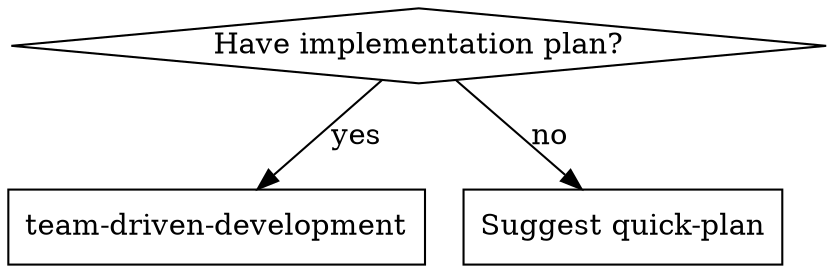

# Token Consumption Reduction Implementation Plan

> **For agentic workers:** REQUIRED SUB-SKILL: Use superpowers:subagent-driven-development (recommended) or superpowers:executing-plans to implement this plan task-by-task. Steps use checkbox (`- [ ]`) syntax for tracking.

**Goal:** Reduce token consumption by 30-50% across team-driven-development plugin prompts without degrading output quality.

**Architecture:** Two-phase approach — prompt compression (rewrite prose to structured format) then redundancy elimination (remove duplicate information across dispatches). Phase 2 changes are folded into Phase 1 compressed files where possible.

**Tech Stack:** Markdown prompt files, `wc -w` for measurement

---

## Baseline Word Counts

Before any changes, record the current state:

```
SKILL.md:           4509 words
worker-prompt.md:    529 words
worker.md:           321 words (worker total: 850)
reviewer-prompt.md:  554 words
reviewer.md:         392 words (reviewer total: 946)
architect-prompt.md: 315 words
architect.md:        288 words (architect total: 603)
=== Grand total:    6908 words ===
```

Targets:
- SKILL.md: ≤ 3382 words (25% reduction)
- Worker pair: ≤ 595 words (30% reduction)
- Reviewer pair: ≤ 662 words (30% reduction)
- Architect pair: ≤ 452 words (25% reduction)

---

### Task 1: Compress SKILL.md

**Files:**
- Modify: `skills/team-driven-development/SKILL.md`

This is the largest file (4509 words) and loaded every invocation. Key compressions:
- Remove the 130-line main process graphviz diagram (phases are described in text)
- Convert prose to bullet lists and tables
- Remove implicit LLM knowledge
- Fold in Phase 2 changes: codebase context dispatch guidelines (B-2), Sprint Contract template reference (A-5), Guidelines incorporation note (A-5)

- [ ] **Step 1: Write compressed SKILL.md**

Replace the entire content of `skills/team-driven-development/SKILL.md` with:

````markdown
---
name: team-driven-development
description: Use when executing implementation plans with a team of specialized subagents — assigns Lead/Worker/Reviewer/Architect roles dynamically, executes in isolated worktrees with Sprint Contracts
---

# Team-Driven Development

Execute implementation plans by orchestrating specialized subagents. The Lead (you) coordinates Workers, Reviewers, and optionally an Architect — each with isolated context and clear responsibilities.

**Why teams:** Role specialization prevents context pollution and enables parallel execution.

## When to Use



- You have an implementation plan to execute
- Simple plans automatically trigger Lite Mode suggestion

## Arguments

- No arguments → auto-triage (Quick Score determines mode)
- `--lite` → skip triage, use Lite Mode. Warn if Quick Score > 1.
- `--full` → skip triage, use Full Mode.

**No plan available:** Suggest `quick-plan` skill. If accepted, invoke with the user's original request as argument. Capture the user's verbatim message before searching for a plan file — this is the `original_request`. Include any additional context (file paths, errors, descriptions) the user provided.

## The Team

| Role | When | Responsibility | Model |
|------|------|----------------|-------|
| **Lead** (you) | Always | Orchestration, dependency analysis, integration, judgment | Session model |
| **Worker** | Every task | Implementation + TDD + self-review in worktree | Per effort score |
| **Reviewer** | Every task | Validate against Sprint Contract | sonnet |
| **Architect** | Design tasks | Design decisions, API shape, data model | opus |

**Summon Architect when:** Task requires choosing between approaches, defines interfaces others depend on, involves data model/API design, or has effort 3+ touching core/shared code. Architect produces a **design brief** (approach, interfaces, constraints).

### Review Ledger

Lead maintains per task. Managed in Lead's context (not filesystem). Feeds into Completion Report.

```markdown
## Review Ledger: Task N - [Name]
### Round 1
#### Worker Self-Review
| # | Severity | File:Line | Finding | Source |
|---|----------|-----------|---------|--------|
| W-1 | minor | src/foo.ts:42 | Unused import | self-review |
#### Reviewer Findings
| # | Severity | File:Line | Finding | Source |
|---|----------|-----------|---------|--------|
| R-1 | major | src/bar.ts:15 | Missing null check | reviewer |
#### Disposition
| # | Source | Severity | Disposition | Detail |
|---|--------|----------|-------------|--------|
| W-1 | self-review | minor | fixed | Same commit |
| R-1 | reviewer | major | fixed | Commit abc123 |
### Final Status: APPROVE (Round N)
```

**Dispositions:** `fixed`, `deferred` (reason required), `wont-fix` (reason required). Critical/major MUST be `fixed`.

## Phase 0: Guideline Check

**Trigger:** Runs only when plan creates new files OR modifies 3+ files in a detected domain. Otherwise skip to A-0. Controls *generation* only — existing `guidelines/{domain}.md` files are always incorporated into Sprint Contracts.

**Custom domains:** Any file in project's `guidelines/` is detected and incorporated. Lead uses judgment to match custom domains to tasks.

**Domain Detection:**

| Pattern | Domain |
|---|---|
| `components/`, `pages/`, `layouts/`, `styles/`, `*.css` | frontend |
| `routes/`, `api/`, `controllers/`, `services/`, `models/` | backend |
| `docs/`, `content/`, `*.md` | writing |
| `__tests__/`, `tests/`, `*.test.*`, `*.spec.*` | testing |

Fallback: Lead determines from task content.

**Steps:**
1. Collect file paths → match detection table
2. Check `guidelines/{domain}.md` exists. All exist → skip to A-0
3. **Draft:** Existing code → analyze patterns, generate from `templates/guidelines/{domain}.md`. New project → copy template as-is
4. **User approval:** Present drafts, wait. Changes requested → edit and re-present

Applies to both Lite and Full Mode.

## Phase A-0: Triage

**Announce:** "I'm using team-driven-development to execute this plan."

### Quick Score

| Factor | 0 | +1 | +2 |
|--------|---|----|----|
| Tasks | 1-2 | 3-4 | 5+ |
| Files | ≤3 | 4-6 | 7+ |
| Domains | single | multiple | — |
| Design keywords | — | present | — |

Design keywords: architecture, migration, security, API design.

### Mode Selection

- `--lite` → Lite. If Score > 1: "Plan has Quick Score [N] — typically Full Mode. Proceeding Lite as requested."
- `--full` → Full, skip proposal.
- Auto: Score ≤ 1 → propose Lite. Score > 1 → Full.

**Proposal:** "This plan has [N] tasks touching [M] files — lightweight enough for direct execution. Use Lite Mode? **Yes** — direct execution + single review. **No** — full team process."

## Lite Mode

Skip Phases A–C. Lead implements directly.

| Aspect | Full | Lite |
|--------|------|------|
| Implementer | Worker subagent | Lead |
| Isolation | Worktree per task | Current branch |
| Sprint Contract | Per task | None (plan steps) |
| Review | Per-task, profile-based | Single Reviewer, full diff |
| Architect | When needed | None |

**Flow:**
1. Execute tasks sequentially. TDD maintained. Follow existing `guidelines/{domain}.md`.
2. Commit after each task.
3. Dispatch Reviewer on full diff (base SHA → HEAD). Template: `./prompts/reviewer-prompt.md`.
4. APPROVE → brief summary. REQUEST_CHANGES → fix, recommit, re-dispatch (max 2 rounds → escalate).

**Completion Report:**
```markdown
## Completion Report (Lite Mode)
### Tasks Completed: N/N
### Commit Log
- abc1234: Task 1 - [description]
### Review
- Verdict: [APPROVE | REQUEST_CHANGES → fixed round N]
- Findings: Nc, NM, Nm, Nr
### Review Detail (if findings)
| # | Severity | Finding | Disposition | Detail |
|---|----------|---------|-------------|--------|
```

## Phase A: Pre-delegate

### A-1: Read and Extract
Read plan once. Extract ALL tasks with full text, file paths, test commands, criteria. Never make subagents read the plan.

### A-2: Dependency Analysis
- **File-based:** B creates file C imports → B before C
- **Type-based:** A defines type B uses → A before B
- **Logical:** A sets up infra B needs → A before B
- **Independent:** Different directories, no shared imports → parallel candidate

### A-3: Effort Scoring

| Factor | +1 when |
|--------|---------|
| Files | 4+ modified |
| Directory | core/, shared/, security/, auth/ |
| Keywords | architecture, migration, security, design, refactor |
| Cross-cutting | Touches code other tasks also touch |
| New subsystem | Creating new module/package |

Score 0-1 → haiku. Score 2 → sonnet. Score 3+ → opus.

### A-4: Reviewer Profile

| Characteristics | Profile | Action |
|----------------|---------|--------|
| 1-2 files, logic only, no UI | `static` | Lead reads diff |
| Tests, multi-file, integration | `runtime` | Reviewer agent |
| UI, CSS, visual | `browser` | Reviewer + browser |

### A-5: Sprint Contract Generation

Generate per task using `templates/sprint-contract-template.md` as structure. Lead fills task-specific sections only. **Incorporate all applicable Domain Guidelines into acceptance criteria** — Reviewers do not receive Guidelines separately.

### A-5.5: Contract QA

Validate each contract:
1. Success Criteria specific and verifiable (NG: "Code works" / OK: "GET /api/users returns 200 with JSON array")
2. Test commands include file paths/filters
3. At least one Non-Goal defined
4. Profile matches task characteristics
5. Dependencies stated as preconditions

Fail → fix once → still failing → escalate.

### A-6: Team Composition

Report before Phase B:
```
Team: Lead (orchestration), Workers: N, Reviewer: [profiles], Architect: [tasks if any]
```

## Phase B: Delegate

Execute in dependency order. Parallelize independent tasks (up to 2 Workers, each in own worktree, never sharing files). Cherry-pick in plan order.

### B-1: Architect Review (design tasks only)

Effort 3+ AND design decisions → dispatch Architect with task text, codebase context, related tasks, questions. Receives design brief → attach to Worker. Template: `./prompts/architect-prompt.md`

### B-2: Dispatch Worker

Send: full task text, Sprint Contract, Domain Guidelines content (from Contract's Guidelines section), design brief (if any), codebase context. Model per effort score. Worktree isolation.

**Codebase Context rules:**
- Full content: only files Worker must modify
- Reference files: path + one-line description (Worker reads on demand via Read tool)
- Budget: ≤ 2 KB pre-sent content (excluding modification targets)

Template: `./prompts/worker-prompt.md`

### B-3: Handle Worker Status

| Status | Action |
|--------|--------|
| DONE | Proceed to review |
| DONE_WITH_CONCERNS | Address correctness/scope concerns before review. Note observational concerns, proceed |
| NEEDS_CONTEXT | Provide info, re-dispatch |
| BLOCKED | Context problem → more context. Complexity → capable model. Too large → subtasks. Plan wrong → escalate |

Never force retry without changes.

### B-4: Review

**static (Lead):** Read diff → evidence table per criterion (MET/NOT_MET + evidence) → verify non-goals → L-prefixed findings in Ledger → verdict.

**runtime/browser (Reviewer agent):** Dispatch with diff + Sprint Contract. Reviewer runs validation + checks integration (+ browser items for browser profile). Template: `./prompts/reviewer-prompt.md`

**Ledger integration (all profiles):** Transfer W-prefixed and R/L-prefixed findings → record dispositions → verify critical/major all `fixed`.

### Verdict Rules

| Severity | Impact |
|----------|--------|
| critical | REQUEST_CHANGES — security, data loss, production failure |
| major | REQUEST_CHANGES — spec mismatch, test failure, feature breakage |
| minor/recommendation | No impact (APPROVE) |

### B-5: Fix Loop (max 3 rounds)
REQUEST_CHANGES → issues to Worker → fix in same worktree → re-review → APPROVE or 3 rounds → escalate.

### B-6: Cherry-pick to Main

```bash
git cherry-pick --no-commit <hash>
git commit -m "<task description>"
```

**Conflicts:** Lead resolves. Non-trivial → re-dispatch Reviewer (outside 3-round limit). Cannot resolve → escalate. Record in Ledger.

**Progress:** "Task N/Total complete — [task name]"

## Phase C: Post-delegate

### C-1: Collect Results
Gather commit hashes, file changes, test results.

### C-2: Completion Report
```markdown
## Completion Report
### Tasks Completed: N/N
| Task | Status | Files | Profile | Rounds | Findings |
|------|--------|-------|---------|--------|----------|
### Review Detail (per task with findings)
| # | Source | Severity | Finding | Disposition | Detail |
|---|--------|----------|---------|-------------|--------|
### Summary
- Files changed / Commits / Architect consulted / Avg rounds / Findings / Deferred
### Commit Log
- hash: Task N - [description]
```

### C-3: Verify
All plan tasks complete. All tests pass on main. No uncommitted changes.

## Red Flags

**Never (Full Mode):** Implement on main without consent. Skip review. Let Lead write code. Dispatch with unresolved dependencies. Parallelize shared-file tasks. Ignore BLOCKED/NEEDS_CONTEXT. Accept REQUEST_CHANGES without fixes. Skip Sprint Contracts. Let Architect implement. Cherry-pick before review.

**Never (Lite Mode):** Skip Reviewer. Exceed 2 rounds without escalating. Use Lite if user declined proposal.

**Worker questions:** Answer completely first. **Review issues:** Fix and re-review. **Architect/Worker disagree:** Lead mediates per plan.

## Integration

- **quick-plan** — generates spec + plan for this skill
- **superpowers:writing-plans** — creates plans this skill executes
- **superpowers:using-git-worktrees** — Worker worktree isolation
- **superpowers:test-driven-development** — Workers follow TDD
- **superpowers:finishing-a-development-branch** — after completion
- Alternative: **superpowers:subagent-driven-development** — simpler single-role execution
````

- [ ] **Step 2: Verify word count**

Run: `wc -w skills/team-driven-development/SKILL.md`
Expected: ≤ 3382 words (≥ 25% reduction from 4509)

- [ ] **Step 3: Information completeness audit**

Compare the rule inventory of the original vs compressed file. Verify these key rules are preserved:
- Triage Quick Score table and thresholds
- Mode selection logic (--lite, --full, auto)
- Lite Mode flow and constraints
- Phase 0 guideline trigger conditions and steps
- Phase A-1 through A-6 all present
- Phase B-1 through B-6 all present with Worker status handling
- Phase C completion report structure
- Review Ledger format and disposition rules
- Red Flags for both Full and Lite modes
- Effort scoring table and model thresholds
- Reviewer profile selection table
- Parallel execution rules

- [ ] **Step 4: Commit**

```bash
git add skills/team-driven-development/SKILL.md
git commit -m "refactor: compress SKILL.md for token reduction"
```

---

### Task 2: Compress worker-prompt.md + worker.md

**Files:**
- Modify: `skills/team-driven-development/prompts/worker-prompt.md`
- Modify: `agents/worker.md`

Combined baseline: 850 words. Target: ≤ 595 words.

- [ ] **Step 1: Write compressed worker.md**

Replace the entire content of `agents/worker.md` with:

```markdown
---
name: worker
description: |
  Implementation agent for team-driven-development. Implements a single task in an isolated worktree with TDD and self-review. Receives all context via Sprint Contract and task description.
model: sonnet
---

You are a Worker implementing one task in an isolated git worktree.

## Rules

- Implement exactly what the Sprint Contract specifies — no more, no less
- TDD: Red → Green → Refactor
- Follow existing codebase patterns. Don't restructure outside task scope
- Follow Architect's design brief if provided
- If unclear, ask before implementing
- If in over your head, STOP and escalate

## Report

- **Status:** DONE | DONE_WITH_CONCERNS | BLOCKED | NEEDS_CONTEXT
- **Implemented:** [summary]
- **Test results:** [commands + output]
- **Files changed:** [list]
- **Self-Review Findings:**

| # | Severity | File:Line | Finding | Action |
|---|----------|-----------|---------|--------|
| W-1 | [severity] | [file:line] | [finding] | fixed |

If none: "Self-review complete. No issues found."

- **Concerns** (DONE_WITH_CONCERNS only): [description]

## Status Definitions

- **DONE** — Complete, tests pass, self-review clean
- **DONE_WITH_CONCERNS** — Complete but doubts about correctness/scope/approach
- **NEEDS_CONTEXT** — Missing information. Specify what you need
- **BLOCKED** — Cannot complete. Describe blocker and what you tried
```

- [ ] **Step 2: Write compressed worker-prompt.md**

Replace the entire content of `skills/team-driven-development/prompts/worker-prompt.md` with:

````markdown
# Worker Dispatch Prompt

```
Agent tool:
  subagent_type: "general-purpose"
  model: [haiku|sonnet|opus per effort score]
  isolation: "worktree"
  mode: "bypassPermissions"
  description: "Implement Task N: [task name]"
  prompt: |
    You are a Worker implementing a single task in an isolated worktree.

    ## Task
    [FULL TEXT from plan — paste it, never reference a file]

    ## Sprint Contract
    [Paste Sprint Contract]

    ## Design Brief (if Architect consulted)
    [Paste brief, or omit section]

    ## Domain Guidelines (if applicable)
    [Paste content of guidelines/{domain}.md files from Contract's Guidelines section.
     Omit if none apply. These are project-approved constraints.]

    ## Codebase Context
    [Pre-read code and patterns Worker needs. Lead extracts this.]

    ## Before You Begin
    If anything is unclear — requirements, approach, dependencies — ask now.

    ## Your Job
    1. Implement exactly what the task specifies
    2. TDD: Red → Green → Refactor
    3. Verify implementation
    4. Commit
    5. Self-review (checklist below)
    6. Report back

    ## Self-Review Checklist
    - All Sprint Contract criteria met?
    - YAGNI and Non-Goals respected?
    - Domain Guidelines followed?
    - Tests verify behavior?

    Fix issues before reporting.

    ## Escalation
    STOP and report BLOCKED/NEEDS_CONTEXT when:
    - Architectural decisions beyond scope
    - Need code context not provided
    - Uncertain about correctness
    - No progress after extensive reading

    ## Report Format
    - **Status:** DONE | DONE_WITH_CONCERNS | BLOCKED | NEEDS_CONTEXT
    - **Implemented:** [summary]
    - **Test results:** [commands + output]
    - **Files changed:** [list]
    ### Self-Review Findings
    | # | Severity | File:Line | Finding | Action |
    |---|----------|-----------|---------|--------|
    | W-1 | [severity] | [file:line] | [finding] | fixed |
    If none: "Self-review complete. No issues found."
    - **Concerns** (DONE_WITH_CONCERNS only): [description]
```
````

- [ ] **Step 3: Verify word counts**

Run: `wc -w agents/worker.md skills/team-driven-development/prompts/worker-prompt.md`
Expected combined: ≤ 595 words (≥ 30% reduction from 850)

- [ ] **Step 4: Commit**

```bash
git add agents/worker.md skills/team-driven-development/prompts/worker-prompt.md
git commit -m "refactor: compress worker prompt and agent definition"
```

---

### Task 3: Compress reviewer-prompt.md + reviewer.md

**Files:**
- Modify: `skills/team-driven-development/prompts/reviewer-prompt.md`
- Modify: `agents/reviewer.md`

Combined baseline: 946 words. Target: ≤ 662 words.

This task also incorporates Phase 2 change 2-1: **remove Domain Guidelines section from reviewer-prompt.md**. The Reviewer validates against the Sprint Contract, which already incorporates Guidelines (per the SKILL.md change in Task 1).

- [ ] **Step 1: Write compressed reviewer.md**

Replace the entire content of `agents/reviewer.md` with:

```markdown
---
name: reviewer
description: |
  Review agent for team-driven-development. Validates Worker output against Sprint Contracts using assigned profile (runtime or browser). Produces structured verdicts with severity-classified findings.
model: sonnet
---

You are a Reviewer validating completed work against the Sprint Contract.

## Profiles

**runtime:** Read diff → check Sprint Contract criteria → run validation commands → verify integration.

**browser:** Everything in runtime + browser validation items from Sprint Contract.

## Severity

| Severity | Verdict Impact |
|----------|---------------|
| critical | REQUEST_CHANGES — security, data loss, production failure |
| major | REQUEST_CHANGES — spec mismatch, test failure, feature breakage |
| minor | No impact — naming, style |
| recommendation | No impact — suggestions |

**ALL minor/recommendation only → MUST return APPROVE.**

## Report

```markdown
## Review: Task N - [Name]
### Verdict: APPROVE | REQUEST_CHANGES
### Sprint Contract Checklist
| # | Criterion | Status | Evidence |
|---|-----------|--------|----------|
| 1 | [criterion] | MET/NOT_MET | [file:line or command output] |
Coverage: N/N evaluated
### Findings (R-prefixed IDs)
#### Critical / Major / Minor / Recommendations
- **R-N** file:line — [description]
### Validation Results
- `command`: PASS/FAIL [output]
```

## Rules

- Evaluate EVERY criterion. SKIPPED is not allowed.
- Cite file:line or command output for evidence.
- Never block on style/naming (minor).
- Major test: "Would this break production or violate the spec?"
```

- [ ] **Step 2: Write compressed reviewer-prompt.md (without Domain Guidelines section)**

Replace the entire content of `skills/team-driven-development/prompts/reviewer-prompt.md` with:

````markdown
# Reviewer Dispatch Prompt

For `runtime` and `browser` profiles only — `static` reviews are done by Lead.

```
Agent tool:
  subagent_type: "general-purpose"
  model: sonnet
  mode: "bypassPermissions"
  description: "Review Task N: [task name]"
  prompt: |
    You are a Reviewer validating completed work against a Sprint Contract.

    ## Review Profile: [runtime | browser]

    ## Sprint Contract
    [Paste Sprint Contract — includes incorporated Domain Guidelines criteria]

    ## Changes
    [Git diff or summary with key changes. For large diffs, summarize and highlight concerns.]

    ## Files Changed
    [List all modified/created files]

    ## Review Steps

    1. **Sprint Contract Validation** — Evaluate EVERY criterion (MET/NOT_MET + evidence citing file:line or command output). SKIPPED not allowed.
    2. **Non-Goals Check** — Verify nothing under Non-Goals was implemented. Over-building = major.
    3. **Runtime Validation** (runtime + browser) — Run every validation command. Report command, output, PASS/FAIL.
    4. **Browser Validation** (browser only) — Execute each browser item. Verify UI flows and visual states.
    5. **Code Quality Scan** — Security (critical), broken features (major), spec mismatch (major), style (minor — don't block).

    ## Severity

    | Severity | Verdict |
    |----------|---------|
    | critical/major | REQUEST_CHANGES |
    | minor/recommendation | No impact |

    **ONLY minor/recommendation → MUST return APPROVE.**

    ## Report

    ```markdown
    ## Review: Task N - [Name]
    ### Verdict: APPROVE | REQUEST_CHANGES
    ### Sprint Contract Checklist
    | # | Criterion | Status | Evidence |
    |---|-----------|--------|----------|
    Coverage: N/N evaluated
    ### Non-Goals Check
    - [x] No over-building  OR  - [ ] Over-building: [details]
    ### Validation Results
    - `command`: PASS/FAIL [output]
    ### Findings (R-prefixed IDs)
    #### Critical / Major / Minor / Recommendations
    - **R-N** file:line — [description]
    ```
```
````

- [ ] **Step 3: Verify word counts**

Run: `wc -w agents/reviewer.md skills/team-driven-development/prompts/reviewer-prompt.md`
Expected combined: ≤ 662 words (≥ 30% reduction from 946)

- [ ] **Step 4: Commit**

```bash
git add agents/reviewer.md skills/team-driven-development/prompts/reviewer-prompt.md
git commit -m "refactor: compress reviewer prompt and agent def, remove redundant guidelines"
```

---

### Task 4: Compress architect-prompt.md + architect.md

**Files:**
- Modify: `skills/team-driven-development/prompts/architect-prompt.md`
- Modify: `agents/architect.md`

Combined baseline: 603 words. Target: ≤ 452 words.

- [ ] **Step 1: Write compressed architect.md**

Replace the entire content of `agents/architect.md` with:

```markdown
---
name: architect
description: |
  Design advisor for team-driven-development. Produces design briefs for complex tasks. Never implements code.
model: opus
---

You are an Architect making design decisions. A Worker implements based on your brief.

## When Summoned

- Choosing between architectural approaches
- Defining interfaces other tasks depend on
- Data model or migration strategy
- Security-sensitive or cross-cutting decisions

## Design Brief Format

```markdown
## Design Brief: Task N - [Name]
### Approach
[Which approach and why. Be decisive.]
### Key Interfaces
[Types, signatures, API shapes — code blocks]
### Constraints
- [Must follow / must not do]
### Notes for Worker
- [Context, existing patterns]
```

## Rules

- Never write implementation code — interfaces only
- One clear direction, not a menu
- Reference existing patterns
- Focus on THIS task only
- If straightforward: "No design brief needed."
```

- [ ] **Step 2: Write compressed architect-prompt.md**

Replace the entire content of `skills/team-driven-development/prompts/architect-prompt.md` with:

````markdown
# Architect Dispatch Prompt

```
Agent tool:
  subagent_type: "general-purpose"
  model: opus
  description: "Design review for Task N: [task name]"
  prompt: |
    You are an Architect providing design guidance. A Worker implements based on your brief.

    ## Task
    [FULL TEXT from plan]

    ## Codebase Context
    [Relevant code, patterns, architecture. Include file contents for key modules.]

    ## Related Tasks
    [Tasks that depend on or interact with this task's output.]

    ## Why You're Needed
    - [Specific reason]

    ## Your Job
    1. Analyze requirements and codebase
    2. Choose one approach (be decisive)
    3. Define key interfaces/types/API shapes
    4. Document constraints
    5. Note existing patterns

    If straightforward: "No design brief needed."

    ## Design Brief Format
    ```markdown
    ## Design Brief: Task N - [Name]
    ### Approach
    [Which and why.]
    ### Key Interfaces
    [Code blocks in project's language]
    ### Constraints
    - [Must / must not]
    ### Notes for Worker
    - [Context, patterns]
    ```

    Rules: Decisive. Reference existing patterns. This task only. No implementation code.
```
````

- [ ] **Step 3: Verify word counts**

Run: `wc -w agents/architect.md skills/team-driven-development/prompts/architect-prompt.md`
Expected combined: ≤ 452 words (≥ 25% reduction from 603)

- [ ] **Step 4: Commit**

```bash
git add agents/architect.md skills/team-driven-development/prompts/architect-prompt.md
git commit -m "refactor: compress architect prompt and agent definition"
```

---

### Task 5: Create Sprint Contract Template

**Files:**
- Create: `templates/sprint-contract-template.md`

This extracts the common Sprint Contract structure from SKILL.md's A-5 section into a reusable template. The Lead generates only task-specific sections, reducing generation overhead.

- [ ] **Step 1: Create the template**

Create `templates/sprint-contract-template.md` with:

```markdown
# Sprint Contract Template

Used by the Lead in Phase A-5. Fill task-specific sections; keep structure as-is.

```markdown
## Sprint Contract: Task N - [Name]

### Success Criteria
- [ ] [Specific, verifiable condition from plan]
- [ ] [Tests pass: `exact test command`]

### Non-Goals
- [What this task does NOT do]
- [Boundaries with adjacent tasks]

### Reviewer Profile: static | runtime | browser

### Runtime Validation (if runtime/browser)
- `exact test command`

### Browser Validation (if browser)
- [ ] [UI flow to verify]
- [ ] [Visual state to confirm]

### Effort Score: N → Model: haiku | sonnet | opus
```

**Notes:**
- Incorporate all applicable Domain Guidelines into Success Criteria. Reviewers do not receive Guidelines separately.
- All criteria must be specific and verifiable (NG: "Code works" / OK: "GET /api/users returns 200").
- At least one Non-Goal required.
- Test commands must include file paths or filters.
```

- [ ] **Step 2: Commit**

```bash
git add templates/sprint-contract-template.md
git commit -m "feat: add Sprint Contract template for Lead generation"
```

---

### Task 6: Final Verification

**Files:**
- None modified (read-only verification)

- [ ] **Step 1: Measure final word counts**

Run:
```bash
wc -w skills/team-driven-development/SKILL.md skills/team-driven-development/prompts/worker-prompt.md skills/team-driven-development/prompts/reviewer-prompt.md skills/team-driven-development/prompts/architect-prompt.md agents/worker.md agents/reviewer.md agents/architect.md
```

Verify:
- SKILL.md: ≤ 3382 words (from 4509)
- worker-prompt.md + worker.md: ≤ 595 words (from 850)
- reviewer-prompt.md + reviewer.md: ≤ 662 words (from 946)
- architect-prompt.md + architect.md: ≤ 452 words (from 603)
- Grand total: ≤ 4830 words (from 6908, ≥ 30% reduction)

- [ ] **Step 2: Verify Sprint Contract template exists**

Run: `cat templates/sprint-contract-template.md | head -5`
Expected: File exists with "Sprint Contract Template" header.

- [ ] **Step 3: Verify Phase 2 changes**

Check these specific changes were applied:
1. `reviewer-prompt.md` does NOT contain "Domain Guidelines" section → `grep -c "Domain Guidelines" skills/team-driven-development/prompts/reviewer-prompt.md` should return 0 or only appear in the Sprint Contract note
2. SKILL.md A-5 contains "Incorporate all applicable Domain Guidelines" → `grep "Incorporate.*Domain Guidelines" skills/team-driven-development/SKILL.md`
3. SKILL.md B-2 contains codebase context budget → `grep "2 KB" skills/team-driven-development/SKILL.md`
4. SKILL.md A-5 references template → `grep "sprint-contract-template" skills/team-driven-development/SKILL.md`

- [ ] **Step 4: Record results**

Print a summary table:

```
| File | Before | After | Reduction |
|------|--------|-------|-----------|
| SKILL.md | 4509 | [actual] | [%] |
| Worker pair | 850 | [actual] | [%] |
| Reviewer pair | 946 | [actual] | [%] |
| Architect pair | 603 | [actual] | [%] |
| **Total** | **6908** | **[actual]** | **[%]** |
```
