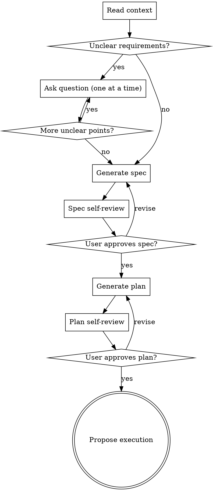
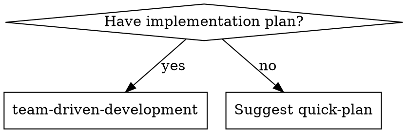

# Quick-Plan Skill Design

## Overview

A lightweight planning skill that generates full-quality spec and plan documents with minimal user interaction. Sits between brainstorming (heavy dialogue) and writing-plans (requires existing spec) — providing a streamlined path from task description to implementation plan within a single skill invocation.

## Motivation

- **brainstorming + writing-plans** is thorough but heavy: deep-dive questions, approach comparison, section-by-section approval, then a separate skill invocation for plan generation.
- Many tasks don't need that depth — the requirements are mostly clear, with only a few ambiguous points.
- Currently there's no middle ground: either full brainstorming or skipping straight to implementation.
- quick-plan fills this gap: ask only what's unclear, generate spec + plan in one flow, stay within this plugin (no superpowers dependency).

## Design

### Positioning

| Aspect | brainstorming + writing-plans | quick-plan | Direct execution |
|--------|-------------------------------|------------|-----------------|
| Dialogue | Heavy (one-at-a-time deep-dive + approach comparison) | Light (unclear points only, 0–few questions) | None |
| Spec quality | Full | Full (equivalent) | None |
| Plan quality | Full | Full (equivalent) | None |
| Skill dependency | superpowers (brainstorming → writing-plans) | Self-contained (this plugin) | — |
| Execution handoff | writing-plans → subagent-driven / executing-plans | quick-plan → team-driven-development | — |

### Process Flow

```
User request → Read context → Ask unclear points only (0–few) → Generate spec → Self-review → User confirms spec → Generate plan → Self-review → User confirms plan → Propose execution
```



### Key differences from brainstorming

1. **No approach comparison phase** — Skip "Propose 2-3 approaches with trade-offs." The agent reads context, makes a judgment call, and reflects it in the spec. If the user disagrees, they correct during spec review.
2. **No section-by-section approval** — Spec is presented as a whole, not incrementally.
3. **No Visual Companion** — Text-only.
4. **Questions are optional** — If the requirements are clear from context + user input, skip straight to spec generation. Only ask what cannot be inferred.
5. **Spec and plan in one skill** — No handoff to writing-plans. The same skill generates both documents sequentially.

### Clarification Logic

The agent does NOT deep-dive every aspect. Instead:

- Read the user's request and explore the codebase context.
- Infer what can be inferred (existing patterns, conventions, obvious choices).
- Ask ONLY about genuinely ambiguous points — one question at a time, multiple-choice preferred.
- Zero questions is valid when the requirements are clear.

### Document Formats

#### Spec

Same format as brainstorming output. Saved to `docs/team-dd/specs/YYYY-MM-DD-<topic>-design.md`. Covers: overview, motivation, architecture, components, data flow, error handling, testing strategy.

#### Plan

Same format as writing-plans output. Saved to `docs/team-dd/plans/YYYY-MM-DD-<topic>.md`. Follows all writing-plans standards:

- File structure mapping
- Bite-sized TDD tasks (test → run → implement → verify → commit)
- No placeholders policy
- Exact file paths, complete code, exact commands

Plan header adapted for team-driven-development:

```markdown
# [Feature Name] Implementation Plan

> **For agentic workers:** Use team-driven-development to execute this plan.

**Goal:** [One sentence]
**Architecture:** [2-3 sentences]
**Tech Stack:** [Key technologies]

---
```

### Self-Review

Both spec and plan go through self-review before user confirmation:

**Spec self-review:**
1. Placeholder scan — No TBD, TODO, incomplete sections
2. Internal consistency — No contradictions between sections
3. Scope check — Focused enough for a single plan
4. Ambiguity check — No requirements with multiple interpretations

**Plan self-review:**
1. Spec coverage — Every spec requirement maps to a task
2. Placeholder scan — No vague steps ("add appropriate handling")
3. Type consistency — Names/signatures consistent across tasks

Issues found are fixed inline immediately.

## Triggers

### Explicit invocation

User calls `/quick-plan` with a task description:

```
/quick-plan Add remember-me functionality to the login screen
```

### Auto-routing from team-driven-development

When team-driven-development is invoked without an existing plan, it suggests quick-plan:



Message: "No implementation plan found. Would you like to use quick-plan to generate a spec and plan first?"

## Execution Handoff

After plan confirmation:

> **Plan complete and saved to `<path>`. Execute with team-driven-development?**
> - **Yes** — Invoke team-driven-development to execute
> - **No** — End here (plan is saved)

## File Changes

### New files

| File | Purpose |
|------|---------|
| `skills/quick-plan/SKILL.md` | Skill definition (single file) |

### Modified files

| File | Change |
|------|--------|
| `skills/team-driven-development/SKILL.md` | Add quick-plan routing to "When to Use" section (~5-10 lines) |

### Not modified

- `CLAUDE.md` — Skill auto-discovered from directory structure
- `README.md` / `docs/README.ja.md` — Out of scope for this change
- `agents/` — No changes to role definitions
- Any superpowers skills — No dependency
