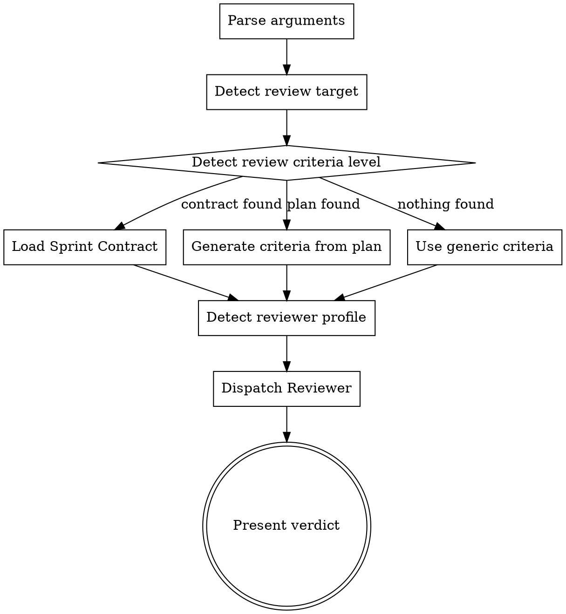

# Solo-Review Skill Design

## Overview

A standalone review skill that invokes the team-driven-development Reviewer agent independently — without the full team orchestration (Lead/Worker/Architect). Enables users to get structured, evidence-based code review on demand for any set of changes.

## Motivation

- The Reviewer agent is currently only accessible through team-driven-development's Phase B, which requires a plan, Sprint Contract, and full team orchestration.
- Users often need a quick review of their changes before committing, after finishing a feature branch, or on arbitrary diffs — without running a full team workflow.
- The existing superpowers `requesting-code-review` skill serves a different purpose (review of completed superpowers work). solo-review is a general-purpose code review tool within this plugin.

## Design

### Review Target Auto-Detection

The skill determines what to review automatically, with argument-based override:

| Priority | Condition | Target |
|----------|-----------|--------|
| 1 | Staged changes exist | `git diff --cached` |
| 2 | Unstaged changes exist | `git diff` (all uncommitted) |
| 3 | Branch differs from main | `git diff main...HEAD` |
| 4 | Nothing detected | Ask user for target |

**Override via arguments:**
- `/solo-review` — auto-detect
- `/solo-review HEAD~3..HEAD` — specific commit range
- `/solo-review src/api/` — changes in specific path only (combined with auto-detected range)

### Review Criteria: 3-Level Fallback

The skill adapts its review criteria based on available context:

```
Sprint Contract provided? → Contract-based review (existing format)
       ↓ no
Plan file exists for current work? → Auto-generate criteria from plan
       ↓ no
Generic code review criteria
```

#### Level 1: Sprint Contract

When a Sprint Contract is provided (via argument or found in context), the Reviewer uses it directly — identical behavior to team-driven-development Phase B-4.

#### Level 2: Plan-Derived Criteria

When a plan file exists (in `docs/team-dd/plans/` or `docs/superpowers/plans/`), the skill:
1. Identifies which plan tasks relate to the changed files
2. Extracts success criteria and test commands from those tasks
3. Generates a lightweight review checklist from the extracted criteria

#### Level 3: Generic Code Review

When no contract or plan is available, the Reviewer uses general code quality criteria:

| Category | Severity | What to check |
|----------|----------|---------------|
| Security vulnerabilities | critical | Injection, XSS, auth bypass, secrets in code |
| Data loss risk | critical | Destructive operations without safeguards |
| Existing feature breakage | major | Changed behavior of existing public interfaces |
| Missing tests for new logic | major | New functions/methods without corresponding tests |
| Error handling gaps | major | Unhandled error paths in external calls |
| Type safety | minor | Missing type annotations, unsafe casts |
| Code style / naming | minor | Does not block — noted only |

### Reviewer Profile Auto-Selection

When no profile is specified, auto-detect from changed files:

| Changed files contain | Profile |
|----------------------|---------|
| Only logic files (no test files, no UI) | `static` |
| Test files or project has test scripts | `runtime` |
| UI/CSS/component files (.tsx, .vue, .css, .html) | `browser` |

User can override: `/solo-review --profile runtime`

### Execution Flow



### Output Format

Reuses the existing Reviewer report format from `agents/reviewer.md`:

```markdown
## Review: solo-review

### Verdict: APPROVE | REQUEST_CHANGES

### Checklist
| # | Criterion | Status | Evidence |
|---|-----------|--------|----------|
| 1 | [criterion] | MET/NOT_MET | [file:line or observation] |

Coverage: N/N criteria evaluated

### Findings

#### Critical
- **R-1** file:line — [description]

#### Major
- **R-2** file:line — [description]

#### Minor
- **R-3** file:line — [description — noted, does not block]

#### Recommendations
- **R-4** [suggestion]
```

### No Fix Loop

Unlike team-driven-development, solo-review does NOT enter a fix loop. It reports findings and returns. The user decides what to do with the results.

## File Changes

### New files

| File | Purpose |
|------|---------|
| `skills/solo-review/SKILL.md` | Skill definition |

### Modified files

| File | Change |
|------|--------|
| `README.md` | Add solo-review to feature list and usage section |
| `docs/README.ja.md` | Add solo-review (Japanese translation) |

### Not modified

| File | Reason |
|------|--------|
| `agents/reviewer.md` | Shared as-is, no changes needed |
| `skills/team-driven-development/prompts/reviewer-prompt.md` | Shared as-is |
| `skills/team-driven-development/SKILL.md` | No cross-reference needed |
| `CLAUDE.md` | Skills auto-discovered from directory structure |
