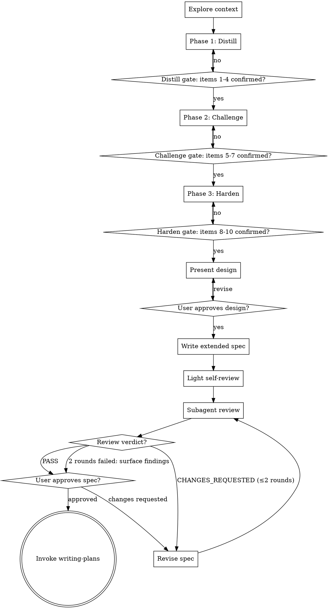

# deep-brainstorm Skill Implementation Plan

> **For agentic workers:** REQUIRED SUB-SKILL: Use superpowers:subagent-driven-development (recommended) or superpowers:executing-plans to implement this plan task-by-task. Steps use checkbox (`- [ ]`) syntax for tracking.

**Goal:** Create the `deep-brainstorm` skill — a rigorous variant of brainstorming that distills vague requirements through Distill/Challenge/Harden phases, gated by a 10-item checklist with dynamic additions, and validated by a subagent reviewer before user approval.

**Architecture:** Pure markdown skill (no code). Main entry `skills/deep-brainstorm/SKILL.md` carries the full prompt; a companion prompt at `skills/deep-brainstorm/prompts/reviewer.md` is loaded by the review subagent. Skills are auto-discovered by the plugin loader — no registration changes needed. Validation is grep-based (section presence / required strings), since skills are prompt artifacts rather than executable code.

**Tech Stack:** Markdown only. Shell (grep) for structural validation.

---

## File Structure

| File | Responsibility |
|---|---|
| `skills/deep-brainstorm/SKILL.md` | Main skill definition: frontmatter, flow, three phases, checklist gate, surfaced concerns, anti-patterns, spec template, review pipeline, handoff. |
| `skills/deep-brainstorm/prompts/reviewer.md` | Subagent reviewer prompt — criteria (10-item coverage, Decision Log soundness, unresolved legitimacy, consistency, ambiguity) and output format (`PASS` / `CHANGES_REQUESTED: [findings]`). |

No other files are created or modified. `plugin.json` auto-discovers skills.

---

## Task 1: Scaffold directory and reviewer prompt

**Files:**
- Create: `skills/deep-brainstorm/prompts/reviewer.md`

- [ ] **Step 1: Write the validation test**

Create a verification script that confirms the reviewer prompt has required sections. Save it inline as a shell one-liner — no test file needed.

Plan test: after creating the file, run this command:
```bash
grep -c "^## " skills/deep-brainstorm/prompts/reviewer.md
```
Expected: at least `4` (Role / Criteria / Output Format / Constraints headings).

- [ ] **Step 2: Run the test to confirm it fails**

Run: `grep -c "^## " skills/deep-brainstorm/prompts/reviewer.md 2>&1 || echo "FAIL: file missing"`
Expected: `FAIL: file missing` (file not yet created).

- [ ] **Step 3: Create the reviewer prompt file**

Write `skills/deep-brainstorm/prompts/reviewer.md` with exactly this content:

```markdown
# deep-brainstorm Spec Reviewer

## Role

You are a fresh-eyes reviewer for a spec produced by the `deep-brainstorm` skill. You have no conversation context from the brainstorming session. Read only the spec file and judge it on its own merits. Your job is to catch embedded assumptions, unsupported claims, and coverage gaps that the author could not see.

## Input

You will receive the absolute path to a spec file. Read it fully before responding.

## Criteria

Evaluate the spec against each of these criteria. For every failed criterion, produce a specific finding with a file-location reference.

1. **10-item checklist coverage** — the spec's Checklist Snapshot must list all ten items (Purpose, Success criteria, Scope boundaries, Users/stakeholders, Alternatives considered, Assumptions, Major constraints, Risks, Security, NFR), each with a status of `confirmed` or `N/A`. `unknown` or `draft` states are failures. `N/A` is only acceptable when the spec body justifies why.

2. **Decision Log reasoning soundness** — each Decision Log entry must list alternatives considered, the chosen option, and a reasoning statement that explains why the chosen option beats the alternatives. Reasoning that merely restates the choice ("we chose B because B is better") is a failure.

3. **Unresolved Items legitimacy** — each Unresolved Item must be something that genuinely blocks implementation and was consciously deferred. Trivial TODOs or scope that should have been resolved during brainstorming are failures.

4. **Internal consistency** — no section contradicts another. Architecture matches the feature descriptions. File Changes table matches files referenced in the Design section.

5. **Ambiguity** — no requirement is interpretable two meaningfully different ways. Vague directives like "handle edge cases appropriately" without specification are failures.

6. **Placeholder scan** — no `TBD`, `TODO`, "fill in later", or equivalent placeholder text remains in any section.

## Output Format

Respond with exactly one of the following formats.

If the spec passes all criteria:

```
PASS
```

If any criterion fails:

```
CHANGES_REQUESTED:
- [criterion-number] [finding with section/line reference]
- [criterion-number] [finding with section/line reference]
...
```

## Constraints

- Do not propose solutions — only identify problems.
- Do not comment on writing style unless it causes ambiguity.
- Do not request additional information from the user; work with the spec as given.
- Keep each finding to a single sentence where possible.
```

- [ ] **Step 4: Run the test to confirm it passes**

Run: `grep -c "^## " skills/deep-brainstorm/prompts/reviewer.md`
Expected: `5` (Role, Input, Criteria, Output Format, Constraints).

Run: `grep "^# deep-brainstorm Spec Reviewer" skills/deep-brainstorm/prompts/reviewer.md`
Expected: matches the H1 line.

- [ ] **Step 5: Commit**

```bash
git add skills/deep-brainstorm/prompts/reviewer.md
git commit -m "feat(deep-brainstorm): add subagent reviewer prompt"
```

---

## Task 2: SKILL.md foundation (frontmatter, overview, checklist, process flow)

**Files:**
- Create: `skills/deep-brainstorm/SKILL.md`

- [ ] **Step 1: Write the validation test**

Plan tests (run after file creation):
```bash
grep -q "^name: deep-brainstorm$" skills/deep-brainstorm/SKILL.md && echo OK
grep -q "HARD-GATE" skills/deep-brainstorm/SKILL.md && echo OK
grep -q "digraph" skills/deep-brainstorm/SKILL.md && echo OK
```
Expected: three `OK` lines.

- [ ] **Step 2: Run the test to confirm it fails**

Run: `test -f skills/deep-brainstorm/SKILL.md || echo "FAIL: file missing"`
Expected: `FAIL: file missing`.

- [ ] **Step 3: Create SKILL.md with foundation content**

Write `skills/deep-brainstorm/SKILL.md` with this exact content:

````markdown
---
name: deep-brainstorm
description: Rigorous variant of brainstorming for vague or high-stakes requirements. Distills the idea through Distill/Challenge/Harden phases, gated by a 10-item checklist with dynamic additions, then validates the spec with a subagent reviewer before user approval.
---

# Deep Brainstorm

Take a vague idea and forge it into a fully specified design through a three-phase process: restate and distill, propose counter-options and stress-test, then harden against risk, security, and non-functional concerns. Produce an extended spec with a Decision Log and Unresolved Items, validate it with a fresh-eyes subagent reviewer, and hand off to `writing-plans`.

Unlike `brainstorming`, this skill pushes back hard, surfaces concerns Claude detects on its own, and replaces self-review with external review. Use it when the requirements are vague, the stakes are high, or you want the decision-making reasoning preserved in the spec.

**Announce at start:** "I'm using deep-brainstorm to distill the requirements through Distill/Challenge/Harden phases and produce an extended spec."

<HARD-GATE>
Do NOT invoke any implementation skill, write any code, or scaffold any project until the user has approved the spec. Do NOT advance to the next phase until all owned checklist items are `confirmed` or `N/A`. Do NOT write the spec file until all ten base checklist items are resolved AND the user has approved the presented design.
</HARD-GATE>

## Checklist

You MUST create a task for each of these items and complete them in order:

1. **Explore project context** — read related files, docs, and recent commits.
2. **Phase 1 — Distill** — restate, surface ambiguity, establish Purpose / Success criteria / Scope boundaries / Users.
3. **Phase 2 — Challenge** — present counter-proposals, stress-test, establish Alternatives / Assumptions / Constraints.
4. **Phase 3 — Harden** — probe Risks / Security / NFR; resolve any Surfaced Concerns.
5. **Present design sections** — architecture, components, data flow, error handling, testing — approve section-by-section.
6. **Write extended spec** — save to `docs/team-dd/specs/YYYY-MM-DD-<topic>-design.md`, commit.
7. **Light self-review** — placeholder and contradiction scan only (~30 seconds).
8. **Subagent review** — dispatch fresh reviewer with `prompts/reviewer.md`; revise on `CHANGES_REQUESTED` up to 2 rounds.
9. **User approves spec** — wait for explicit approval.
10. **Invoke writing-plans** — hand off for implementation plan.

## Process Flow



<!-- SECTIONS BELOW ARE ADDED IN LATER TASKS -->
````

- [ ] **Step 4: Run the tests to confirm they pass**

```bash
grep -q "^name: deep-brainstorm$" skills/deep-brainstorm/SKILL.md && echo OK
grep -q "HARD-GATE" skills/deep-brainstorm/SKILL.md && echo OK
grep -q "digraph" skills/deep-brainstorm/SKILL.md && echo OK
```
Expected: three `OK` lines.

- [ ] **Step 5: Commit**

```bash
git add skills/deep-brainstorm/SKILL.md
git commit -m "feat(deep-brainstorm): add SKILL.md foundation (frontmatter, checklist, process flow)"
```

---

## Task 3: Three Phases section (Distill, Challenge, Harden)

**Files:**
- Modify: `skills/deep-brainstorm/SKILL.md`

- [ ] **Step 1: Write the validation test**

Plan tests:
```bash
grep -q "^### Phase 1 — Distill$" skills/deep-brainstorm/SKILL.md && echo OK
grep -q "^### Phase 2 — Challenge$" skills/deep-brainstorm/SKILL.md && echo OK
grep -q "^### Phase 3 — Harden$" skills/deep-brainstorm/SKILL.md && echo OK
grep -q "📌 Understanding" skills/deep-brainstorm/SKILL.md && echo OK
```
Expected: four `OK` lines.

- [ ] **Step 2: Run the test to confirm it fails**

Run the four commands above. All four should produce no `OK` line (the headings and template do not yet exist).

- [ ] **Step 3: Append the Three Phases section**

Use Edit to replace the marker `<!-- SECTIONS BELOW ARE ADDED IN LATER TASKS -->` with the following content (keeping the marker at the end for later tasks):

```markdown
## Three Phases

Phase progression is gated. A phase ends only when all its owned checklist items are `confirmed` or `N/A`. Users can explicitly mark an item `N/A` to skip it; record the reason in the Decision Log.

### Phase 1 — Distill

Establish Purpose, Success criteria, Scope boundaries, Users/stakeholders.

**Turn format: structured three-part (strict).** Every turn in Phase 1 follows this template exactly:

```
[Phase 1 Distill | Unresolved: <item numbers> | Added: <surfaced items or none>]

📌 Understanding: <one- or two-sentence restatement of what you've understood so far>
🔍 Gaps: <2–3 bullet points of ambiguity or missing context>
❓ Question: <one focused question, multiple-choice preferred>
```

The status line on top is required every turn. The 📌/🔍/❓ template is required until all Phase 1 items are `confirmed` or `N/A`.

Owned items: 1 Purpose, 2 Success criteria, 3 Scope boundaries, 4 Users/stakeholders.

### Phase 2 — Challenge

Surface counter-proposals, stress-test assumptions, pin down major constraints.

**Turn format: dynamic, counter-proposal-centric.** The status line is still required every turn, but the 📌/🔍/❓ template becomes optional. Each counter-proposal must be motivated by a real concern — not contrarianism (see Anti-Patterns).

Present 2–3 alternatives per major decision with explicit trade-offs and a recommended option with reasoning. Record everything discussed here in the eventual spec's Decision Log, whether the user accepts your recommendation or not.

Owned items: 5 Alternatives considered, 6 Assumptions, 7 Major constraints.

### Phase 3 — Harden

Probe remaining risk, security, and non-functional concerns. Status line still required.

**Turn format: dynamic, targeted probes at unresolved items.** May include proposal-style confirmation ("I'll proceed with X unless you object"). Use the lowest-confidence item (see Confidence Signal) to pick the next probe.

Owned items: 8 Risks, 9 Security, 10 NFR.

<!-- SECTIONS BELOW ARE ADDED IN LATER TASKS -->
```

Use the Edit tool: `old_string` is `<!-- SECTIONS BELOW ARE ADDED IN LATER TASKS -->`, `new_string` is the content block above ending with a fresh `<!-- SECTIONS BELOW ARE ADDED IN LATER TASKS -->` marker.

- [ ] **Step 4: Run the tests to confirm they pass**

```bash
grep -q "^### Phase 1 — Distill$" skills/deep-brainstorm/SKILL.md && echo OK
grep -q "^### Phase 2 — Challenge$" skills/deep-brainstorm/SKILL.md && echo OK
grep -q "^### Phase 3 — Harden$" skills/deep-brainstorm/SKILL.md && echo OK
grep -q "📌 Understanding" skills/deep-brainstorm/SKILL.md && echo OK
```
Expected: four `OK` lines.

- [ ] **Step 5: Commit**

```bash
git add skills/deep-brainstorm/SKILL.md
git commit -m "feat(deep-brainstorm): add Three Phases section with turn formats"
```

---

## Task 4: Checklist, Termination Gate, Surfaced Concerns

**Files:**
- Modify: `skills/deep-brainstorm/SKILL.md`

- [ ] **Step 1: Write the validation test**

Plan tests:
```bash
grep -c "^| [0-9]\+ | " skills/deep-brainstorm/SKILL.md
grep -q "Surfaced Concerns" skills/deep-brainstorm/SKILL.md && echo OK
grep -q "Confidence Signal" skills/deep-brainstorm/SKILL.md && echo OK
grep -q "Final Gate" skills/deep-brainstorm/SKILL.md && echo OK
```
Expected: first command prints `10` (ten checklist rows); three `OK` lines.

- [ ] **Step 2: Run the test to confirm it fails**

Same four commands. First prints `0`; the three `OK` commands print nothing.

- [ ] **Step 3: Append the Checklist/Gate/Surfaced Concerns section**

Use Edit to replace the marker `<!-- SECTIONS BELOW ARE ADDED IN LATER TASKS -->` with:

```markdown
## Checklist and Termination Gate

Fixed floor of 10 items; extendable via Surfaced Concerns. Each item holds one of four states: `unknown`, `draft`, `confirmed`, `N/A`.

| # | Item | Phase |
|---|---|---|
| 1 | Purpose | Distill |
| 2 | Success criteria | Distill |
| 3 | Scope boundaries | Distill |
| 4 | Users / stakeholders | Distill |
| 5 | Alternatives considered | Challenge |
| 6 | Assumptions | Challenge |
| 7 | Major constraints | Challenge |
| 8 | Risks | Harden |
| 9 | Security | Harden |
| 10 | NFR (performance, reliability) | Harden |

### Phase Gate

A phase ends only when every item it owns is `confirmed` or `N/A`. Do not advance to the next phase otherwise.

### Final Gate

After all ten base items and any Surfaced Concerns are resolved, present the design sections for user approval. The user's explicit approval is the authoritative termination. Do not write the spec file before this point.

### Confidence Signal (internal only)

After every turn, self-rate confidence on each unresolved item. Use the **lowest-confidence item** to pick the next question. Confidence is **never a gate** — only a prioritization tool. This compensates for the known miscalibration of LLM self-confidence: a "confident" answer is not the same as a correct one.

### Status Line

Every turn begins with a status line:

```
[Phase <N> <name> | Unresolved: <item numbers> | Added: <surfaced items or none>]
```

## Surfaced Concerns

The 10-item list is a floor, not a ceiling. Whenever you detect a concern that must be resolved before the design can be written, raise it as a Surfaced Concern:

```
⚠ Surfaced concern: <title> — <why it matters>. Add to checklist? (**Add / Decline / Defer**)
```

Route the user's response:

- **Add** — becomes item #11+, tracked like any other item. Must reach `confirmed` before the owning phase closes. Assign it to the phase whose scope it falls under (or the current phase if ambiguous).
- **Decline** — record in the spec's Decision Log under "Declined concerns" with the user's reason.
- **Defer** — record in the spec's Unresolved Items section. Must be addressed before implementation starts.

No surfaced concern is ever silently dropped. This mechanism makes Claude co-responsible for coverage and defends against the checklist becoming pro-forma.

**When to surface (not every thought):** only raise concerns that genuinely block design. Implementation details ("what library to use for X") belong in the plan, not the spec. If you catch yourself surfacing more than two concerns per phase, reconsider — you may be drifting into scope creep.

<!-- SECTIONS BELOW ARE ADDED IN LATER TASKS -->
```

- [ ] **Step 4: Run the tests to confirm they pass**

```bash
grep -c "^| [0-9]\+ | " skills/deep-brainstorm/SKILL.md
grep -q "Surfaced Concerns" skills/deep-brainstorm/SKILL.md && echo OK
grep -q "Confidence Signal" skills/deep-brainstorm/SKILL.md && echo OK
grep -q "Final Gate" skills/deep-brainstorm/SKILL.md && echo OK
```
Expected: `10`, three `OK` lines.

- [ ] **Step 5: Commit**

```bash
git add skills/deep-brainstorm/SKILL.md
git commit -m "feat(deep-brainstorm): add checklist, termination gates, surfaced concerns"
```

---

## Task 5: Anti-Patterns and Extended Spec Format

**Files:**
- Modify: `skills/deep-brainstorm/SKILL.md`

- [ ] **Step 1: Write the validation test**

Plan tests:
```bash
grep -q "^## Anti-Patterns$" skills/deep-brainstorm/SKILL.md && echo OK
grep -q "Checklist theater" skills/deep-brainstorm/SKILL.md && echo OK
grep -q "Contrarianism" skills/deep-brainstorm/SKILL.md && echo OK
grep -q "^## Extended Spec Format$" skills/deep-brainstorm/SKILL.md && echo OK
grep -q "## Decision Log" skills/deep-brainstorm/SKILL.md && echo OK
grep -q "## Checklist Snapshot" skills/deep-brainstorm/SKILL.md && echo OK
```
Expected: six `OK` lines.

- [ ] **Step 2: Run the test to confirm it fails**

Same commands produce nothing.

- [ ] **Step 3: Append the Anti-Patterns and Extended Spec Format sections**

Use Edit to replace the marker `<!-- SECTIONS BELOW ARE ADDED IN LATER TASKS -->` with:

````markdown
## Anti-Patterns

Guard against these failure modes. They are common and each undermines the purpose of this skill.

1. **Checklist theater** — asking about an item purely to tick a box. Every question must serve real clarification. If you cannot articulate what information you need, do not ask.
2. **Contrarianism** — proposing alternatives without motivation. Every alternative you present must come with an explicit reason it may be better than the current direction. "Here's another option" with no argument is noise.
3. **Scope creep via surfacing** — raising every possible concern. Surface only what genuinely blocks design — not implementation details, not nice-to-haves.
4. **Question bombing** — more than one question per turn. Always one focused question. If you have more, pick the most important and queue the rest.
5. **Premature design** — presenting a design before all owned checklist items are resolved. This is hard-gated; do not bypass.
6. **Review laundering** — accepting a subagent `PASS` verdict without reading the findings. The reviewer may approve with observations; read them.

## Extended Spec Format

Save to: `docs/team-dd/specs/YYYY-MM-DD-<topic>-design.md`

The spec covers the same ground as a brainstorming-produced spec, plus three additions that preserve the decision-making work: **Decision Log**, **Unresolved Items**, **Checklist Snapshot**.

### Spec Structure

```markdown
# [Feature Name] Design

## Overview
[What this feature does and why — 2-3 sentences]

## Motivation
[Why this change is needed — bullet points]

## Design

### [Section per major component or decision]
[Architecture, components, data flow, interfaces — scaled to complexity]

### Error Handling
[How errors are handled — omit if trivial]

### Testing Strategy
[What to test and how — types of tests, key scenarios]

## File Changes
[New files, modified files — table format]

---

## Decision Log

### Decision N: [topic]
- **Alternatives considered**: [A / B / C]
- **Chosen**: [option]
- **Reasoning**: [why, including why others were rejected]
- **Declined concerns**: [surfaced concerns the user dismissed, with reasons]

## Unresolved Items
- [ ] [deferred concern] — must be resolved before implementation

## Checklist Snapshot
| # | Item | Status | Notes |
|---|---|---|---|
| 1 | Purpose | confirmed | ... |
| ... | ... | ... | ... |
```

The Decision Log captures the thinking spent in Challenge phase — every alternative you considered, why you chose one, and why you rejected the others. Workers and Reviewers downstream can audit design choices without asking.

The Unresolved Items section makes deferred decisions explicit — `writing-plans` and `team-driven-development` will see these and can surface them for re-discussion before implementation.

The Checklist Snapshot gives reviewers a one-glance audit of what was (and was not) considered.

<!-- SECTIONS BELOW ARE ADDED IN LATER TASKS -->
````

- [ ] **Step 4: Run the tests to confirm they pass**

```bash
grep -q "^## Anti-Patterns$" skills/deep-brainstorm/SKILL.md && echo OK
grep -q "Checklist theater" skills/deep-brainstorm/SKILL.md && echo OK
grep -q "Contrarianism" skills/deep-brainstorm/SKILL.md && echo OK
grep -q "^## Extended Spec Format$" skills/deep-brainstorm/SKILL.md && echo OK
grep -q "## Decision Log" skills/deep-brainstorm/SKILL.md && echo OK
grep -q "## Checklist Snapshot" skills/deep-brainstorm/SKILL.md && echo OK
```
Expected: six `OK` lines.

- [ ] **Step 5: Commit**

```bash
git add skills/deep-brainstorm/SKILL.md
git commit -m "feat(deep-brainstorm): add anti-patterns and extended spec format"
```

---

## Task 6: Review Pipeline, Error Handling, Integration, Key Principles

**Files:**
- Modify: `skills/deep-brainstorm/SKILL.md`

- [ ] **Step 1: Write the validation test**

Plan tests:
```bash
grep -q "^## Review Pipeline$" skills/deep-brainstorm/SKILL.md && echo OK
grep -q "^## Error Handling and Edge Cases$" skills/deep-brainstorm/SKILL.md && echo OK
grep -q "^## Integration$" skills/deep-brainstorm/SKILL.md && echo OK
grep -q "^## Testing Strategy$" skills/deep-brainstorm/SKILL.md && echo OK
grep -q "^## Key Principles$" skills/deep-brainstorm/SKILL.md && echo OK
grep -q "prompts/reviewer.md" skills/deep-brainstorm/SKILL.md && echo OK
grep -q "writing-plans" skills/deep-brainstorm/SKILL.md && echo OK
```
Expected: seven `OK` lines.

- [ ] **Step 2: Run the test to confirm it fails**

Same commands; missing headings produce no output.

- [ ] **Step 3: Append the final sections**

Use Edit to replace the final marker `<!-- SECTIONS BELOW ARE ADDED IN LATER TASKS -->` with:

```markdown
## Review Pipeline

Replace brainstorming's pure self-review with a two-step pipeline.

### 1. Light Self-Review (~30 seconds)

Mechanical pass only. Check for:
- Placeholder text: `TBD`, `TODO`, "fill in later", incomplete sentences.
- Obvious internal contradictions (statements that flatly contradict earlier sections).
- Missing sections from the Extended Spec Format template.

Fix findings inline. Do not attempt a substantive critique here — that is the subagent's job.

### 2. Subagent Review

Dispatch a fresh subagent (no conversation context) using the Task/Agent tool with:

- The absolute path to the spec file.
- The reviewer prompt loaded from `skills/deep-brainstorm/prompts/reviewer.md`.
- Instructions to read the spec in full before responding.

The subagent must return `PASS` or `CHANGES_REQUESTED: [findings]` (format defined in `prompts/reviewer.md`).

### Revision Loop

On `CHANGES_REQUESTED`: revise the spec to address each finding, then re-dispatch a fresh subagent. **Maximum two revision rounds.** If the third dispatch still returns `CHANGES_REQUESTED`, do not loop further — surface the findings to the user verbatim and let them decide whether to continue, revise manually, or accept known gaps.

### User Approval

After `PASS` (or after surfacing unresolved findings), ask the user to review the spec file:

> "Spec written and committed to `<path>`. Subagent review: <PASS / findings surfaced>. Please review and let me know if you want changes before I invoke writing-plans."

Wait for approval. Only then proceed to handoff.

## Error Handling and Edge Cases

- **User dismisses every counter-proposal** — record each as a Declined concern in the Decision Log. Do not loop or re-argue. Proceed with the user's direction.
- **User defers a decision** ("either is fine", "up to you") — mirror `quick-plan` convention: choose the most comprehensive option that satisfies all plausible interpretations, record as a Deferred decision in the Decision Log with your reasoning, proceed.
- **Subagent review fails twice** — surface the findings to the user verbatim. Do not enter a third automated round.
- **User tries to skip ahead** ("just write the spec already") — acknowledge, mark remaining unresolved items as Deferred in Unresolved Items, proceed to design. The user retains ultimate control.
- **User changes direction mid-skill** — if the user pivots (e.g., "actually, let's build Y instead"), mark current items as `N/A` with a reason, reset to Phase 1, announce the reset, and continue.

## Integration

- **Replaces**: `brainstorming` for vague or high-stakes cases. Users pick per-invocation.
- **Coexists with**: `quick-plan` for cases where requirements are already clear.
- **Hands off to**: `writing-plans` after spec approval — identical terminal transition to `brainstorming`.
- **Downstream**: plans produced from deep-brainstorm specs are executed by `team-driven-development` as usual. Workers and Reviewers benefit from the Decision Log audit trail.

## Testing Strategy

This skill is a markdown prompt — testing is manual and comparative.

- **Smoke test** — run `/deep-brainstorm` against a deliberately vague prompt (e.g., "I want to add notifications"). Verify: status line appears each turn, Phase 1 uses the structured three-part format, phase gates block advancement, Surfaced Concerns are routed correctly, subagent review is dispatched, spec contains Decision Log and Checklist Snapshot.
- **Comparative test** — run the same vague prompt through `brainstorming` and `deep-brainstorm`. Diff the specs. `deep-brainstorm` should show more completeness, explicit alternatives, and a traceable Decision Log.
- **Handoff test** — confirm the skill invokes `writing-plans` after approval and that a plan can be produced from the spec without loss of information.

## Key Principles

- **One question at a time** — always one focused question per turn. Multiple choice preferred.
- **Counter-propose only with motivation** — every alternative carries an explicit reason.
- **Coverage over confidence** — the checklist decides whether you can advance; Claude's self-confidence does not.
- **Surface blocking concerns, not trivia** — add items only when they would cause rework if ignored.
- **Preserve the thinking** — the Decision Log is not optional; the reasoning discussed during Challenge phase must survive into the spec.
- **External review over self-review** — fresh eyes catch what the author cannot see.
- **Human has final say** — the user approves both the design and the spec; hard-gated.
```

- [ ] **Step 4: Run the tests to confirm they pass**

```bash
grep -q "^## Review Pipeline$" skills/deep-brainstorm/SKILL.md && echo OK
grep -q "^## Error Handling and Edge Cases$" skills/deep-brainstorm/SKILL.md && echo OK
grep -q "^## Integration$" skills/deep-brainstorm/SKILL.md && echo OK
grep -q "^## Testing Strategy$" skills/deep-brainstorm/SKILL.md && echo OK
grep -q "^## Key Principles$" skills/deep-brainstorm/SKILL.md && echo OK
grep -q "prompts/reviewer.md" skills/deep-brainstorm/SKILL.md && echo OK
grep -q "writing-plans" skills/deep-brainstorm/SKILL.md && echo OK
```
Expected: seven `OK` lines.

Also confirm the marker is gone:
```bash
grep -c "SECTIONS BELOW ARE ADDED" skills/deep-brainstorm/SKILL.md
```
Expected: `0`.

- [ ] **Step 5: Commit**

```bash
git add skills/deep-brainstorm/SKILL.md
git commit -m "feat(deep-brainstorm): add review pipeline, error handling, integration, principles"
```

---

## Task 7: End-to-end integration check

**Files:**
- Read-only: `skills/deep-brainstorm/SKILL.md`, `skills/deep-brainstorm/prompts/reviewer.md`

- [ ] **Step 1: Full structural grep**

Run all of these; every line must print `OK`:

```bash
grep -q "^name: deep-brainstorm$" skills/deep-brainstorm/SKILL.md && echo OK
grep -q "^### Phase 1 — Distill$" skills/deep-brainstorm/SKILL.md && echo OK
grep -q "^### Phase 2 — Challenge$" skills/deep-brainstorm/SKILL.md && echo OK
grep -q "^### Phase 3 — Harden$" skills/deep-brainstorm/SKILL.md && echo OK
grep -q "^## Checklist and Termination Gate$" skills/deep-brainstorm/SKILL.md && echo OK
grep -q "^## Surfaced Concerns$" skills/deep-brainstorm/SKILL.md && echo OK
grep -q "^## Anti-Patterns$" skills/deep-brainstorm/SKILL.md && echo OK
grep -q "^## Extended Spec Format$" skills/deep-brainstorm/SKILL.md && echo OK
grep -q "^## Review Pipeline$" skills/deep-brainstorm/SKILL.md && echo OK
grep -q "^## Error Handling and Edge Cases$" skills/deep-brainstorm/SKILL.md && echo OK
grep -q "^## Integration$" skills/deep-brainstorm/SKILL.md && echo OK
grep -q "^## Testing Strategy$" skills/deep-brainstorm/SKILL.md && echo OK
grep -q "^## Key Principles$" skills/deep-brainstorm/SKILL.md && echo OK
grep -q "^# deep-brainstorm Spec Reviewer$" skills/deep-brainstorm/prompts/reviewer.md && echo OK
```

Expected: 14 `OK` lines.

- [ ] **Step 2: Check 10-item table presence**

```bash
grep -c "^| [0-9]\+ | " skills/deep-brainstorm/SKILL.md
```
Expected: exactly `10`.

- [ ] **Step 3: Check no placeholders remain**

```bash
grep -E "TBD|TODO|FIXME|SECTIONS BELOW" skills/deep-brainstorm/SKILL.md
```
Expected: no output (empty). If any line returns, fix it and recommit before proceeding.

- [ ] **Step 4: Verify skill auto-discovery**

Confirm no registration changes are needed (plugin auto-discovers skills from `skills/`):

```bash
test -d skills/deep-brainstorm && test -f skills/deep-brainstorm/SKILL.md && test -f skills/deep-brainstorm/prompts/reviewer.md && echo "Skill layout OK"
```
Expected: `Skill layout OK`.

- [ ] **Step 5: No commit for this task** — it is a read-only verification step.

---

## Task 8: Manual smoke test (operator-run)

This task is run by the human operator, not an agentic worker. It verifies the skill behaves as designed in a real invocation. Record the result at the bottom of this plan file.

- [ ] **Step 1: Invoke with a vague prompt**

Start a fresh Claude Code session and run:

```
/deep-brainstorm I want to add notifications to my app
```

- [ ] **Step 2: Verify Phase 1 behavior**

Confirm:
- A status line of the form `[Phase 1 Distill | Unresolved: 1,2,3,4 | Added: none]` appears on Claude's first reply.
- The reply uses the 📌 / 🔍 / ❓ template.
- Only one question is asked.

- [ ] **Step 3: Verify phase gating**

Continue answering until Phase 1 items are `confirmed`. Confirm that:
- Claude does not advance to Phase 2 while any Phase 1 item is `unknown` or `draft`.
- When all four are `confirmed`, the status line transitions to `[Phase 2 Challenge | ...]`.

- [ ] **Step 4: Verify Surfaced Concerns**

Watch for at least one `⚠ Surfaced concern:` prompt over the course of the session. Test each route (Add, Decline, Defer) at least once across separate sessions if possible.

- [ ] **Step 5: Verify subagent review**

After spec approval, confirm Claude dispatches a subagent review before asking for user approval. Confirm the verdict (`PASS` or `CHANGES_REQUESTED`) is shown.

- [ ] **Step 6: Verify spec contents**

Open the produced spec file. Confirm it contains:
- Decision Log with at least one entry per major decision discussed.
- Unresolved Items section (may be empty if nothing was deferred).
- Checklist Snapshot table with all ten base items and any Surfaced Concerns.

- [ ] **Step 7: Record result**

Append to the bottom of this plan file:

```markdown
## Smoke Test Result (YYYY-MM-DD)

- Phase gating: PASS / FAIL
- Surfaced Concerns routing: PASS / FAIL
- Subagent review dispatch: PASS / FAIL
- Spec structural completeness: PASS / FAIL
- Notes: <anything unexpected>
```

Commit the update:

```bash
git add docs/team-dd/plans/2026-04-17-deep-brainstorm.md
git commit -m "docs: record deep-brainstorm smoke test result"
```
