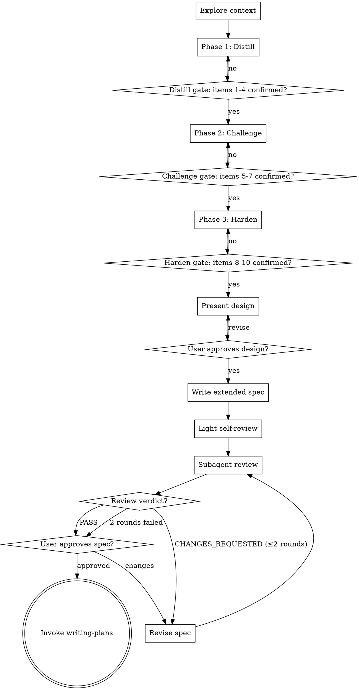

# deep-brainstorm Skill Implementation Plan

> **For agentic workers:** REQUIRED SUB-SKILL: Use superpowers:subagent-driven-development (recommended) or superpowers:executing-plans to implement this plan task-by-task. Steps use checkbox (`- [ ]`) syntax for tracking.

**Goal:** Create the `deep-brainstorm` skill — a rigorous brainstorming variant that runs Distill/Challenge/Harden phases, gates on a 10-item checklist with dynamic additions, and validates via subagent review before user approval.

**Architecture:** Pure markdown skill. `skills/deep-brainstorm/SKILL.md` is the entry; `skills/deep-brainstorm/prompts/reviewer.md` is loaded by the review subagent. Skills are auto-discovered — no registration changes. Validation is grep-based (section presence / required strings).

**Tech Stack:** Markdown. Shell `grep` for structural validation.

---

## File Structure

| File | Responsibility |
|---|---|
| `skills/deep-brainstorm/SKILL.md` | Skill definition: phases, checklist gate, surfaced concerns, anti-patterns, spec template, review pipeline, handoff. |
| `skills/deep-brainstorm/prompts/reviewer.md` | Subagent reviewer prompt: criteria + output format. |

No other files. `plugin.json` auto-discovers skills.

---

## Task 1: Scaffold directory and reviewer prompt

**Files:**
- Create: `skills/deep-brainstorm/prompts/reviewer.md`

- [ ] **Step 1: Write the validation test**

After file creation, run:
```bash
grep -c "^## " skills/deep-brainstorm/prompts/reviewer.md
```
Expected: `5` (Role, Input, Criteria, Output Format, Constraints).

- [ ] **Step 2: Run the test to confirm it fails**

Run: `test -f skills/deep-brainstorm/prompts/reviewer.md || echo "FAIL: file missing"`
Expected: `FAIL: file missing`.

- [ ] **Step 3: Create the reviewer prompt**

Write `skills/deep-brainstorm/prompts/reviewer.md`:

```markdown
# deep-brainstorm Spec Reviewer

## Role

Fresh-eyes reviewer for a `deep-brainstorm` spec. No conversation context. Read the spec file and judge it on its own merits. Catch embedded assumptions, unsupported claims, coverage gaps.

## Input

Absolute path to a spec file. Read fully before responding.

## Criteria

For each failed criterion, produce a finding with a section reference.

1. **10-item checklist coverage** — Checklist Snapshot lists all ten base items, each `confirmed` or `N/A`. `unknown`/`draft` = fail. `N/A` must be justified in the spec body.
2. **Decision Log soundness** — each entry lists alternatives, choice, reasoning. Reasoning that restates the choice = fail.
3. **Unresolved Items legitimacy** — each item genuinely blocks implementation and was consciously deferred. Trivial TODOs = fail.
4. **Internal consistency** — no section contradicts another. File Changes matches files referenced in Design.
5. **Ambiguity** — no requirement interpretable two ways. Vague directives (e.g., "handle edge cases appropriately") = fail.
6. **Placeholders** — no `TBD`/`TODO`/`fill in later`/similar.

## Output Format

Output exactly one format.

Pass:
```
PASS
```

Fail:
```
CHANGES_REQUESTED:
- [criterion-number] [finding with section reference]
- [criterion-number] [finding with section reference]
```

## Constraints

- Identify problems only; no solutions.
- Skip style comments unless they cause ambiguity.
- No questions to the user.
- One sentence per finding.
```

- [ ] **Step 4: Run the test to confirm it passes**

```bash
grep -c "^## " skills/deep-brainstorm/prompts/reviewer.md
grep -q "^# deep-brainstorm Spec Reviewer$" skills/deep-brainstorm/prompts/reviewer.md && echo OK
```
Expected: `5`, `OK`.

- [ ] **Step 5: Commit**

```bash
git add skills/deep-brainstorm/prompts/reviewer.md
git commit -m "feat(deep-brainstorm): add subagent reviewer prompt"
```

---

## Task 2: SKILL.md foundation (frontmatter, overview, checklist, process flow)

**Files:**
- Create: `skills/deep-brainstorm/SKILL.md`

- [ ] **Step 1: Write the validation test**

```bash
grep -q "^name: deep-brainstorm$" skills/deep-brainstorm/SKILL.md && echo OK
grep -q "HARD-GATE" skills/deep-brainstorm/SKILL.md && echo OK
grep -q "digraph" skills/deep-brainstorm/SKILL.md && echo OK
```
Expected: three `OK` lines.

- [ ] **Step 2: Run the test to confirm it fails**

Run: `test -f skills/deep-brainstorm/SKILL.md || echo "FAIL: file missing"`
Expected: `FAIL: file missing`.

- [ ] **Step 3: Create SKILL.md foundation**

Write `skills/deep-brainstorm/SKILL.md`:

````markdown
---
name: deep-brainstorm
description: Rigorous variant of brainstorming for vague or high-stakes requirements. Runs Distill/Challenge/Harden phases, gates on a 10-item checklist with dynamic additions, validates via subagent review before user approval.
---

# Deep Brainstorm

Forge a vague idea into a specified design through three phases — Distill, Challenge, Harden. Produce an extended spec with Decision Log and Unresolved Items, validate via fresh-eyes subagent, hand off to `writing-plans`.

Unlike `brainstorming`: stronger pushback, Claude-surfaced concerns, external review instead of self-review. Use for vague or high-stakes requirements, or when decision reasoning must survive into the spec.

**Announce at start:** "I'm using deep-brainstorm to run Distill/Challenge/Harden phases and produce an extended spec."

<HARD-GATE>
No implementation skill, code, or scaffolding until user approves the spec. No phase advancement until owned items are `confirmed`/`N/A`. No spec file until all ten base items resolved AND design approved.
</HARD-GATE>

## Checklist

Create a task for each item and complete in order:

1. **Explore context** — related files, docs, recent commits.
2. **Phase 1 Distill** — restate, surface ambiguity, resolve Purpose / Success criteria / Scope / Users.
3. **Phase 2 Challenge** — counter-proposals, stress-test, resolve Alternatives / Assumptions / Constraints.
4. **Phase 3 Harden** — Risks / Security / NFR + Surfaced Concerns.
5. **Present design** — section-by-section user approval.
6. **Write extended spec** — `docs/team-dd/specs/YYYY-MM-DD-<topic>-design.md`, commit.
7. **Light self-review** — placeholders + obvious contradictions (~30s).
8. **Subagent review** — dispatch with `prompts/reviewer.md`; revise on `CHANGES_REQUESTED`, max 2 rounds.
9. **User approves spec**.
10. **Invoke `writing-plans`**.

## Process Flow



<!-- SECTIONS BELOW ARE ADDED IN LATER TASKS -->
````

- [ ] **Step 4: Run the tests to confirm they pass**

Same three commands from Step 1. Expected: three `OK` lines.

- [ ] **Step 5: Commit**

```bash
git add skills/deep-brainstorm/SKILL.md
git commit -m "feat(deep-brainstorm): add SKILL.md foundation"
```

---

## Task 3: Three Phases section

**Files:**
- Modify: `skills/deep-brainstorm/SKILL.md`

- [ ] **Step 1: Write the validation test**

```bash
grep -q "^### Phase 1 — Distill$" skills/deep-brainstorm/SKILL.md && echo OK
grep -q "^### Phase 2 — Challenge$" skills/deep-brainstorm/SKILL.md && echo OK
grep -q "^### Phase 3 — Harden$" skills/deep-brainstorm/SKILL.md && echo OK
grep -q "📌 Understanding" skills/deep-brainstorm/SKILL.md && echo OK
```
Expected: four `OK` lines.

- [ ] **Step 2: Run the test to confirm it fails**

Same commands. Missing headings produce no output.

- [ ] **Step 3: Append Three Phases**

Use Edit to replace `<!-- SECTIONS BELOW ARE ADDED IN LATER TASKS -->` with:

```markdown
## Three Phases

Phase ends when owned items are `confirmed` or `N/A`. `N/A` reasons go in the Decision Log.

### Phase 1 — Distill

Resolve Purpose, Success criteria, Scope boundaries, Users/stakeholders.

**Turn format: structured three-part (strict).**

```
[Phase 1 Distill | Unresolved: <item numbers> | Added: <surfaced or none>]

📌 Understanding: <1-2 sentence restatement>
🔍 Gaps: <2-3 bullet points>
❓ Question: <one question, multiple-choice preferred>
```

Status line required every turn. 📌/🔍/❓ required until Phase 1 items confirmed.

Owned items: 1 Purpose, 2 Success criteria, 3 Scope boundaries, 4 Users/stakeholders.

### Phase 2 — Challenge

Counter-proposals, stress-tests, resolve Alternatives / Assumptions / Constraints.

**Turn format: dynamic, counter-proposal-centric.** Status line required; 📌/🔍/❓ optional. Counter-proposals need real motivation (see Anti-Patterns).

Present 2–3 alternatives per major decision with trade-offs and a recommended option. Record everything in the Decision Log — user acceptance doesn't matter.

Owned items: 5 Alternatives considered, 6 Assumptions, 7 Major constraints.

### Phase 3 — Harden

Probe Risks / Security / NFR. Status line required.

**Turn format: dynamic.** Targeted probes at unresolved items; proposal-style confirmation OK ("I'll proceed with X unless you object"). Use lowest-confidence item (see Confidence Signal) to pick the next probe.

Owned items: 8 Risks, 9 Security, 10 NFR.

<!-- SECTIONS BELOW ARE ADDED IN LATER TASKS -->
```

Edit: `old_string` is `<!-- SECTIONS BELOW ARE ADDED IN LATER TASKS -->`, `new_string` is the content above ending with a fresh marker.

- [ ] **Step 4: Run the tests to confirm they pass**

Same four commands. Expected: four `OK` lines.

- [ ] **Step 5: Commit**

```bash
git add skills/deep-brainstorm/SKILL.md
git commit -m "feat(deep-brainstorm): add Three Phases"
```

---

## Task 4: Checklist, Termination Gate, Surfaced Concerns

**Files:**
- Modify: `skills/deep-brainstorm/SKILL.md`

- [ ] **Step 1: Write the validation test**

```bash
grep -c "^| [0-9]\+ | " skills/deep-brainstorm/SKILL.md
grep -q "Surfaced Concerns" skills/deep-brainstorm/SKILL.md && echo OK
grep -q "Confidence Signal" skills/deep-brainstorm/SKILL.md && echo OK
grep -q "Final Gate" skills/deep-brainstorm/SKILL.md && echo OK
```
Expected: `10`, three `OK` lines.

- [ ] **Step 2: Run the test to confirm it fails**

Same commands. Expected: `0` and no OK lines.

- [ ] **Step 3: Append Checklist + Gate + Surfaced Concerns**

Replace the marker with:

```markdown
## Checklist and Termination Gate

10-item floor; extendable via Surfaced Concerns. Each item: `unknown` / `draft` / `confirmed` / `N/A`.

| # | Item | Phase |
|---|---|---|
| 1 | Purpose | Distill |
| 2 | Success criteria | Distill |
| 3 | Scope boundaries | Distill |
| 4 | Users / stakeholders | Distill |
| 5 | Alternatives considered | Challenge |
| 6 | Assumptions | Challenge |
| 7 | Major constraints | Challenge |
| 8 | Risks | Harden |
| 9 | Security | Harden |
| 10 | NFR (performance, reliability) | Harden |

### Phase Gate

Phase ends when every owned item is `confirmed` or `N/A`. No advancement otherwise.

### Final Gate

After all ten base items + Surfaced Concerns resolved, present design for user approval. Explicit approval terminates. No spec file before this.

### Confidence Signal (internal only)

Self-rate confidence per unresolved item each turn. Use the **lowest-confidence item** to pick the next question. **Never a gate** — prioritization only. LLM self-confidence is miscalibrated; don't treat confidence as correctness.

### Status Line

Every turn starts:

```
[Phase <N> <name> | Unresolved: <item numbers> | Added: <surfaced or none>]
```

## Surfaced Concerns

The 10-item list is a floor. Raise any additional concern blocking design as a Surfaced Concern:

```
⚠ Surfaced concern: <title> — <why it matters>. Add to checklist? (**Add / Decline / Defer**)
```

Route the response:

- **Add** — becomes item #11+, must reach `confirmed` before owning phase closes. Assign to the matching phase (or current if ambiguous).
- **Decline** — record in Decision Log → Declined concerns with reason.
- **Defer** — record in Unresolved Items (blocks implementation).

No surfaced concern is silently dropped. This makes Claude co-responsible for coverage.

**When to surface:** only concerns that block design. Implementation details (library choice, etc.) belong in the plan. >2 per phase = scope creep warning.

<!-- SECTIONS BELOW ARE ADDED IN LATER TASKS -->
```

- [ ] **Step 4: Run the tests to confirm they pass**

Same commands. Expected: `10`, three `OK` lines.

- [ ] **Step 5: Commit**

```bash
git add skills/deep-brainstorm/SKILL.md
git commit -m "feat(deep-brainstorm): add checklist, gates, surfaced concerns"
```

---

## Task 5: Anti-Patterns and Extended Spec Format

**Files:**
- Modify: `skills/deep-brainstorm/SKILL.md`

- [ ] **Step 1: Write the validation test**

```bash
grep -q "^## Anti-Patterns$" skills/deep-brainstorm/SKILL.md && echo OK
grep -q "Checklist theater" skills/deep-brainstorm/SKILL.md && echo OK
grep -q "Contrarianism" skills/deep-brainstorm/SKILL.md && echo OK
grep -q "^## Extended Spec Format$" skills/deep-brainstorm/SKILL.md && echo OK
grep -q "## Decision Log" skills/deep-brainstorm/SKILL.md && echo OK
grep -q "## Checklist Snapshot" skills/deep-brainstorm/SKILL.md && echo OK
```
Expected: six `OK` lines.

- [ ] **Step 2: Run the test to confirm it fails**

Same commands. No output.

- [ ] **Step 3: Append Anti-Patterns + Extended Spec Format**

Replace the marker with:

````markdown
## Anti-Patterns

1. **Checklist theater** — asking to tick boxes. If you can't articulate what info you need, don't ask.
2. **Contrarianism** — alternatives without motivation. Every alternative needs an explicit reason it may beat the current direction.
3. **Scope creep via surfacing** — surface only what blocks design. Not implementation details, not nice-to-haves.
4. **Question bombing** — >1 question per turn. Pick the most important; queue the rest.
5. **Premature design** — designing before owned items resolved. Hard-gated.
6. **Review laundering** — accepting `PASS` without reading observations. Reviewers approve with notes; read them.

## Extended Spec Format

Save to: `docs/team-dd/specs/YYYY-MM-DD-<topic>-design.md`.

Adds three sections over brainstorming spec: **Decision Log**, **Unresolved Items**, **Checklist Snapshot**.

### Spec Structure

```markdown
# [Feature Name] Design

## Overview
[What + why — 2-3 sentences]

## Motivation
[Why now — bullets]

## Design
### [Component/decision sections, scaled to complexity]
### Error Handling
### Testing Strategy

## File Changes
[Table: File / Status / Purpose]

---

## Decision Log

### Decision N: [topic]
- **Alternatives considered**: [A / B / C]
- **Chosen**: [option]
- **Reasoning**: [why chosen beats rejected]
- **Declined concerns**: [surfaced items the user dismissed, with reason]

## Unresolved Items
- [ ] [deferred item] — must resolve before implementation

## Checklist Snapshot
| # | Item | Status | Notes |
|---|---|---|---|
| 1 | Purpose | confirmed | ... |
| ... | ... | ... | ... |
```

- **Decision Log**: captures Challenge-phase thinking. Auditable by downstream Workers/Reviewers.
- **Unresolved Items**: deferred decisions made explicit. Downstream skills can re-surface.
- **Checklist Snapshot**: one-glance audit of what was considered.

<!-- SECTIONS BELOW ARE ADDED IN LATER TASKS -->
````

- [ ] **Step 4: Run the tests to confirm they pass**

Same commands. Expected: six `OK` lines.

- [ ] **Step 5: Commit**

```bash
git add skills/deep-brainstorm/SKILL.md
git commit -m "feat(deep-brainstorm): add anti-patterns and spec format"
```

---

## Task 6: Review Pipeline, Error Handling, Integration, Key Principles

**Files:**
- Modify: `skills/deep-brainstorm/SKILL.md`

- [ ] **Step 1: Write the validation test**

```bash
grep -q "^## Review Pipeline$" skills/deep-brainstorm/SKILL.md && echo OK
grep -q "^## Error Handling$" skills/deep-brainstorm/SKILL.md && echo OK
grep -q "^## Integration$" skills/deep-brainstorm/SKILL.md && echo OK
grep -q "^## Testing Strategy$" skills/deep-brainstorm/SKILL.md && echo OK
grep -q "^## Key Principles$" skills/deep-brainstorm/SKILL.md && echo OK
grep -q "prompts/reviewer.md" skills/deep-brainstorm/SKILL.md && echo OK
grep -q "writing-plans" skills/deep-brainstorm/SKILL.md && echo OK
```
Expected: seven `OK` lines.

- [ ] **Step 2: Run the test to confirm it fails**

Same commands. Missing headings produce no output.

- [ ] **Step 3: Append final sections**

Replace the final marker with:

```markdown
## Review Pipeline

Replaces brainstorming's pure self-review with a two-step pipeline.

### 1. Light Self-Review (~30s)

Mechanical pass only:
- Placeholders: `TBD`, `TODO`, `fill in later`, incomplete sentences.
- Obvious internal contradictions.
- Missing Extended Spec Format sections.

Fix inline. Substantive critique is the subagent's job.

### 2. Subagent Review

Dispatch fresh subagent (no context) via Task/Agent with:

- Absolute path to spec file.
- Reviewer prompt from `skills/deep-brainstorm/prompts/reviewer.md`.
- Instruction: read spec fully before responding.

Subagent returns `PASS` or `CHANGES_REQUESTED: [findings]` (format in `prompts/reviewer.md`).

### Revision Loop

On `CHANGES_REQUESTED`: revise → re-dispatch. **Max 2 rounds.** 3rd round: surface findings to user verbatim; user decides continue / revise manually / accept gaps.

### User Approval

After `PASS` (or surfaced findings), ask user:

> "Spec committed to `<path>`. Subagent review: <PASS / findings surfaced>. Review and let me know before I invoke writing-plans."

Wait for approval, then hand off.

## Error Handling

- **User dismisses all counter-proposals** — record each as Declined in Decision Log. Don't loop. Proceed with user's direction.
- **User defers** ("either is fine"/"up to you") — mirror `quick-plan`: pick the most comprehensive option, record as Deferred decision with reasoning, proceed.
- **Subagent fails twice** — surface verbatim; no third automated round.
- **User skips ahead** ("just write the spec") — mark remaining items as Deferred, proceed. User retains control.
- **User pivots mid-skill** — mark current items `N/A` with reason, reset to Phase 1, announce reset, continue.

## Integration

- **Replaces**: `brainstorming` for vague/high-stakes cases.
- **Coexists with**: `quick-plan` (requirements already clear).
- **Hands off to**: `writing-plans` after approval.
- **Downstream**: plans executed by `team-driven-development`. Workers/Reviewers consume the Decision Log.

## Testing Strategy

Markdown prompt — testing is manual and comparative.

- **Smoke test** — run against a vague prompt ("add notifications"). Verify: status line per turn, Phase 1 structured format, phase gates block advancement, Surfaced Concerns route correctly, subagent review dispatched, spec contains Decision Log + Checklist Snapshot.
- **Comparative test** — same prompt through `brainstorming` vs `deep-brainstorm`. Diff specs. deep-brainstorm should show more completeness and traceable reasoning.
- **Handoff test** — `writing-plans` produces a plan from the spec without information loss.

## Key Principles

- **One question per turn**. Multiple choice preferred.
- **Counter-propose with motivation only**.
- **Coverage over confidence** — checklist gates advancement, not self-confidence.
- **Surface blocking concerns only**.
- **Preserve the thinking** — Decision Log is mandatory.
- **External review over self-review**.
- **Human has final say**.
```

- [ ] **Step 4: Run the tests to confirm they pass**

Same commands. Expected: seven `OK` lines.

Also confirm marker removed:
```bash
grep -c "SECTIONS BELOW ARE ADDED" skills/deep-brainstorm/SKILL.md
```
Expected: `0`.

- [ ] **Step 5: Commit**

```bash
git add skills/deep-brainstorm/SKILL.md
git commit -m "feat(deep-brainstorm): add review pipeline, error handling, integration, principles"
```

---

## Task 7: End-to-end integration check

**Files:**
- Read-only: `skills/deep-brainstorm/SKILL.md`, `skills/deep-brainstorm/prompts/reviewer.md`

- [ ] **Step 1: Full structural grep**

Each line must print `OK`:

```bash
grep -q "^name: deep-brainstorm$" skills/deep-brainstorm/SKILL.md && echo OK
grep -q "^### Phase 1 — Distill$" skills/deep-brainstorm/SKILL.md && echo OK
grep -q "^### Phase 2 — Challenge$" skills/deep-brainstorm/SKILL.md && echo OK
grep -q "^### Phase 3 — Harden$" skills/deep-brainstorm/SKILL.md && echo OK
grep -q "^## Checklist and Termination Gate$" skills/deep-brainstorm/SKILL.md && echo OK
grep -q "^## Surfaced Concerns$" skills/deep-brainstorm/SKILL.md && echo OK
grep -q "^## Anti-Patterns$" skills/deep-brainstorm/SKILL.md && echo OK
grep -q "^## Extended Spec Format$" skills/deep-brainstorm/SKILL.md && echo OK
grep -q "^## Review Pipeline$" skills/deep-brainstorm/SKILL.md && echo OK
grep -q "^## Error Handling$" skills/deep-brainstorm/SKILL.md && echo OK
grep -q "^## Integration$" skills/deep-brainstorm/SKILL.md && echo OK
grep -q "^## Testing Strategy$" skills/deep-brainstorm/SKILL.md && echo OK
grep -q "^## Key Principles$" skills/deep-brainstorm/SKILL.md && echo OK
grep -q "^# deep-brainstorm Spec Reviewer$" skills/deep-brainstorm/prompts/reviewer.md && echo OK
```

Expected: 14 `OK` lines.

- [ ] **Step 2: 10-item table check**

```bash
grep -c "^| [0-9]\+ | " skills/deep-brainstorm/SKILL.md
```
Expected: `10`.

- [ ] **Step 3: No placeholders**

```bash
grep -E "TBD|FIXME|SECTIONS BELOW" skills/deep-brainstorm/SKILL.md
```
Expected: no output. (`TODO` and "fill in later" appear legitimately inside the anti-pattern and review-pipeline text, so they're excluded from this scan.)

- [ ] **Step 4: Skill layout**

```bash
test -d skills/deep-brainstorm && test -f skills/deep-brainstorm/SKILL.md && test -f skills/deep-brainstorm/prompts/reviewer.md && echo "Skill layout OK"
```
Expected: `Skill layout OK`.

- [ ] **Step 5: No commit** — verification only.

---

## Task 8: Manual smoke test (operator-run)

Human operator runs this; record the result at the bottom of this file.

- [ ] **Step 1: Invoke**

```
/deep-brainstorm I want to add notifications to my app
```

- [ ] **Step 2: Phase 1 behavior**

Verify:
- Status line `[Phase 1 Distill | Unresolved: 1,2,3,4 | Added: none]` on first reply.
- Uses 📌 / 🔍 / ❓ template.
- One question only.

- [ ] **Step 3: Phase gating**

Continue until Phase 1 items `confirmed`. Verify:
- No advance while any Phase 1 item is `unknown`/`draft`.
- Status line transitions to `[Phase 2 Challenge | ...]` when all four confirmed.

- [ ] **Step 4: Surfaced Concerns**

Watch for at least one `⚠ Surfaced concern:` prompt. Test each route (Add, Decline, Defer) across separate sessions where possible.

- [ ] **Step 5: Subagent review**

After spec approval, confirm subagent dispatch happens before user-approval ask. Verdict shown.

- [ ] **Step 6: Spec contents**

Open the produced spec. Verify:
- Decision Log with one entry per major decision.
- Unresolved Items section (may be empty).
- Checklist Snapshot with all ten base items + any Surfaced Concerns.

- [ ] **Step 7: Record result**

Append to the bottom of this file:

```markdown
## Smoke Test Result (YYYY-MM-DD)

- Phase gating: PASS / FAIL
- Surfaced Concerns routing: PASS / FAIL
- Subagent review dispatch: PASS / FAIL
- Spec structural completeness: PASS / FAIL
- Notes: <anything unexpected>
```

Commit:

```bash
git add docs/team-dd/plans/2026-04-17-deep-brainstorm.md
git commit -m "docs: record deep-brainstorm smoke test result"
```
