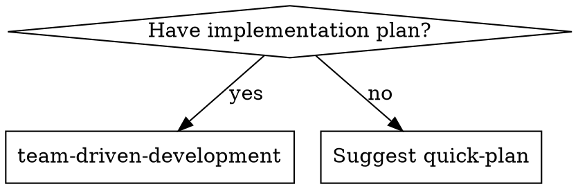

# Prompt Deduplication and Compression Implementation Plan

> **For agentic workers:** Use team-driven-development to execute this plan.

**Goal:** Eliminate ~139 lines of duplicated or verbose content across the plugin's skill and agent prompts, with zero behavior change.

**Architecture:** Five independent edits across three files. Each task verifies current state, applies a single scoped change, verifies the result with `grep`, and commits. All tasks touch disjoint regions of `SKILL.md` (or different files) and can be executed sequentially in plan order.

**Tech Stack:** Markdown prompts only. Verification uses `grep` — no test framework.

---

## File Structure

| File | Responsibility | Tasks |
|------|----------------|-------|
| `skills/team-driven-development/sprint-contract-template.md` | Orphan template (will be removed) | Task 1 |
| `skills/team-driven-development/SKILL.md` | Master orchestrator skill | Tasks 2, 3, 4 |
| `agents/worker.md` | Worker agent definition | Task 5 |

Tasks are ordered but independent. Each task is a standalone commit; the plan can be paused after any commit.

---

## Task 1: Delete orphan Sprint Contract template

**Files:**
- Delete: `skills/team-driven-development/sprint-contract-template.md`

- [ ] **Step 1: Verify orphan status (no live references)**
Run: `grep -rn "skills/team-driven-development/sprint-contract-template.md" --exclude-dir=docs --exclude-dir=.git .`
Expected: no output. (Matches inside `docs/` — historical planning archives and the current spec/plan — are acceptable and excluded here.)

- [ ] **Step 2: Verify the root template is the one actually referenced**
Run: `grep -n "sprint-contract-template.md" skills/team-driven-development/SKILL.md`
Expected: one match pointing at `templates/sprint-contract-template.md` (root template, not the skill-embedded one).

- [ ] **Step 3: Delete the orphan file**
```bash
git rm skills/team-driven-development/sprint-contract-template.md
```

- [ ] **Step 4: Verify deletion**
Run: `test ! -f skills/team-driven-development/sprint-contract-template.md && echo OK`
Expected: `OK`

- [ ] **Step 5: Commit**
```bash
git commit -m "refactor: delete orphan sprint-contract-template.md

Duplicate of templates/sprint-contract-template.md with no live
references. SKILL.md:202 points at the root template. Removes 115
lines of unused content."
```

---

## Task 2: Consolidate Severity/Verdict mapping

**Files:**
- Modify: `skills/team-driven-development/SKILL.md`

- [ ] **Step 1: Confirm `agents/reviewer.md` holds the canonical table**
Run: `grep -n "| critical |" agents/reviewer.md`
Expected: one match (the Severity table row for critical).

- [ ] **Step 2: Locate the duplicate table in SKILL.md**
Run: `grep -n "### Verdict Rules" skills/team-driven-development/SKILL.md`
Expected: one match (around line 264).

- [ ] **Step 3: Replace the Verdict Rules table with a pointer**

In `skills/team-driven-development/SKILL.md`, replace:

```markdown
### Verdict Rules

| Severity | Impact |
|----------|--------|
| critical | REQUEST_CHANGES — security, data loss, production failure |
| major | REQUEST_CHANGES — spec mismatch, test failure, feature breakage |
| minor/recommendation | No impact (APPROVE) |
```

with:

```markdown
### Verdict Rules

Severity → verdict mapping is defined in `agents/reviewer.md`. The Lead applies the same rules when running a static-profile review.
```

- [ ] **Step 4: Verify replacement**
Run: `grep -A2 "### Verdict Rules" skills/team-driven-development/SKILL.md`
Expected: heading followed by the pointer sentence — no table row.

Run: `grep -c "| critical | REQUEST_CHANGES" skills/team-driven-development/SKILL.md`
Expected: `0`

- [ ] **Step 5: Commit**
```bash
git add skills/team-driven-development/SKILL.md
git commit -m "refactor: consolidate verdict rules to agents/reviewer.md

The severity → verdict table existed in both agents/reviewer.md and
SKILL.md with identical semantics. Replace SKILL.md copy with a
pointer. agents/reviewer.md is the authoritative source (loaded
automatically when the Reviewer subagent is dispatched)."
```

---

## Task 3: Replace "When to Use" digraph with one sentence

**Files:**
- Modify: `skills/team-driven-development/SKILL.md`

- [ ] **Step 1: Confirm the digraph currently exists**
Run: `grep -n "digraph when_to_use" skills/team-driven-development/SKILL.md`
Expected: one match (around line 15).

- [ ] **Step 2: Replace the digraph block with a single sentence**

In `skills/team-driven-development/SKILL.md`, replace:

````markdown
## When to Use



- You have an implementation plan to execute
- Simple plans automatically trigger Lite Mode suggestion
````

with:

```markdown
## When to Use

You have an implementation plan to execute. No plan → suggest the `quick-plan` skill first. Simple plans automatically trigger Lite Mode suggestion.
```

- [ ] **Step 3: Verify digraph is gone**
Run: `grep -c "digraph when_to_use" skills/team-driven-development/SKILL.md`
Expected: `0`

- [ ] **Step 4: Verify replacement text is present**
Run: `grep -n 'No plan → suggest the' skills/team-driven-development/SKILL.md`
Expected: one match inside the `## When to Use` section.

- [ ] **Step 5: Commit**
```bash
git add skills/team-driven-development/SKILL.md
git commit -m "refactor: replace When to Use digraph with one sentence

The 9-line DOT digraph expressed a simple binary decision (plan present
→ execute, no plan → suggest quick-plan). Inline to one sentence."
```

---

## Task 4: Merge Quick Score and Mode Selection into one section

**Files:**
- Modify: `skills/team-driven-development/SKILL.md`

- [ ] **Step 1: Confirm the current two-section structure**
Run: `grep -n "^### Quick Score$\|^### Mode Selection$" skills/team-driven-development/SKILL.md`
Expected: exactly two matches — one `### Quick Score` heading and one `### Mode Selection` heading.

- [ ] **Step 2: Replace the two sections with a single merged section**

In `skills/team-driven-development/SKILL.md`, replace:

```markdown
### Quick Score

| Factor | 0 | +1 | +2 |
|--------|---|----|----|
| Tasks | 1-2 | 3-4 | 5+ |
| Files | ≤3 | 4-6 | 7+ |
| Domains | single | multiple | — |
| Design keywords | — | present | — |

Design keywords: architecture, migration, security, API design.

### Mode Selection

- `--lite` → Lite. If Score > 1: "Plan has Quick Score [N] — typically Full Mode. Proceeding Lite as requested."
- `--full` → Full, skip proposal.
- Auto: Score ≤ 1 → propose Lite. Score > 1 → Full.

**Proposal:** "This plan has [N] tasks touching [M] files — lightweight enough for direct execution. Use Lite Mode? **Yes** — direct execution + single review. **No** — full team process."
```

with:

```markdown
### Quick Score → Mode Selection

| Factor | 0 | +1 | +2 |
|--------|---|----|----|
| Tasks | 1-2 | 3-4 | 5+ |
| Files | ≤3 | 4-6 | 7+ |
| Domains | single | multiple | — |
| Design keywords (architecture, migration, security, API design) | — | present | — |

- `--lite` → Lite Mode. If total > 1: `"Plan has Quick Score [N] — typically Full Mode. Proceeding Lite as requested."`
- `--full` → Full Mode, skip proposal.
- Auto: Score ≤ 1 → propose Lite. Score > 1 → Full.

**Proposal (auto, Score ≤ 1):** "This plan has [N] tasks touching [M] files — lightweight enough for direct execution. Use Lite Mode? **Yes** — direct execution + single review. **No** — full team process."
```

- [ ] **Step 3: Verify the merged heading is present**
Run: `grep -c "^### Quick Score → Mode Selection$" skills/team-driven-development/SKILL.md`
Expected: `1`

- [ ] **Step 4: Verify the old headings are gone**
Run: `grep -c "^### Quick Score$\|^### Mode Selection$" skills/team-driven-development/SKILL.md`
Expected: `0`

- [ ] **Step 5: Commit**
```bash
git add skills/team-driven-development/SKILL.md
git commit -m "refactor: merge Quick Score and Mode Selection

These adjacent sections shared a single score → mode mapping and are
clearer together. Consolidated the factor table, inlined the design
keywords note, and clarified the auto-proposal condition."
```

---

## Task 5: Inline Worker Status labels into the Report section

**Files:**
- Modify: `agents/worker.md`

- [ ] **Step 1: Verify current dual-location structure**
Run: `grep -n "^## Status Definitions$\|- \*\*Status:\*\*" agents/worker.md`
Expected: two matches — the `- **Status:**` bullet inside the Report section (around line 31), and the standalone `## Status Definitions` heading (around line 45).

- [ ] **Step 2: Expand the one-line Status bullet into an inline block**

In `agents/worker.md`, replace:

```markdown
- **Status:** DONE | DONE_WITH_CONCERNS | BLOCKED | NEEDS_CONTEXT
```

with:

```markdown
- **Status:** one of
  - `DONE` — Complete, tests pass, self-review clean
  - `DONE_WITH_CONCERNS` — Complete but doubts about correctness/scope/approach
  - `NEEDS_CONTEXT` — Missing information. Specify what you need
  - `BLOCKED` — Cannot complete. Describe blocker and what you tried
```

- [ ] **Step 3: Delete the standalone Status Definitions section**

In `agents/worker.md`, delete this entire block:

```markdown
## Status Definitions

- **DONE** — Complete, tests pass, self-review clean
- **DONE_WITH_CONCERNS** — Complete but doubts about correctness/scope/approach
- **NEEDS_CONTEXT** — Missing information. Specify what you need
- **BLOCKED** — Cannot complete. Describe blocker and what you tried
```

- [ ] **Step 4: Verify result**
Run: `grep -c "^## Status Definitions$" agents/worker.md`
Expected: `0`

Run: `grep -c 'Status:\*\* one of' agents/worker.md`
Expected: `1`

Run: `grep -c '\`DONE\` — Complete' agents/worker.md`
Expected: `1` (the inlined definition, no second copy).

- [ ] **Step 5: Commit**
```bash
git add agents/worker.md
git commit -m "refactor: inline Worker status labels into Report section

Status Definitions was a standalone section restating the labels
already listed in the Status bullet. Merged into a single Report
bullet with inline definitions."
```

---

## Final Acceptance Criteria

After all five tasks complete, all of the following must hold:

- [ ] File `skills/team-driven-development/sprint-contract-template.md` does not exist.
- [ ] `skills/team-driven-development/SKILL.md` contains no `| critical | REQUEST_CHANGES` table row.
- [ ] `skills/team-driven-development/SKILL.md` contains no `digraph when_to_use` block.
- [ ] `skills/team-driven-development/SKILL.md` contains exactly one heading `### Quick Score → Mode Selection` and zero `### Quick Score` / `### Mode Selection` headings.
- [ ] `agents/worker.md` contains no `## Status Definitions` heading and exactly one `Status:** one of` bullet with the four labels inlined.
- [ ] `git diff --stat main...HEAD` shows a net removal of roughly 130+ lines concentrated in the three target files.

**Expected total reduction:** ~139 lines (115 + 7 + 8 + 4 + 5).
