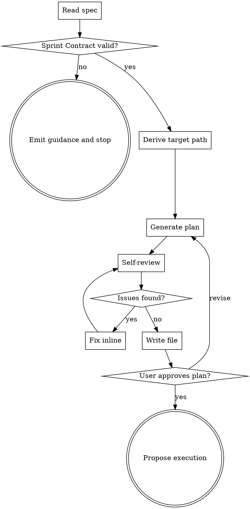
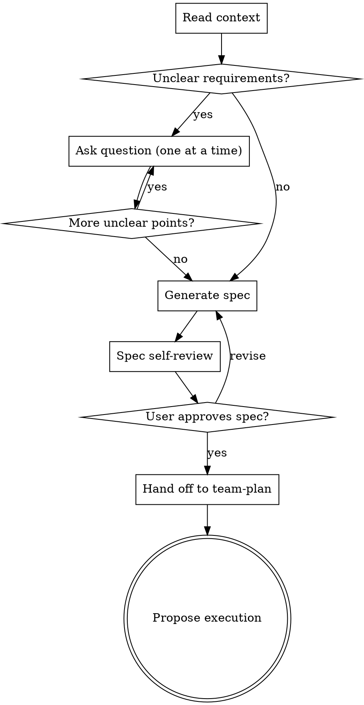

# team-plan Implementation Plan

> **For agentic workers:** Use team-driven-development to execute this plan. Steps use checkbox (`- [ ]`) syntax for tracking.

**Goal:** Add a `team-plan` skill to the team-driven-development plugin that generates token-optimized implementation plans from specs, and migrate `deep-brainstorm`/`quick-plan`/docs to route plan generation through it.

**Architecture:** `team-plan` is a markdown-only Skill under `skills/team-plan/`. It consumes a spec file containing a `## Sprint Contract` section and writes a plan to `docs/team-dd/plans/`. Supporting fixtures live in `skills/team-plan/fixtures/`. Handoff references in `deep-brainstorm`, `quick-plan`, `CLAUDE.md`, and public README files are updated to point to `team-plan`.

**Tech Stack:** Markdown (Claude Code Skill format), Graphviz DOT (process-flow diagram), shell (git, grep) for verification.

**Spec:** `docs/team-dd/specs/2026-04-17-team-plan-design.md` (authoritative; consult for rationale/decisions)

---

## Sprint Contract (Common)

- Profile: static
- Shared Criteria:
  - Every file path referenced in a task exists after the commit step
  - No task contains `TBD`, `TODO`, `fill in later`, or `implement later` in the final committed state
  - Every grep-based verification passes with the expected match count stated in the step
  - After a commit step, `git status` reports a clean tree

> Task-level `Sprint Contract:` sections OVERRIDE these defaults per key.

---

## File Structure

| File | Status | Responsibility |
| --- | --- | --- |
| `skills/team-plan/SKILL.md` | Create | The `team-plan` skill definition — invocation, input/output contract, plan template, self-review, error handling |
| `skills/team-plan/fixtures/valid-spec.md` | Create | Smoke-test fixture — a minimal spec with a valid `## Sprint Contract` section |
| `skills/team-plan/fixtures/missing-contract-spec.md` | Create | Fail-fast-test fixture — a spec intentionally missing the `## Sprint Contract` section |
| `skills/deep-brainstorm/SKILL.md` | Modify | Replace `writing-plans` handoff references with `team-plan` |
| `skills/quick-plan/SKILL.md` | Modify | Replace inline plan-generation steps with a handoff to `team-plan` after spec approval; keep spec-generation steps untouched |
| `CLAUDE.md` | Modify | Update the "Executes plans created by ... `writing-plans`" note to reflect that `team-plan` is now the in-plugin writer |
| `README.md` | Modify | Update the flow description and references that mention `writing-plans` as the plugin's plan writer |
| `docs/README.ja.md` | Modify | Mirror the `README.md` changes in Japanese |
| `guidelines/writing.md` | Modify | Update the guideline lines that reference `writing-plans` alongside `quick-plan` |

---

### Task 1: Create the valid-spec test fixture

**Files:**
- Create: `skills/team-plan/fixtures/valid-spec.md`

- [ ] **Step 1: Write the failing verification**

The verification is a shell command that succeeds only after the fixture exists and contains the required markers.

Run:
```bash
test -f skills/team-plan/fixtures/valid-spec.md \
  && grep -c '^## Sprint Contract$' skills/team-plan/fixtures/valid-spec.md \
  && grep -c '^- Profile: static$' skills/team-plan/fixtures/valid-spec.md
```
Expected once passing: exit code 0 and two lines printing `1` and `1`.

- [ ] **Step 2: Run verification to confirm it fails**

Run the exact command from Step 1 from the repository root (`/Users/tar/personal/team-driven-development`).
Expected: FAIL with `test: skills/team-plan/fixtures/valid-spec.md: No such file or directory` and non-zero exit (the file does not exist yet).

- [ ] **Step 3: Create the fixture file**

Create `skills/team-plan/fixtures/valid-spec.md` with exactly this content:

```markdown
# Reverse String Design

## Overview

A toy spec used as a smoke-test fixture for the team-plan skill.

## Motivation

- Exercise team-plan against a spec with a valid Sprint Contract.

## Design

### Goal

Add a `reverse_string(s: str) -> str` function in `src/util.py`.

## Sprint Contract

- Profile: static
- Shared Criteria:
  - Unit test passes
  - Linter passes

## File Changes

| File | Status | Purpose |
| --- | --- | --- |
| `src/util.py` | Create | Houses `reverse_string` |
| `tests/test_util.py` | Create | Unit tests for `reverse_string` |
```

- [ ] **Step 4: Run verification to confirm it passes**

Run the exact command from Step 1.
Expected: exit code 0 and two lines printing `1` and `1` (one match for each grep).

- [ ] **Step 5: Commit**

```bash
git add skills/team-plan/fixtures/valid-spec.md
git commit -m "test(team-plan): add valid-spec fixture for smoke tests"
```

---

### Task 2: Create the missing-contract-spec test fixture

**Files:**
- Create: `skills/team-plan/fixtures/missing-contract-spec.md`

- [ ] **Step 1: Write the failing verification**

Verification succeeds only after the file exists AND does NOT contain `## Sprint Contract`.

Run:
```bash
test -f skills/team-plan/fixtures/missing-contract-spec.md \
  && ! grep -q '^## Sprint Contract$' skills/team-plan/fixtures/missing-contract-spec.md \
  && echo OK
```
Expected once passing: exit code 0 and `OK` printed.

- [ ] **Step 2: Run verification to confirm it fails**

Run the exact command from Step 1.
Expected: FAIL with `test: skills/team-plan/fixtures/missing-contract-spec.md: No such file or directory`.

- [ ] **Step 3: Create the fixture file**

Create `skills/team-plan/fixtures/missing-contract-spec.md` with exactly this content:

```markdown
# Incomplete Design

## Overview

A fixture that intentionally omits the Sprint Contract section so team-plan can be tested for fail-fast behavior.

## Motivation

- Verify that team-plan stops without writing a plan when `## Sprint Contract` is absent.

## Design

### Goal

Ensure team-plan emits the documented guidance message and exits before writing any file.
```

- [ ] **Step 4: Run verification to confirm it passes**

Run the exact command from Step 1.
Expected: exit code 0 and `OK` printed.

- [ ] **Step 5: Commit**

```bash
git add skills/team-plan/fixtures/missing-contract-spec.md
git commit -m "test(team-plan): add missing-contract fixture for fail-fast test"
```

---

### Task 3: Create SKILL.md with frontmatter and announce line

**Files:**
- Create: `skills/team-plan/SKILL.md`

**Spec ref:** `docs/team-dd/specs/2026-04-17-team-plan-design.md#skill-identity`

- [ ] **Step 1: Write the failing verification**

Run:
```bash
test -f skills/team-plan/SKILL.md \
  && grep -c '^name: team-plan$' skills/team-plan/SKILL.md \
  && grep -c 'I.m using team-plan' skills/team-plan/SKILL.md
```
Expected once passing: exit code 0 and two lines printing `1` and `1`.

- [ ] **Step 2: Run verification to confirm it fails**

Run the exact command from Step 1.
Expected: FAIL with `test: skills/team-plan/SKILL.md: No such file or directory`.

- [ ] **Step 3: Create SKILL.md with the initial scaffolding**

Create `skills/team-plan/SKILL.md` with exactly this content:

```markdown
---
name: team-plan
description: Team-driven-development plan writer. Converts a spec (with Sprint Contract) into a token-optimized implementation plan for Lead/Worker/Reviewer agents.
---

# Team Plan

Write a team-driven-development implementation plan from a spec. Replaces `superpowers:writing-plans` inside this plugin. Plans are hybrid-density (execution artifacts inline, rationale referenced) with a common Sprint Contract plus per-task deltas.

**Announce at start:** "I'm using team-plan to generate an implementation plan from the spec."

<HARD-GATE>
Do NOT write any implementation code or invoke any execution skill until the user has approved the plan. If the spec lacks a `## Sprint Contract` section, stop and emit the guidance message in Error Handling — do not create a partial plan.
</HARD-GATE>
```

- [ ] **Step 4: Run verification to confirm it passes**

Run the exact command from Step 1.
Expected: exit code 0 and two lines printing `1` and `1`.

- [ ] **Step 5: Commit**

```bash
git add skills/team-plan/SKILL.md
git commit -m "feat(team-plan): scaffold SKILL.md with frontmatter and HARD-GATE"
```

---

### Task 4: Add Checklist and Process Flow sections

**Files:**
- Modify: `skills/team-plan/SKILL.md`

**Spec ref:** `docs/team-dd/specs/2026-04-17-team-plan-design.md#generation-flow`

- [ ] **Step 1: Write the failing verification**

Run:
```bash
grep -c '^## Checklist$' skills/team-plan/SKILL.md \
  && grep -c '^## Process Flow$' skills/team-plan/SKILL.md \
  && grep -c 'digraph team_plan' skills/team-plan/SKILL.md
```
Expected once passing: three lines each printing `1`.

- [ ] **Step 2: Run verification to confirm it fails**

Run the exact command from Step 1.
Expected: three `0` lines and non-zero exit (sections not yet present).

- [ ] **Step 3: Append the Checklist and Process Flow sections**

Append the following content to the end of `skills/team-plan/SKILL.md`:

```markdown

## Checklist

1. **Read spec** — open the file at the provided path. Fail if missing.
2. **Validate Sprint Contract** — require `## Sprint Contract` with a `Profile` of `static`, `runtime`, or `browser`. Fail fast if absent or invalid.
3. **Derive target path** — topic = spec filename with the leading `YYYY-MM-DD-` prefix and trailing `-design` suffix removed. Target = `docs/team-dd/plans/YYYY-MM-DD-<topic>.md`.
4. **Generate plan** — write header, common Sprint Contract, File Structure, tasks.
5. **Self-review** — run mechanical checks; fix findings inline.
6. **Write file** — save to target path, report path to caller.
7. **User confirms plan** — wait for approval. Revise on request.
8. **Propose execution** — offer `team-driven-development` handoff.

## Process Flow


```

- [ ] **Step 4: Run verification to confirm it passes**

Run the exact command from Step 1.
Expected: three lines each printing `1`.

- [ ] **Step 5: Commit**

```bash
git add skills/team-plan/SKILL.md
git commit -m "feat(team-plan): add Checklist and Process Flow to SKILL.md"
```

---

### Task 5: Add Invocation, Input, and Output sections

**Files:**
- Modify: `skills/team-plan/SKILL.md`

**Spec ref:** `docs/team-dd/specs/2026-04-17-team-plan-design.md#input`

- [ ] **Step 1: Write the failing verification**

Run:
```bash
grep -c '^## Invocation$' skills/team-plan/SKILL.md \
  && grep -c '^## Input$' skills/team-plan/SKILL.md \
  && grep -c '^## Output$' skills/team-plan/SKILL.md \
  && grep -c '/team-driven-development:team-plan' skills/team-plan/SKILL.md
```
Expected once passing: four lines each printing `1`.

- [ ] **Step 2: Run verification to confirm it fails**

Run the exact command from Step 1.
Expected: four `0` lines and non-zero exit.

- [ ] **Step 3: Append Invocation, Input, Output sections**

Append the following content to the end of `skills/team-plan/SKILL.md`:

```markdown

## Invocation

```
/team-driven-development:team-plan <spec-path>
```

- Single argument: absolute or repo-relative spec path.
- Supported equally: direct human invocation and handoff from `deep-brainstorm` or `quick-plan`.

## Input

- Spec markdown at the provided path.
- MUST contain `## Sprint Contract` (case-insensitive, level-2 heading).
- Inside that section, MUST contain a `Profile` field whose value is `static`, `runtime`, or `browser`.

## Output

- Single plan file at `docs/team-dd/plans/YYYY-MM-DD-<topic>.md`.
- `<topic>` = spec filename with the leading `YYYY-MM-DD-` and trailing `-design` removed.
- English only. Translation files (`docs/team-dd/plans/YYYY-MM-DD-<topic>.<lang>.md`) are created only when the user requests a translation during confirmation.
```

- [ ] **Step 4: Run verification to confirm it passes**

Run the exact command from Step 1.
Expected: four lines each printing `1`.

- [ ] **Step 5: Commit**

```bash
git add skills/team-plan/SKILL.md
git commit -m "feat(team-plan): add Invocation/Input/Output sections"
```

---

### Task 6: Add the Plan File Structure template and inline-content rules

**Files:**
- Modify: `skills/team-plan/SKILL.md`

**Spec ref:** `docs/team-dd/specs/2026-04-17-team-plan-design.md#plan-file-structure`

- [ ] **Step 1: Write the failing verification**

Run:
```bash
grep -c '^## Plan File Structure$' skills/team-plan/SKILL.md \
  && grep -c '^## Inline Content Rules$' skills/team-plan/SKILL.md \
  && grep -c '^## Sprint Contract Override Rules$' skills/team-plan/SKILL.md \
  && grep -c 'Sprint Contract (Common)' skills/team-plan/SKILL.md
```
Expected once passing: four lines each printing `1`.

- [ ] **Step 2: Run verification to confirm it fails**

Run the exact command from Step 1.
Expected: four `0` lines and non-zero exit.

- [ ] **Step 3: Append the template and rule sections**

Append the following content to the end of `skills/team-plan/SKILL.md`:

````markdown

## Plan File Structure

```markdown
# <Feature> Implementation Plan

> **For agentic workers:** Use team-driven-development to execute this plan.

**Goal:** <1 sentence>
**Architecture:** <2-3 sentences>
**Tech Stack:** <key technologies>
**Spec:** <relative path to spec> (authoritative; consult for rationale/decisions)

---

## Sprint Contract (Common)

- Profile: static | runtime | browser
- Shared Criteria:
  - <criterion 1>
  - <criterion 2>

> Task-level `Sprint Contract:` sections OVERRIDE these defaults per key.

---

## File Structure

| File | Status | Responsibility |
| --- | --- | --- |
| <path> | Create / Modify | <one-line responsibility> |

---

### Task N: <name>

**Files:**
- Create: <path>
- Modify: <path>
- Test: <path>

**Spec ref:** <spec-path>#<section-heading>

**Sprint Contract:** <task-level delta, one line per overridden key; omit the section entirely when no delta>

- [ ] Step 1: Write the failing test
  ```<lang>
  <actual test code>
  ```
- [ ] Step 2: Run test to verify it fails
  Run: `<exact command>`
  Expected: FAIL with "<specific message>"
- [ ] Step 3: Write minimal implementation
  ```<lang>
  <actual code>
  ```
- [ ] Step 4: Run test to verify it passes
  Run: `<exact command>`
  Expected: PASS
- [ ] Step 5: Commit
  ```bash
  git add <files>
  git commit -m "<message>"
  ```
```

## Inline Content Rules

- Tests, implementation code, and shell commands are ALWAYS inlined. Workers execute from the plan alone.
- Rationale, Decision Log context, and trade-offs are NEVER inlined. Reference spec sections instead.
- `Spec ref` MUST be a heading anchor (e.g., `<spec-path>#error-handling`). Line-range refs are rejected in self-review.

## Sprint Contract Override Rules

- The common block lives once, immediately after the plan header.
- Per-task overrides list deltas only; do not restate the common block.
- Tasks with no delta omit the `Sprint Contract:` section entirely (absence means "use common as-is").
````

- [ ] **Step 4: Run verification to confirm it passes**

Run the exact command from Step 1.
Expected: four lines each printing `1`.

- [ ] **Step 5: Commit**

```bash
git add skills/team-plan/SKILL.md
git commit -m "feat(team-plan): add plan file structure template and override rules"
```

---

### Task 7: Add Self-Review and Error Handling sections

**Files:**
- Modify: `skills/team-plan/SKILL.md`

**Spec ref:** `docs/team-dd/specs/2026-04-17-team-plan-design.md#self-review`

- [ ] **Step 1: Write the failing verification**

Run:
```bash
grep -c '^## Self-Review$' skills/team-plan/SKILL.md \
  && grep -c '^## Error Handling$' skills/team-plan/SKILL.md \
  && grep -c 'Sprint Contract section not found in' skills/team-plan/SKILL.md \
  && grep -c 'AKIA' skills/team-plan/SKILL.md
```
Expected once passing: four lines each printing `1`.

- [ ] **Step 2: Run verification to confirm it fails**

Run the exact command from Step 1.
Expected: four `0` lines and non-zero exit.

- [ ] **Step 3: Append Self-Review and Error Handling sections**

Append the following content to the end of `skills/team-plan/SKILL.md`:

```markdown

## Self-Review

Mechanical pass after plan generation, before writing the file:

1. **Placeholder scan** — reject `TBD`, `TODO`, `fill in later`, `implement later`, `handle edge cases appropriately`, or any Step that lacks concrete code/command content. Fix inline.
2. **Spec coverage** — every spec requirement maps to at least one task. Add missing tasks.
3. **Type/identifier consistency** — names, paths, and signatures match across tasks.
4. **Spec ref shape** — every `Spec ref` is a heading anchor. Convert line-range refs or remove them.
5. **Override consistency** — task-level Sprint Contract deltas do not restate the common block verbatim.
6. **Secret-like patterns** — redact matches of `AKIA[0-9A-Z]{16}`, `Bearer `, `password=`, `api[_-]?key=` with `<REDACTED>`. Emit a warning line at the top of the plan.

Fix findings inline. Do not dispatch a subagent.

## Error Handling

- **Spec file missing / unreadable:** stop. Emit `Spec file not found: <path>`. Do not create a partial plan.
- **`## Sprint Contract` section missing:** stop before any write. Emit `Sprint Contract section not found in <path>. Either (1) regenerate the spec via deep-brainstorm, (2) add a "## Sprint Contract" section manually, or (3) wait for the sprint-master follow-up skill.`
- **`Profile` value not `static`/`runtime`/`browser`:** stop. Emit `Invalid Profile: <value>. Allowed: static, runtime, browser.`
- **Unfixable contradiction** (task references an identifier no task defines): stop. Report the contradiction; do not write a partial plan.
- **Secrets detected:** redact in the plan and emit a warning line in the plan header. Do not abort. Do not modify the spec.
```

- [ ] **Step 4: Run verification to confirm it passes**

Run the exact command from Step 1.
Expected: four lines each printing `1`.

- [ ] **Step 5: Commit**

```bash
git add skills/team-plan/SKILL.md
git commit -m "feat(team-plan): add Self-Review and Error Handling sections"
```

---

### Task 8: Add User Plan Gate, Execution Handoff, and Key Principles

**Files:**
- Modify: `skills/team-plan/SKILL.md`

**Spec ref:** `docs/team-dd/specs/2026-04-17-team-plan-design.md#output`

- [ ] **Step 1: Write the failing verification**

Run:
```bash
grep -c '^## User Plan Gate$' skills/team-plan/SKILL.md \
  && grep -c '^## Execution Handoff$' skills/team-plan/SKILL.md \
  && grep -c '^## Key Principles$' skills/team-plan/SKILL.md \
  && grep -c 'team-driven-development to execute' skills/team-plan/SKILL.md
```
Expected once passing: four lines each printing `1` (or higher for the last line if already present in other sections).

- [ ] **Step 2: Run verification to confirm it fails**

Run the exact command from Step 1.
Expected: the first three lines print `0`; non-zero exit.

- [ ] **Step 3: Append User Plan Gate, Execution Handoff, and Key Principles**

Append the following content to the end of `skills/team-plan/SKILL.md`:

```markdown

## User Plan Gate

> "Plan written and committed to `<path>`. Please review — any changes before we proceed?"

Wait for the user response. Revise if requested.

## Execution Handoff

After plan confirmation:

> **Plan complete and saved to `<path>`. Execute with team-driven-development?**
> - **Yes** — Invoke team-driven-development to execute the plan
> - **No** — End here (plan is saved for later)

If Yes, invoke the `team-driven-development` skill. Do NOT invoke any superpowers skill.

## Key Principles

- **Inline what executes; reference what explains.** Workers need code and commands at hand; rationale belongs in the spec.
- **Sprint Contract as common plus delta.** Reviewers decide from the plan alone.
- **Fail fast on missing contract.** No interim logic; `sprint-master` is the follow-up.
- **English-only canonical.** Translation only on explicit user request.
- **Self-contained.** No dependency on superpowers skills at runtime.
```

- [ ] **Step 4: Run verification to confirm it passes**

Run the exact command from Step 1.
Expected: four lines each printing `1` or higher.

- [ ] **Step 5: Commit**

```bash
git add skills/team-plan/SKILL.md
git commit -m "feat(team-plan): add user gate, execution handoff, and key principles"
```

---

### Task 9: Verify SKILL.md length is within the NFR budget

**Files:**
- No file changes; verification only.

**Spec ref:** `docs/team-dd/specs/2026-04-17-team-plan-design.md#checklist-snapshot`

**Sprint Contract:**
- Shared Criteria override: Step 4 must not mutate files; no commit required for this task.

- [ ] **Step 1: Write the verification**

Per NFR N5, SKILL.md should be no longer than 80% of `quick-plan`'s length. Compute both line counts and compare.

Run:
```bash
qp=$(wc -l < skills/quick-plan/SKILL.md)
tp=$(wc -l < skills/team-plan/SKILL.md)
ratio=$(awk -v tp="$tp" -v qp="$qp" 'BEGIN { printf "%.2f", tp/qp }')
echo "quick-plan=$qp team-plan=$tp ratio=$ratio"
awk -v tp="$tp" -v qp="$qp" 'BEGIN { exit !(tp <= qp * 0.80) }'
```
Expected once passing: the `echo` prints a ratio ≤ 0.80, and the `awk` exits 0.

- [ ] **Step 2: Run verification to confirm current state**

Run the exact command from Step 1.
Expected: either PASS (ratio ≤ 0.80, exit 0) or FAIL (exit 1 — team-plan is too long).

- [ ] **Step 3: If Step 2 failed, tighten prose**

Re-read each appended section and remove any sentence that restates a prior sentence without adding information. Typical targets: redundant bullets in `Key Principles`, verbose wording in `Error Handling`, or duplicated phrasing between `Inline Content Rules` and `Sprint Contract Override Rules`. Do not delete headings or normative rules.

If Step 2 already passed, skip this step and proceed to Step 4.

- [ ] **Step 4: Re-run the verification**

Run the exact command from Step 1.
Expected: ratio ≤ 0.80, exit 0.

- [ ] **Step 5: Commit if any edits were made**

If Step 3 made changes:

```bash
git add skills/team-plan/SKILL.md
git commit -m "chore(team-plan): tighten prose to meet N5 length budget"
```

If no edits were required, skip the commit — there is nothing to record.

---

### Task 10: Smoke test — run team-plan against the valid-spec fixture

**Files:**
- No file changes directly; may produce `docs/team-dd/plans/<generated>.md` which is added to `.gitignore`-equivalent handling (Step 5 removes it).

**Spec ref:** `docs/team-dd/specs/2026-04-17-team-plan-design.md#testing-strategy`

**Sprint Contract:**
- Shared Criteria override: Step 5 does `git clean`-style removal of generated plan, then asserts a clean tree.

- [ ] **Step 1: Write the expected-behavior checklist**

Create an ad-hoc checklist file for the smoke test. Run:
```bash
cat > /tmp/team-plan-smoke-checklist.txt <<'EOF'
[ ] Output file created at docs/team-dd/plans/<date>-reverse-string.md
[ ] Output starts with "# Reverse String Implementation Plan"
[ ] Output contains "## Sprint Contract (Common)" exactly once
[ ] Output contains "Profile: static"
[ ] Output contains a "## File Structure" heading followed by a table
[ ] Output contains at least one "### Task 1:" heading
[ ] Every Step N in every task contains either inline code or an inline shell command
[ ] No "TBD", "TODO", "fill in later", or "implement later" strings
[ ] No "Spec ref:" line contains "L" followed by a number (no line-range refs)
EOF
cat /tmp/team-plan-smoke-checklist.txt
```
Expected: checklist printed to stdout.

- [ ] **Step 2: Invoke team-plan with the fixture**

If the skill is not yet discoverable by Claude Code, reload plugins first by running `/reload-plugins` in the Claude Code session. Then invoke the skill:

```
/team-driven-development:team-plan skills/team-plan/fixtures/valid-spec.md
```

Record the generated plan path. Expected generated path: `docs/team-dd/plans/<YYYY-MM-DD>-reverse-string.md` where `<YYYY-MM-DD>` is the current date.

- [ ] **Step 3: Run the checklist against the generated plan**

Let `PLAN=docs/team-dd/plans/<YYYY-MM-DD>-reverse-string.md` using the path from Step 2. Run each check:

```bash
PLAN=docs/team-dd/plans/<YYYY-MM-DD>-reverse-string.md
test -f "$PLAN"
head -1 "$PLAN" | grep -qx '# Reverse String Implementation Plan'
grep -c '^## Sprint Contract (Common)$' "$PLAN"   # expect 1
grep -c '^- Profile: static$' "$PLAN"             # expect 1 or more
grep -c '^## File Structure$' "$PLAN"             # expect 1
grep -c '^### Task 1:' "$PLAN"                    # expect 1 or more
! grep -E 'TBD|TODO|fill in later|implement later' "$PLAN"
! grep -E 'Spec ref:.*#[^ ]+:L[0-9]+' "$PLAN"
```
Expected: every command exits 0, grep counts match the annotated expectations.

- [ ] **Step 4: If any check fails, edit `skills/team-plan/SKILL.md` to fix the behavior and re-run**

Identify the failing check from Step 3. The failure points to a specific instruction in `SKILL.md` that was ambiguous or incorrect. Examples:
- Missing `## Sprint Contract (Common)` → strengthen the wording in the Plan File Structure section to mandate the exact heading.
- Line-range refs present → reinforce the Spec ref shape rule in Self-Review.

After editing, repeat Step 2 (re-invoke the skill) and Step 3 (re-run the checks). Loop until all checks pass.

- [ ] **Step 5: Clean up the generated plan and commit any SKILL.md fixes**

```bash
rm -f docs/team-dd/plans/<YYYY-MM-DD>-reverse-string.md
git status
```
Expected `git status` output: clean working tree unless Step 4 modified `skills/team-plan/SKILL.md`.

If `skills/team-plan/SKILL.md` was modified, commit the fixes:
```bash
git add skills/team-plan/SKILL.md
git commit -m "fix(team-plan): resolve smoke-test findings"
```

If nothing changed, skip the commit.

---

### Task 11: Fail-fast test — run team-plan against the missing-contract fixture

**Files:**
- No file changes.

**Spec ref:** `docs/team-dd/specs/2026-04-17-team-plan-design.md#error-handling`

**Sprint Contract:**
- Shared Criteria override: the verification asserts NO file was written; a clean `git status` is part of the assertion.

- [ ] **Step 1: Capture the expected guidance message**

Run:
```bash
cat > /tmp/team-plan-failfast-expected.txt <<'EOF'
Sprint Contract section not found in skills/team-plan/fixtures/missing-contract-spec.md. Either (1) regenerate the spec via deep-brainstorm, (2) add a "## Sprint Contract" section manually, or (3) wait for the sprint-master follow-up skill.
EOF
cat /tmp/team-plan-failfast-expected.txt
```
Expected: the expected message is printed.

- [ ] **Step 2: Invoke team-plan with the failing fixture**

Invoke the skill via Claude Code:

```
/team-driven-development:team-plan skills/team-plan/fixtures/missing-contract-spec.md
```

Capture Claude's response text.

- [ ] **Step 3: Verify the response matches and no file was written**

Run:
```bash
ls docs/team-dd/plans/ | grep -E '^[0-9]{4}-[0-9]{2}-[0-9]{2}-incomplete' || echo "no partial plan created"
git status --porcelain
```
Expected:
- `no partial plan created` printed (no file starting with a date prefix and `incomplete` was created).
- `git status --porcelain` prints nothing (clean tree).

Confirm the Claude response contains exactly the string from `/tmp/team-plan-failfast-expected.txt`. If it does not, the SKILL.md `Error Handling` wording is off.

- [ ] **Step 4: If Step 3 found a file, a dirty tree, or a message mismatch, edit SKILL.md and re-run**

Edit `skills/team-plan/SKILL.md` `Error Handling` section to fix the mismatch. Then repeat Steps 2 and 3.

- [ ] **Step 5: Commit any SKILL.md fixes**

If `skills/team-plan/SKILL.md` was modified:
```bash
git add skills/team-plan/SKILL.md
git commit -m "fix(team-plan): align Error Handling wording with fail-fast test"
```

If nothing changed, skip the commit.

---

### Task 12: Redirect `deep-brainstorm` handoff from `writing-plans` to `team-plan`

**Files:**
- Modify: `skills/deep-brainstorm/SKILL.md`

**Spec ref:** `docs/team-dd/specs/2026-04-17-team-plan-design.md#file-changes`

- [ ] **Step 1: Write the failing verification**

Run:
```bash
grep -c 'writing-plans' skills/deep-brainstorm/SKILL.md   # expect 0 after change
grep -c 'team-plan' skills/deep-brainstorm/SKILL.md       # expect 4 or more after change (handoff, checklist step, integration, testing)
```
Expected once passing: the first grep prints `0`, the second prints at least `4`.

- [ ] **Step 2: Run verification to confirm it fails**

Run the exact command from Step 1.
Expected: the first grep prints a number greater than zero; the current state has `writing-plans` references.

- [ ] **Step 3: Apply the edits**

Make exactly the following seven replacements in `skills/deep-brainstorm/SKILL.md` using the Edit tool; each `old_string` is unique in the file, so no `replace_all` is required.

Edit 1 — headline description (near the top of the file):
- old_string: `` Produce an extended spec with Decision Log and Unresolved Items, validate via fresh-eyes subagent, hand off to `writing-plans`. ``
- new_string: `` Produce an extended spec with Decision Log and Unresolved Items, validate via fresh-eyes subagent, hand off to `team-plan`. ``

Edit 2 — Checklist step 10:
- old_string: `` 10. **Invoke `writing-plans`**. ``
- new_string: `` 10. **Invoke `team-plan`**. ``

Edit 3 — Process Flow diagram terminal node:
- old_string: `    "Invoke writing-plans" [shape=doublecircle];`
- new_string: `    "Invoke team-plan" [shape=doublecircle];`

Edit 4 — Process Flow diagram edge:
- old_string: `    "User approves spec?" -> "Invoke writing-plans" [label="approved"];`
- new_string: `    "User approves spec?" -> "Invoke team-plan" [label="approved"];`

Edit 5 — User Approval message:
- old_string: `> "Spec committed to `<path>`. Subagent review: <PASS / findings surfaced>. Review and let me know before I invoke writing-plans."`
- new_string: `> "Spec committed to `<path>`. Subagent review: <PASS / findings surfaced>. Review and let me know before I invoke team-plan."`

Edit 6 — Integration section `Hands off to` line:
- old_string: `` - **Hands off to**: `writing-plans` after approval. ``
- new_string: `` - **Hands off to**: `team-plan` after approval. ``

Edit 7 — Testing Strategy handoff test line:
- old_string: `` - **Handoff test** — `writing-plans` produces a plan from the spec without information loss. ``
- new_string: `` - **Handoff test** — `team-plan` produces a plan from the spec without information loss. ``

- [ ] **Step 4: Run verification to confirm it passes**

Run the exact command from Step 1.
Expected: the first grep prints `0`; the second grep prints `4` or more (exact value depends on how many lines end up with `team-plan`).

- [ ] **Step 5: Commit**

```bash
git add skills/deep-brainstorm/SKILL.md
git commit -m "refactor(deep-brainstorm): hand off to team-plan instead of writing-plans"
```

---

### Task 13: Rewrite `quick-plan` to delegate plan generation to `team-plan`

**Files:**
- Modify: `skills/quick-plan/SKILL.md`

**Spec ref:** `docs/team-dd/specs/2026-04-17-team-plan-design.md#file-changes`

This task replaces the entire `skills/quick-plan/SKILL.md` file because the change removes a large `## Plan Generation` section (~80 lines) and adds a new `## Handoff to team-plan` section. A single `Write` is cleaner than a chain of multi-line Edits.

- [ ] **Step 1: Write the failing verification**

Run:
```bash
grep -c 'writing-plans' skills/quick-plan/SKILL.md          # expect 0 after change
grep -c 'team-plan'     skills/quick-plan/SKILL.md          # expect at least 4 after change
grep -c '^## Plan Generation$' skills/quick-plan/SKILL.md   # expect 0 after change (section removed)
grep -c '^## Handoff to team-plan$' skills/quick-plan/SKILL.md  # expect 1 after change
```
Expected once passing: `0`, `4 or more`, `0`, `1`.

- [ ] **Step 2: Run verification to confirm it fails**

Run the exact command from Step 1.
Expected current state: first grep prints a positive integer (references to `writing-plans`); third grep prints `1` (section still present); fourth grep prints `0`.

- [ ] **Step 3: Read then rewrite `skills/quick-plan/SKILL.md`**

First use the `Read` tool on `skills/quick-plan/SKILL.md` (the Write tool requires a prior Read). Then use the `Write` tool to replace the file with exactly this content:

````markdown
---
name: quick-plan
description: Lightweight planning skill — generates full-quality spec with minimal dialogue and delegates plan generation to team-plan. Use when requirements are mostly clear but need a spec + plan before execution.
---

# Quick Plan

Generate a full-quality spec with minimal dialogue, then hand off to `team-plan` for implementation-plan generation. Unlike brainstorming (deep-dive questions, approach comparison, section-by-section approval), quick-plan infers what it can from context and only asks about genuinely ambiguous points.

**Announce at start:** "I'm using quick-plan to generate a spec and hand off to team-plan."

<HARD-GATE>
Do NOT write any implementation code or invoke any execution skill until the user has approved both the spec (owned by this skill) and the plan (owned by team-plan).
</HARD-GATE>

## Checklist

1. **Read context** — check relevant files, docs, recent commits related to the request
2. **Clarify unknowns** — ask only genuinely ambiguous points, one at a time (0 questions is valid)
3. **Generate spec** — save to `docs/team-dd/specs/YYYY-MM-DD-<topic>-design.md`, commit
4. **Spec self-review** — placeholder/consistency/scope/ambiguity/Sprint-Contract check, fix inline
5. **User confirms spec** — wait for approval, revise if requested
6. **Hand off to `team-plan`** — invoke `/team-driven-development:team-plan <spec-path>`; team-plan owns plan generation, self-review, and the user plan gate
7. **Propose execution** — after team-plan returns and the plan is approved, offer team-driven-development handoff

## Process Flow



## Clarification Logic

Do NOT deep-dive every aspect of the request. Instead:

- Read the user's request and explore the codebase for relevant context (files, patterns, conventions, recent changes).
- Infer what can be inferred — obvious technology choices, existing patterns to follow, standard approaches.
- Ask ONLY about genuinely ambiguous points — one question at a time, multiple-choice preferred.
- Zero questions is valid. If the requirements are clear from the request + codebase context, proceed directly to spec generation.

**What counts as "genuinely ambiguous":**
- The request can be interpreted in two meaningfully different ways
- A design choice would significantly affect implementation and there's no clear default
- The codebase has no existing pattern to follow for this type of change

**Fallback when the user defers a decision:**

When the user responds with "either is fine", "I'll leave it to you", "up to you", or similar deferral:

1. **Select the best possible method** — choose the approach that most comprehensively satisfies all potential requests and requirements, even if it results in broader scope than the minimal interpretation.
2. **Do not default to the conservative/minimal option.** The user has delegated judgment to you — use that trust to produce the strongest design. A comprehensive plan that covers edge cases and related concerns is preferable to a narrow one that leaves gaps.
3. **Note the deferred decision in the spec** — record what the user deferred, which option you chose, and why. Format: `**Deferred decision:** [question] → Chose [option] because [reasoning]`
4. This applies per-question. If the user defers one question but answers another specifically, respect their specific answer and apply this rule only to the deferred one.

## Spec Generation

Save to: `docs/team-dd/specs/YYYY-MM-DD-<topic>-design.md`

The spec covers the same ground as a brainstorming-produced spec — full quality, not abbreviated. Scale each section to the complexity it deserves.

### Spec Structure

```markdown
# [Feature Name] Design

## Overview
[What this feature does and why — 2-3 sentences]

## Motivation
[Why this change is needed — bullet points]

## Design

### [Section per major component or decision]
[Architecture, components, data flow, interfaces — scaled to complexity]

### Error Handling
[How errors are handled — omit if trivial]

### Testing Strategy
[What to test and how — types of tests, key scenarios]

## Sprint Contract
[Required by team-plan. Contains `Profile: static | runtime | browser` and Shared Criteria bullets.]

## File Changes
[New files, modified files, not modified — table format]
```

### Spec Self-Review

After writing the spec, review with fresh eyes:

1. **Placeholder scan** — No TBD, TODO, incomplete sections, or vague requirements. Fix them.
2. **Internal consistency** — No contradictions between sections. Architecture matches feature descriptions.
3. **Scope check** — Focused enough for a single implementation plan. If not, flag for decomposition.
4. **Ambiguity check** — No requirement interpretable two ways. Pick one and make it explicit.
5. **Sprint Contract present** — The spec contains a `## Sprint Contract` section with a `Profile` of `static`, `runtime`, or `browser`. team-plan fails fast without this.

Fix issues inline immediately. Then commit and ask the user to confirm.

### User Spec Gate

> "Spec written and committed to `<path>`. Please review — any changes before I hand off to team-plan?"

Wait for user response. Revise if requested. Only proceed to the team-plan handoff after approval.

## Handoff to team-plan

After the user approves the spec, invoke `team-plan` with the spec path:

```
/team-driven-development:team-plan <spec-path>
```

`team-plan` owns plan generation, plan self-review, and the user plan gate. When `team-plan` returns and the plan has been approved, proceed to Execution Handoff.

## Execution Handoff

After plan confirmation:

> **Plan complete and saved to `<path>`. Execute with team-driven-development?**
> - **Yes** — Invoke team-driven-development to execute the plan
> - **No** — End here (plan is saved for later)

If Yes: invoke the team-driven-development skill. Do NOT invoke any superpowers skill.

## Key Principles

- **Infer, don't interrogate** — Use codebase context to fill in gaps. Only ask what you truly cannot infer.
- **Full-quality output** — The process is light; the spec is not. Spec meets the same standard as brainstorming.
- **One question at a time** — When you do need to ask, keep it focused. Multiple-choice preferred.
- **YAGNI unless deferred** — Don't design features the user didn't ask for. But when the user defers a decision to you, choose the most comprehensive approach that fully satisfies all potential requirements.
- **Self-contained on spec, delegated on plan** — Spec generation is in-skill; plan generation is delegated to team-plan. No dependency on superpowers skills.
````

- [ ] **Step 4: Run verification to confirm it passes**

Run the exact command from Step 1.
Expected: `0`, `4 or more`, `0`, `1`.

- [ ] **Step 5: Commit**

```bash
git add skills/quick-plan/SKILL.md
git commit -m "refactor(quick-plan): delegate plan generation to team-plan"
```

---

### Task 14: Update `CLAUDE.md`, `README.md`, `docs/README.ja.md`, and `guidelines/writing.md`

**Files:**
- Modify: `CLAUDE.md`
- Modify: `README.md`
- Modify: `docs/README.ja.md`
- Modify: `guidelines/writing.md`

**Spec ref:** `docs/team-dd/specs/2026-04-17-team-plan-design.md#file-changes`

- [ ] **Step 1: Write the failing verification**

Run:
```bash
grep -Hn 'writing-plans' CLAUDE.md README.md docs/README.ja.md guidelines/writing.md
```
Expected once passing: no output (no matches remain in these files). Exit code 1 (grep found nothing).

- [ ] **Step 2: Run verification to confirm it fails**

Run the exact command from Step 1.
Expected: matching lines are printed for each file; exit code 0.

- [ ] **Step 3: Apply the edits**

Edit `CLAUDE.md`:
- old_string: `` Executes plans created by the Superpowers `writing-plans` skill using a team composition. ``
- new_string: `` Executes plans created by the `team-plan` skill (or, for historical specs, the Superpowers `writing-plans` skill) using a team composition. ``

Edit `README.md` — flow line:
- old_string: `brainstorming → writing-plans → team-driven-development`
- new_string: `brainstorming → team-plan → team-driven-development`

Edit `README.md` — descriptive paragraph:
- old_string: `` For tasks that need deep exploration — multiple approach comparisons, section-by-section design approval, visual mockups — use the full Superpowers flow. The `writing-plans` skill produces a plan. When choosing an execution method, select Team-Driven Development for complex plans that benefit from role specialization. ``
- new_string: `` For tasks that need deep exploration — multiple approach comparisons, section-by-section design approval, visual mockups — use the `deep-brainstorm` skill. The `team-plan` skill produces the implementation plan from the approved spec. Execute with Team-Driven Development for complex plans that benefit from role specialization. ``

Edit `docs/README.ja.md` — flow line:
- old_string: `brainstorming → writing-plans → team-driven-development`
- new_string: `brainstorming → team-plan → team-driven-development`

Edit `docs/README.ja.md` — descriptive paragraph:
- old_string: `` 深い探索が必要なタスク — 複数アプローチの比較、セクションごとの設計承認、ビジュアルモックアップ — には Superpowers のフルフローを使用してください。`writing-plans` スキルがプランを出力します。実行方法の選択時に、役割分担が効果的な複雑なプランで Team-Driven Development を選択してください。 ``
- new_string: `` 深い探索が必要なタスク — 複数アプローチの比較、セクションごとの設計承認、ビジュアルモックアップ — には `deep-brainstorm` スキルを使用してください。承認済み spec から `team-plan` スキルが実装プランを出力します。役割分担が効果的な複雑なプランで Team-Driven Development を実行方法として選択してください。 ``

Edit `guidelines/writing.md` — header origin line:
- old_string: `- Start with the `writing-plans` header (Goal / Architecture / Tech Stack).`
- new_string: `- Start with the `team-plan` header (Goal / Architecture / Tech Stack / Spec).`

Edit `guidelines/writing.md` — Plan definition line:
- old_string: `` - **Plan**: output of `writing-plans` / `quick-plan`. ``
- new_string: `` - **Plan**: output of `team-plan` (invoked directly or via `quick-plan` / `deep-brainstorm`). ``

- [ ] **Step 4: Run verification to confirm it passes**

Run the exact command from Step 1.
Expected: no output; grep exits non-zero (no matches).

- [ ] **Step 5: Commit**

```bash
git add CLAUDE.md README.md docs/README.ja.md guidelines/writing.md
git commit -m "docs: route plan generation through team-plan"
```

---

### Task 15: End-to-end handoff sanity check

**Files:**
- No file changes expected. This task is a read-only verification.

**Spec ref:** `docs/team-dd/specs/2026-04-17-team-plan-design.md#testing-strategy`

**Sprint Contract:**
- Shared Criteria override: final step asserts a clean `git status` (no residual changes).

- [ ] **Step 1: Write the verification**

Run these greps to confirm the handoff chain is wired end-to-end:

```bash
# deep-brainstorm points at team-plan
grep -c '^10\.\s\+\*\*Invoke `team-plan`\*\*' skills/deep-brainstorm/SKILL.md   # expect 1
grep -c 'writing-plans' skills/deep-brainstorm/SKILL.md                       # expect 0

# quick-plan delegates to team-plan
grep -c 'Hand off to `team-plan`' skills/quick-plan/SKILL.md                   # expect 1
grep -c 'writing-plans' skills/quick-plan/SKILL.md                            # expect 0

# team-plan's own handoff message exists
grep -c 'Execute with team-driven-development?' skills/team-plan/SKILL.md      # expect 1

# README / CLAUDE.md mention team-plan
grep -c 'team-plan' README.md docs/README.ja.md CLAUDE.md                      # each expect at least 1
```
Expected counts are annotated above each line.

- [ ] **Step 2: Run the verification**

Run all commands from Step 1 sequentially. Record any mismatch.
Expected: every count matches the annotation.

- [ ] **Step 3: Fix mismatches inline**

For any count that doesn't match: identify which Task (12, 13, or 14) owned the corresponding edit and re-apply the missing portion. Re-run Step 2 until every count matches.

- [ ] **Step 4: Verify clean tree**

Run:
```bash
git status --porcelain
```
Expected: no output (clean tree) if Step 3 made no new changes; otherwise the changed files are listed pending commit.

- [ ] **Step 5: Commit any fixes**

If Step 3 modified files:
```bash
git add <modified files>
git commit -m "fix: tighten team-plan handoff wiring after end-to-end check"
```

If nothing changed, skip the commit.
