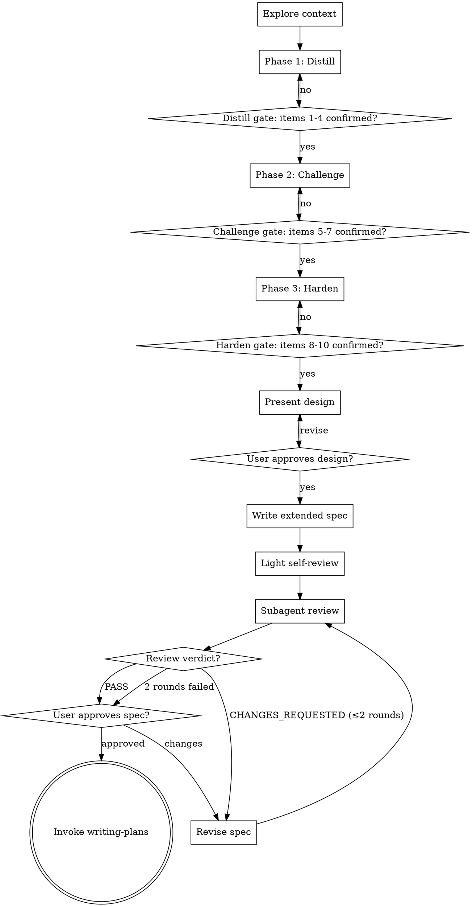

# Deep Brainstorm

Forge a vague idea into a specified design through three phases — Distill, Challenge, Harden. Produce an extended spec with Decision Log and Unresolved Items, validate via fresh-eyes subagent, hand off to `writing-plans`.

Unlike `brainstorming`: stronger pushback, Claude-surfaced concerns, external review instead of self-review. Use for vague or high-stakes requirements, or when decision reasoning must survive into the spec.

**Announce at start:** "I'm using deep-brainstorm to run Distill/Challenge/Harden phases and produce an extended spec."

<HARD-GATE>
No implementation skill, code, or scaffolding until user approves the spec. No phase advancement until owned items are `confirmed`/`N/A`. No spec file until all ten base items resolved AND design approved.
</HARD-GATE>

## Checklist

Create a task for each item and complete in order:

1. **Explore context** — related files, docs, recent commits.
2. **Phase 1 Distill** — restate, surface ambiguity, resolve Purpose / Success criteria / Scope / Users.
3. **Phase 2 Challenge** — counter-proposals, stress-test, resolve Alternatives / Assumptions / Constraints.
4. **Phase 3 Harden** — Risks / Security / NFR + Surfaced Concerns.
5. **Present design** — section-by-section user approval.
6. **Write extended spec** — `docs/team-dd/specs/YYYY-MM-DD-<topic>-design.md`, commit.
7. **Light self-review** — placeholders + obvious contradictions (~30s).
8. **Subagent review** — dispatch with `prompts/reviewer.md`; revise on `CHANGES_REQUESTED`, max 2 rounds.
9. **User approves spec**.
10. **Invoke `writing-plans`**.

## Process Flow



## Three Phases

Phase ends when owned items are `confirmed` or `N/A`. `N/A` reasons go in the Decision Log.

### Phase 1 — Distill

Resolve Purpose, Success criteria, Scope boundaries, Users/stakeholders.

**Turn format: structured three-part (strict).**

```
[Phase 1 Distill | Unresolved: <item numbers> | Added: <surfaced or none>]

📌 Understanding: <1-2 sentence restatement>
🔍 Gaps: <2-3 bullet points>
❓ Question: <one question, multiple-choice preferred>
```

Status line required every turn. 📌/🔍/❓ required until Phase 1 items confirmed.

Owned items: 1 Purpose, 2 Success criteria, 3 Scope boundaries, 4 Users/stakeholders.

### Phase 2 — Challenge

Counter-proposals, stress-tests, resolve Alternatives / Assumptions / Constraints.

**Turn format: dynamic, counter-proposal-centric.** Status line required; 📌/🔍/❓ optional. Counter-proposals need real motivation (see Anti-Patterns).

Present 2–3 alternatives per major decision with trade-offs and a recommended option. Record everything in the Decision Log — user acceptance doesn't matter.

Owned items: 5 Alternatives considered, 6 Assumptions, 7 Major constraints.

### Phase 3 — Harden

Probe Risks / Security / NFR. Status line required.

**Turn format: dynamic.** Targeted probes at unresolved items; proposal-style confirmation OK ("I'll proceed with X unless you object"). Use lowest-confidence item (see Confidence Signal) to pick the next probe.

Owned items: 8 Risks, 9 Security, 10 NFR.

## Checklist and Termination Gate

10-item floor; extendable via Surfaced Concerns. Each item: `unknown` / `draft` / `confirmed` / `N/A`.

| # | Item | Phase |
|---|---|---|
| 1 | Purpose | Distill |
| 2 | Success criteria | Distill |
| 3 | Scope boundaries | Distill |
| 4 | Users / stakeholders | Distill |
| 5 | Alternatives considered | Challenge |
| 6 | Assumptions | Challenge |
| 7 | Major constraints | Challenge |
| 8 | Risks | Harden |
| 9 | Security | Harden |
| 10 | NFR (performance, reliability) | Harden |

### Phase Gate

Phase ends when every owned item is `confirmed` or `N/A`. No advancement otherwise.

### Final Gate

After all ten base items + Surfaced Concerns resolved, present design for user approval. Explicit approval terminates. No spec file before this.

### Confidence Signal (internal only)

Self-rate confidence per unresolved item each turn. Use the **lowest-confidence item** to pick the next question. **Never a gate** — prioritization only. LLM self-confidence is miscalibrated; don't treat confidence as correctness.

### Status Line

Every turn starts:

```
[Phase <N> <name> | Unresolved: <item numbers> | Added: <surfaced or none>]
```

## Surfaced Concerns

The 10-item list is a floor. Raise any additional concern blocking design as a Surfaced Concern:

```
⚠ Surfaced concern: <title> — <why it matters>. Add to checklist? (**Add / Decline / Defer**)
```

Route the response:

- **Add** — becomes item #11+, must reach `confirmed` before owning phase closes. Assign to the matching phase (or current if ambiguous).
- **Decline** — record in Decision Log → Declined concerns with reason.
- **Defer** — record in Unresolved Items (blocks implementation).

No surfaced concern is silently dropped. This makes Claude co-responsible for coverage.

**When to surface:** only concerns that block design. Implementation details (library choice, etc.) belong in the plan. >2 per phase = scope creep warning.

## Anti-Patterns

1. **Checklist theater** — asking to tick boxes. If you can't articulate what info you need, don't ask.
2. **Contrarianism** — alternatives without motivation. Every alternative needs an explicit reason it may beat the current direction.
3. **Scope creep via surfacing** — surface only what blocks design. Not implementation details, not nice-to-haves.
4. **Question bombing** — >1 question per turn. Pick the most important; queue the rest.
5. **Premature design** — designing before owned items resolved. Hard-gated.
6. **Review laundering** — accepting `PASS` without reading observations. Reviewers approve with notes; read them.

## Extended Spec Format

Save to: `docs/team-dd/specs/YYYY-MM-DD-<topic>-design.md`.

Adds three sections over brainstorming spec: **Decision Log**, **Unresolved Items**, **Checklist Snapshot**.

### Spec Structure

````markdown
# [Feature Name] Design

## Overview
[What + why — 2-3 sentences]

## Motivation
[Why now — bullets]

## Design
### [Component/decision sections, scaled to complexity]
### Error Handling
### Testing Strategy

## File Changes
[Table: File / Status / Purpose]

---

## Decision Log

### Decision N: [topic]
- **Alternatives considered**: [A / B / C]
- **Chosen**: [option]
- **Reasoning**: [why chosen beats rejected]
- **Declined concerns**: [surfaced items the user dismissed, with reason]

## Unresolved Items
- [ ] [deferred item] — must resolve before implementation

## Checklist Snapshot
| # | Item | Status | Notes |
|---|---|---|---|
| 1 | Purpose | confirmed | ... |
| ... | ... | ... | ... |
````

- **Decision Log**: captures Challenge-phase thinking. Auditable by downstream Workers/Reviewers.
- **Unresolved Items**: deferred decisions made explicit. Downstream skills can re-surface.
- **Checklist Snapshot**: one-glance audit of what was considered.

## Review Pipeline

Replaces brainstorming's pure self-review with a two-step pipeline.

### 1. Light Self-Review (~30s)

Mechanical pass only:
- Placeholders: `TBD`, `TODO`, `fill in later`, incomplete sentences.
- Obvious internal contradictions.
- Missing Extended Spec Format sections.

Fix inline. Substantive critique is the subagent's job.

### 2. Subagent Review

Dispatch fresh subagent (no context) via Task/Agent with:

- Absolute path to spec file.
- Reviewer prompt from `skills/deep-brainstorm/prompts/reviewer.md`.
- Instruction: read spec fully before responding.

Subagent returns `PASS` or `CHANGES_REQUESTED: [findings]` (format in `prompts/reviewer.md`).

### Revision Loop

On `CHANGES_REQUESTED`: revise → re-dispatch. **Max 2 rounds.** 3rd round: surface findings to user verbatim; user decides continue / revise manually / accept gaps.

### User Approval

After `PASS` (or surfaced findings), ask user:

> "Spec committed to `<path>`. Subagent review: <PASS / findings surfaced>. Review and let me know before I invoke writing-plans."

Wait for approval, then hand off.

## Error Handling

- **User dismisses all counter-proposals** — record each as Declined in Decision Log. Don't loop. Proceed with user's direction.
- **User defers** ("either is fine"/"up to you") — mirror `quick-plan`: pick the most comprehensive option, record as Deferred decision with reasoning, proceed.
- **Subagent fails twice** — surface verbatim; no third automated round.
- **User skips ahead** ("just write the spec") — mark remaining items as Deferred, proceed. User retains control.
- **User pivots mid-skill** — mark current items `N/A` with reason, reset to Phase 1, announce reset, continue.

## Integration

- **Replaces**: `brainstorming` for vague/high-stakes cases.
- **Coexists with**: `quick-plan` (requirements already clear).
- **Hands off to**: `writing-plans` after approval.
- **Downstream**: plans executed by `team-driven-development`. Workers/Reviewers consume the Decision Log.

## Testing Strategy

Markdown prompt — testing is manual and comparative.

- **Smoke test** — run against a vague prompt ("add notifications"). Verify: status line per turn, Phase 1 structured format, phase gates block advancement, Surfaced Concerns route correctly, subagent review dispatched, spec contains Decision Log + Checklist Snapshot.
- **Comparative test** — same prompt through `brainstorming` vs `deep-brainstorm`. Diff specs. deep-brainstorm should show more completeness and traceable reasoning.
- **Handoff test** — `writing-plans` produces a plan from the spec without information loss.

## Key Principles

- **One question per turn**. Multiple choice preferred.
- **Counter-propose with motivation only**.
- **Coverage over confidence** — checklist gates advancement, not self-confidence.
- **Surface blocking concerns only**.
- **Preserve the thinking** — Decision Log is mandatory.
- **External review over self-review**.
- **Human has final say**.