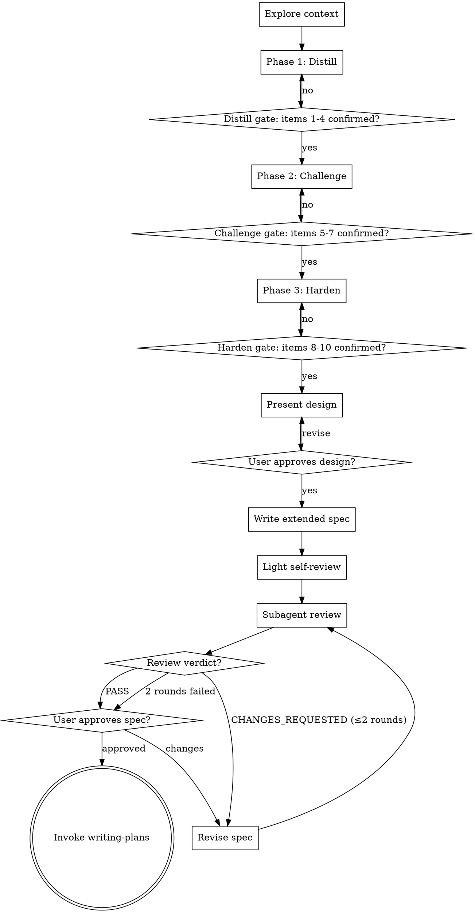

# Deep Brainstorm

Forge a vague idea into a specified design through three phases — Distill, Challenge, Harden. Produce an extended spec with Decision Log and Unresolved Items, validate via fresh-eyes subagent, hand off to `writing-plans`.

Unlike `brainstorming`: stronger pushback, Claude-surfaced concerns, external review instead of self-review. Use for vague or high-stakes requirements, or when decision reasoning must survive into the spec.

**Announce at start:** "I'm using deep-brainstorm to run Distill/Challenge/Harden phases and produce an extended spec."

<HARD-GATE>
No implementation skill, code, or scaffolding until user approves the spec. No phase advancement until owned items are `confirmed`/`N/A`. No spec file until all ten base items resolved AND design approved.
</HARD-GATE>

## Checklist

Create a task for each item and complete in order:

1. **Explore context** — related files, docs, recent commits.
2. **Phase 1 Distill** — restate, surface ambiguity, resolve Purpose / Success criteria / Scope / Users.
3. **Phase 2 Challenge** — counter-proposals, stress-test, resolve Alternatives / Assumptions / Constraints.
4. **Phase 3 Harden** — Risks / Security / NFR + Surfaced Concerns.
5. **Present design** — section-by-section user approval.
6. **Write extended spec** — `docs/team-dd/specs/YYYY-MM-DD-<topic>-design.md`, commit.
7. **Light self-review** — placeholders + obvious contradictions (~30s).
8. **Subagent review** — dispatch with `prompts/reviewer.md`; revise on `CHANGES_REQUESTED`, max 2 rounds.
9. **User approves spec**.
10. **Invoke `writing-plans`**.

## Process Flow

<!-- SECTIONS BELOW ARE ADDED IN LATER TASKS -->