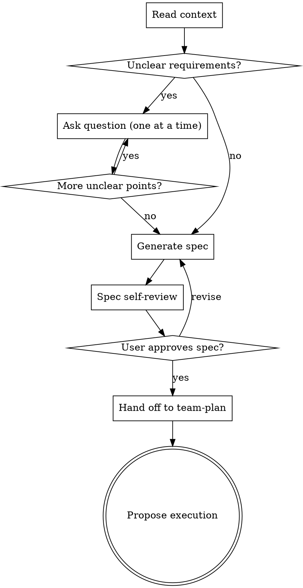

# Quick Brainstorm

Generate a full-quality spec with minimal dialogue, then hand off to `team-plan` for implementation-plan generation. Unlike brainstorming (deep-dive questions, approach comparison, section-by-section approval), quick-brainstorm infers what it can from context and only asks about genuinely ambiguous points.

**Announce at start:** "I'm using quick-brainstorm to generate a spec and hand off to team-plan."

<HARD-GATE>
Do NOT write any implementation code or invoke any execution skill until the user has approved both the spec (owned by this skill) and the plan (owned by team-plan).
</HARD-GATE>

## Language Policy

Translate user-facing prose (announce, gates, status, errors) into the user's conversation language; explicit user request overrides. The English in this file is a template.

Keep literal: commands, paths, `<placeholders>`, identifiers (`PASS`/`APPROVE`/`DONE`/`DONE_WITH_CONCERNS`/`BLOCKED`/`NEEDS_CONTEXT`/`CHANGES_REQUESTED`/`REQUEST_CHANGES`/`MET`/`NOT_MET`, severity/disposition labels), status markers (📌🔍❓⚠), section-anchor headings, report-table column headers.

Detection: match recent natural-language input; pure code/commands → keep prior language; cold start → English.

## Checklist

1. **Read context** — check relevant files, docs, recent commits related to the request
2. **Clarify unknowns** — ask only genuinely ambiguous points, one at a time (0 questions is valid)
3. **Generate spec** — save to `docs/team-dd/specs/YYYY-MM-DD-<topic>-design.md`, commit
4. **Spec self-review** — placeholder/consistency/scope/ambiguity/Sprint-Contract check, fix inline
5. **User confirms spec** — wait for approval, revise if requested
6. **Hand off to `team-plan`** — invoke `/team-driven-development:team-plan <spec-path>`; team-plan owns plan generation, self-review, and the user plan gate
7. **Propose execution** — after team-plan returns and the plan is approved, offer team-driven-development handoff

## Process Flow



## Clarification Logic

Do NOT deep-dive every aspect of the request. Instead:

- Read the user's request and explore the codebase for relevant context (files, patterns, conventions, recent changes).
- Infer what can be inferred — obvious technology choices, existing patterns to follow, standard approaches.
- Ask ONLY about genuinely ambiguous points — one question at a time, multiple-choice preferred.
- Zero questions is valid. If the requirements are clear from the request + codebase context, proceed directly to spec generation.

**What counts as "genuinely ambiguous":**
- The request can be interpreted in two meaningfully different ways
- A design choice would significantly affect implementation and there's no clear default
- The codebase has no existing pattern to follow for this type of change

**Fallback when the user defers a decision:**

When the user responds with "either is fine", "I'll leave it to you", "up to you", or similar deferral:

1. **Select the best possible method** — choose the approach that most comprehensively satisfies all potential requests and requirements, even if it results in broader scope than the minimal interpretation.
2. **Do not default to the conservative/minimal option.** The user has delegated judgment to you — use that trust to produce the strongest design. A comprehensive plan that covers edge cases and related concerns is preferable to a narrow one that leaves gaps.
3. **Note the deferred decision in the spec** — record what the user deferred, which option you chose, and why. Format: `**Deferred decision:** [question] → Chose [option] because [reasoning]`
4. This applies per-question. If the user defers one question but answers another specifically, respect their specific answer and apply this rule only to the deferred one.

## Spec Generation

Save to: `docs/team-dd/specs/YYYY-MM-DD-<topic>-design.md`

The spec covers the same ground as a brainstorming-produced spec — full quality, not abbreviated. Scale each section to the complexity it deserves.

### Spec Structure

```markdown
# [Feature Name] Design

## Overview
[What this feature does and why — 2-3 sentences]

## Motivation
[Why this change is needed — bullet points]

## Design

### [Section per major component or decision]
[Architecture, components, data flow, interfaces — scaled to complexity]

### Error Handling
[How errors are handled — omit if trivial]

### Testing Strategy
[What to test and how — types of tests, key scenarios]

## File Changes
[New files, modified files, not modified — table format]
```

### Spec Self-Review

After writing the spec, review with fresh eyes:

1. **Placeholder scan** — No TBD, TODO, incomplete sections, or vague requirements. Fix them.
2. **Internal consistency** — No contradictions between sections. Architecture matches feature descriptions.
3. **Scope check** — Focused enough for a single implementation plan. If not, flag for decomposition.
4. **Ambiguity check** — No requirement interpretable two ways. Pick one and make it explicit.

Fix issues inline immediately. Then commit and ask the user to confirm.

### User Spec Gate

> "Spec written and committed to `<path>`. Please review — any changes before I hand off to team-plan?"

Wait for user response. Revise if requested. Only proceed to the team-plan handoff after approval.

## Handoff to team-plan

After the user approves the spec, invoke `team-plan` with the spec path:

```
/team-driven-development:team-plan <spec-path>
```

`team-plan` owns plan generation, plan self-review, and the user plan gate. When `team-plan` returns and the plan has been approved, proceed to Execution Handoff.

## Execution Handoff

After plan confirmation:

> **Plan complete and saved to `<path>`. Execute with team-driven-development?**
> - **Yes** — Invoke team-driven-development to execute the plan
> - **No** — End here (plan is saved for later)

If Yes: invoke the team-driven-development skill. Do NOT invoke any superpowers skill.

## Key Principles

- **Infer, don't interrogate** — Use codebase context to fill in gaps. Only ask what you truly cannot infer.
- **Full-quality output** — The process is light; the spec is not. Spec meets the same standard as brainstorming.
- **One question at a time** — When you do need to ask, keep it focused. Multiple-choice preferred.
- **YAGNI unless deferred** — Don't design features the user didn't ask for. But when the user defers a decision to you, choose the most comprehensive approach that fully satisfies all potential requirements.
- **Self-contained on spec, delegated on plan** — Spec generation is in-skill; plan generation is delegated to team-plan. No dependency on superpowers skills.
