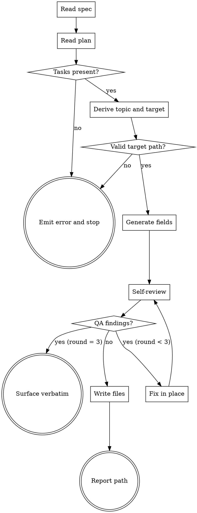

# Sprint Master

Generate Sprint Contract files under `sprints/<topic>/` from a spec and a plan. Replaces the per-task in-memory contract generation in `team-driven-development` Phase A-5.

**Announce at start:** "I'm using sprint-master to generate Sprint Contract files."

<HARD-GATE>
Do NOT write any file outside `sprints/<topic>/`. If the spec or plan is missing, or if the plan contains zero tasks, stop and emit the error message in Error Handling — do not create a partial sprints directory.
</HARD-GATE>

## Checklist

1. **Read spec** — open `<spec-path>`. Fail fast if missing.
2. **Read plan** — open `<plan-path>`. Fail fast if missing.
3. **Parse tasks** — extract all `### Task N:` sections from the plan. Fail fast if zero found.
4. **Derive topic** — `<topic>` = plan filename with trailing `.md` removed. Target directory = `sprints/<topic>/`. Reject path traversal.
5. **Generate fields** — for each task, derive Reviewer Profile (A-4 ruleset), Effort Score (A-3 ruleset), Success Criteria, Non-Goals, and Validation commands. Derive Shared Criteria and Domain Guidelines for common.md.
6. **Self-review** — run Contract QA self-review. Fix findings in place, max 2 rounds. Surface verbatim on third failure.
7. **Write files** — write `common.md` and all `task-N.md` in parallel.
8. **Report** — return the target directory path.

## Process Flow



## Invocation

```
/team-driven-development:sprint-master <spec-path> <plan-path>
```

- Two positional arguments, both required: absolute or repo-relative paths.
- Supported equally: direct human invocation, handoff from `team-plan`, F4-gated dispatch from `team-driven-development`.

## Input

- `<spec-path>`: absolute or repo-relative path to a spec markdown file. Must exist and be readable.
- `<plan-path>`: absolute or repo-relative path to a plan markdown file. Must exist and be readable. Must contain at least one `### Task N:` heading.

## Output Layout

- `sprints/<topic>/common.md` — feature-level shared fields.
- `sprints/<topic>/task-N.md` — one file per plan task, numbered to match the plan.
- `<topic>` is derived from the plan filename by stripping the trailing `.md`.
- Example: `docs/team-dd/plans/2026-04-18-sprint-master.md` → `sprints/2026-04-18-sprint-master/`.
- The `sprints/` directory is committed to git.

## common.md Schema

````markdown
# Sprint Contract: <feature>

## Spec
<relative path to spec, from repo root>

## Plan
<relative path to plan, from repo root>

## Shared Criteria
- <cross-task rule>

## Domain Guidelines
- <domain>: guidelines/<domain>.md
````

Fields:

- `Spec` and `Plan` are machine-derived from the input arguments.
- `Shared Criteria` captures rules that apply to every task in the feature. Derived from the spec's Design and Testing Strategy sections.
- `Domain Guidelines` lists the `guidelines/<domain>.md` files detected from the plan's file-path patterns using the team-driven-development Phase 0 detection table.

## task-N.md Schema

````markdown
# Sprint Contract: Task N - <name>

## Reviewer Profile: static | runtime | browser

## Effort Score: N → Model: haiku | sonnet | opus

## Success Criteria
- [ ] <specific, verifiable condition>
- [ ] Tests pass: `<exact test command>`

## Non-Goals
- <what this task does NOT do>

## Runtime Validation (if runtime/browser)
- `<exact test command>`

## Browser Validation (if browser)
- [ ] <UI flow to verify>
````

Fields are disjoint from `common.md` (D-strict). `task-N.md` never overrides `common.md`. `Non-Goals` requires at least one entry. `Runtime Validation` is omitted when Profile is `static`. `Browser Validation` is present only when Profile is `browser`.

## Generation Flow

1. Read the spec at `<spec-path>`.
2. Read the plan at `<plan-path>`.
3. Parse plan `### Task N:` sections. Extract name, file paths, and test commands.
4. Derive `<topic>` and target directory `sprints/<topic>/`. Validate path stays within repo root.
5. For each task: apply **Effort Scoring** and **Reviewer Profile Selection** below; derive Success Criteria, Non-Goals, and Validation.
6. Derive `common.md` content from the spec's Design + Testing Strategy sections and the detected Domain Guidelines.
7. Run Contract QA self-review (see below). Max two retry rounds.
8. Write `common.md` and all `task-N.md` in parallel.

### Effort Scoring

| Factor | +1 when |
|--------|---------|
| Files | 4+ modified |
| Directory | core/, shared/, security/, auth/ |
| Keywords | architecture, migration, security, design, refactor |
| Cross-cutting | Touches code other tasks also touch |
| New subsystem | Creating new module/package |

Score 0-1 → haiku. Score 2 → sonnet. Score 3+ → opus.

### Reviewer Profile Selection

| Characteristics | Profile |
|----------------|---------|
| 1-2 files, logic only, no UI | `static` |
| Tests, multi-file, integration | `runtime` |
| UI, CSS, visual | `browser` |

## Contract QA Self-Review

Mechanical pass before writing files:

1. **Criterion specificity** — each `Success Criteria` item is specific and verifiable. Reject "Code works"; require conditions like "GET /api/users returns 200 with JSON array".
2. **Test command completeness** — each test command includes a file path or filter, not a bare runner name.
3. **Non-Goal presence** — every `task-N.md` declares at least one `Non-Goal`.
4. **Profile alignment** — `Reviewer Profile` matches the task's file characteristics (e.g., tasks touching `.tsx` cannot be `static`).
5. **Secret scan** — detect patterns `AKIA[0-9A-Z]{16}`, `Bearer `, `password=`, `api[_-]?key=`. Redact matches with `<REDACTED>` and add a warning line at the top of `common.md`.
6. **Path traversal guard** — all write targets resolve to `sprints/<topic>/` within the repo root. Reject absolute paths, `..` segments, and any path escaping the target directory.

Fix findings in place. Max two retry rounds. On third failure, surface findings verbatim to the caller and do not write files.

## Error Handling

- **Spec file missing / unreadable:** stop. Emit `Spec file not found: <path>`. No partial writes.
- **Plan file missing / unreadable:** stop. Emit `Plan file not found: <path>`. No partial writes.
- **Plan has zero tasks:** stop. Emit `No tasks found in plan: <path>`. No partial writes.
- **Path traversal attempt in derived target:** stop. Emit `Invalid target path: <path>`. No writes.
- **Secrets detected:** redact with `<REDACTED>` in output files, add a warning at the top of `common.md`, continue. Do not modify the spec or plan.
- **Self-review fails after two retry rounds:** surface findings verbatim to the caller. Do not write files.
- **Partial write due to unexpected error:** `sprints/<topic>/` may contain some files but not all. Operation is idempotent — re-run overwrites deterministically.
