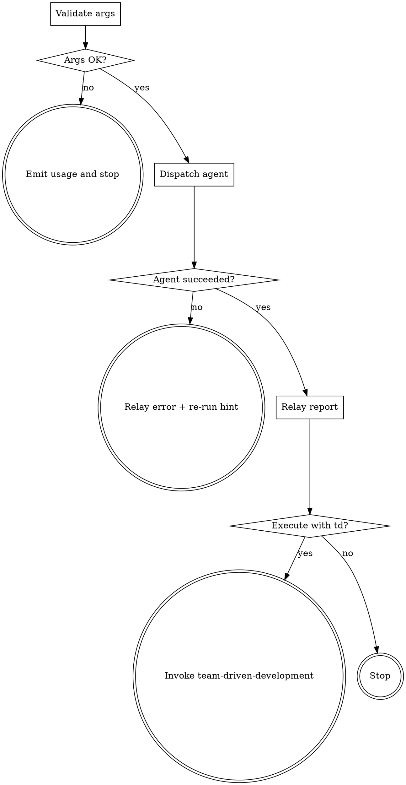

# Sprint Master

Human slash-command wrapper around the `sprint-master` subagent. Dispatches the agent to generate `docs/team-dd/sprints/<topic>/common.md` and `task-N.md`, then offers the natural next step (execute with `team-driven-development`). The agent is the sole owner of schema and generation logic; this skill owns only dispatch and handoff.

**Announce at start:** "I'm using sprint-master to generate Sprint Contract files."

## Language Policy

Render user-facing prose (announce, gates, status, errors) in the user's language; explicit user request overrides. Keep literal: commands, paths, `<placeholders>`, backtick-wrapped identifiers (e.g., `PASS`, `DONE`), severity/disposition labels, status markers (📌🔍❓⚠), Markdown structure (headings, table column headers). Default to match recent user input; English if no signal.

Files written to disk (specs, plans, contracts, source code) stay English regardless of conversation language. Apply Token Economy to their contents:

- Omit what the LLM can infer from context or adjacent sections.
- Prefer shortest unambiguous phrasing. Tables/lists beat prose for enumerations.
- No filler transitions ("Next,", "In summary,", "It's important to note that").
- No rationale unless it changes behavior in edge cases.
- Don't restate the same rule twice within one file.

When the user explicitly requests a translation of a generated document, write the English file first, then additionally write a sibling file with an ISO 639-1 language suffix (e.g., `<name>.ja.md` for Japanese, `<name>.fr.md` for French). The English original must always exist; translations are additive, never replacements. Applies to narrative documents (specs, plans, contracts, READMEs); source code stays English (comments included).

## Checklist

1. **Validate args** — require `<spec-path>` and `<plan-path>`. Missing either → emit `Usage: /team-driven-development:sprint-master <spec-path> <plan-path>` and stop.
2. **Dispatch agent** — call the `Agent` tool with `subagent_type: "team-driven-development:sprint-master"`, prompt containing both paths verbatim.
3. **Relay result** — print the agent's report line to the user.
4. **Propose execution** — on success, ask `Execute with team-driven-development? [yes/no]`. On `yes`, invoke `team-driven-development`. On `no`, stop.
5. **On failure** — surface the agent's error message. Do not propose execution. Suggest the re-run command `/team-driven-development:sprint-master <spec-path> <plan-path>`.

## Process Flow



## Invocation

```
/team-driven-development:sprint-master <spec-path> <plan-path>
```

Two positional arguments, both required. Supported callers: human direct invocation (this skill), `team-plan` (dispatches the agent directly), `team-driven-development` F4 gate (dispatches the agent directly).

## Input

- `<spec-path>`: absolute or repo-relative path to a spec markdown file.
- `<plan-path>`: absolute or repo-relative path to a plan markdown file.

Path validation, parsing, contract generation, QA, and error handling are owned by `agents/sprint-master.md`. See it for schemas and rules.
