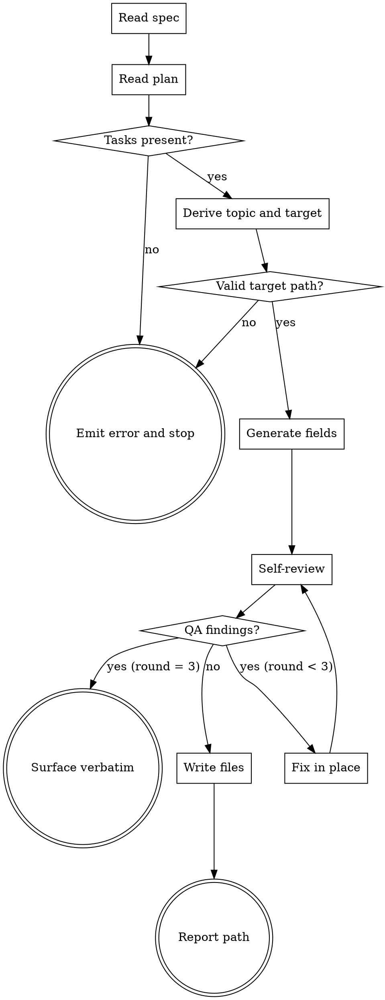

# Sprint Master

Generate Sprint Contract files under `sprints/<topic>/` from a spec and a plan. Replaces the per-task in-memory contract generation in `team-driven-development` Phase A-5.

**Announce at start:** "I'm using sprint-master to generate Sprint Contract files."

<HARD-GATE>
Do NOT write any file outside `sprints/<topic>/`. If the spec or plan is missing, or if the plan contains zero tasks, stop and emit the error message in Error Handling — do not create a partial sprints directory.
</HARD-GATE>

## Checklist

1. **Read spec** — open `<spec-path>`. Fail fast if missing.
2. **Read plan** — open `<plan-path>`. Fail fast if missing.
3. **Parse tasks** — extract all `### Task N:` sections from the plan. Fail fast if zero found.
4. **Derive topic** — `<topic>` = plan filename with trailing `.md` removed. Target directory = `sprints/<topic>/`. Reject path traversal.
5. **Generate fields** — for each task, derive Reviewer Profile (A-4 ruleset), Effort Score (A-3 ruleset), Success Criteria, Non-Goals, and Validation commands. Derive Shared Criteria and Domain Guidelines for common.md.
6. **Self-review** — run Contract QA self-review. Fix findings in place, max 2 rounds. Surface verbatim on third failure.
7. **Write files** — write `common.md` and all `task-N.md` in parallel.
8. **Report** — return the target directory path.

## Process Flow



## Invocation

```
/team-driven-development:sprint-master <spec-path> <plan-path>
```

- Two positional arguments, both required: absolute or repo-relative paths.
- Supported equally: direct human invocation, handoff from `team-plan`, F4-gated dispatch from `team-driven-development`.
