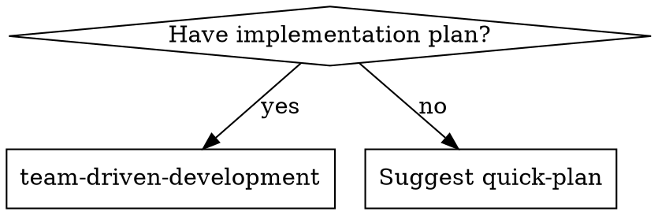

# Team-Driven Development

Execute implementation plans by orchestrating specialized subagents. The Lead (you) coordinates Workers, Reviewers, and optionally an Architect — each with isolated context and clear responsibilities.

**Why teams:** Role specialization prevents context pollution and enables parallel execution.

## When to Use



- You have an implementation plan to execute
- Simple plans automatically trigger Lite Mode suggestion

## Arguments

- No arguments → auto-triage (Quick Score determines mode)
- `--lite` → skip triage, use Lite Mode. Warn if Quick Score > 1.
- `--full` → skip triage, use Full Mode.

**No plan available:** Suggest `quick-plan` skill. If accepted, invoke with the user's original request as argument. Capture the user's verbatim message before searching for a plan file — this is the `original_request`. Include any additional context (file paths, errors, descriptions) the user provided.

## The Team

| Role | When | Responsibility | Model |
|------|------|----------------|-------|
| **Lead** (you) | Always | Orchestration, dependency analysis, integration, judgment | Session model |
| **Worker** | Every task | Implementation + TDD + self-review in worktree | Per effort score |
| **Reviewer** | Every task | Validate against Sprint Contract | sonnet |
| **Architect** | Design tasks | Design decisions, API shape, data model | opus |

**Summon Architect when:** Task requires choosing between approaches, defines interfaces others depend on, involves data model/API design, or has effort 3+ touching core/shared code. Architect produces a **design brief** (approach, interfaces, constraints).

### Review Ledger

Lead maintains per task. Managed in Lead's context (not filesystem). Feeds into Completion Report.

```markdown
## Review Ledger: Task N - [Name]
### Round 1
#### Worker Self-Review
| # | Severity | File:Line | Finding | Source |
|---|----------|-----------|---------|--------|
| W-1 | minor | src/foo.ts:42 | Unused import | self-review |
#### Reviewer Findings
| # | Severity | File:Line | Finding | Source |
|---|----------|-----------|---------|--------|
| R-1 | major | src/bar.ts:15 | Missing null check | reviewer |
#### Disposition
| # | Source | Severity | Disposition | Detail |
|---|--------|----------|-------------|--------|
| W-1 | self-review | minor | fixed | Same commit |
| R-1 | reviewer | major | fixed | Commit abc123 |
### Final Status: APPROVE (Round N)
```

**Dispositions:** `fixed`, `deferred` (reason required), `wont-fix` (reason required). Critical/major MUST be `fixed`.

## Phase 0: Guideline Check

**Trigger:** Runs only when plan creates new files OR modifies 3+ files in a detected domain. Otherwise skip to A-0. Controls *generation* only — existing `guidelines/{domain}.md` files are always incorporated into Sprint Contracts.

**Custom domains:** Any file in project's `guidelines/` is detected and incorporated. Lead uses judgment to match custom domains to tasks.

**Domain Detection:**

| Pattern | Domain |
|---|---|
| `components/`, `pages/`, `layouts/`, `styles/`, `*.css` | frontend |
| `routes/`, `api/`, `controllers/`, `services/`, `models/` | backend |
| `docs/`, `content/`, `*.md` | writing |
| `__tests__/`, `tests/`, `*.test.*`, `*.spec.*` | testing |

Fallback: Lead determines from task content.

**Steps:**
1. Collect file paths → match detection table
2. Check `guidelines/{domain}.md` exists. All exist → skip to A-0
3. **Draft:** Existing code → analyze patterns, generate from `templates/guidelines/{domain}.md`. New project → copy template as-is
4. **User approval:** Present drafts, wait. Changes requested → edit and re-present

Applies to both Lite and Full Mode.

## Phase A-0: Triage

**Announce:** "I'm using team-driven-development to execute this plan."

### Worktree Check

Run: `git rev-parse --git-dir`

If output contains `/worktrees/` → **Worktree Mode**:
- Refuse if `git diff-index --quiet HEAD --` fails → `"Commit or stash changes first."`
- Announce: `"Running in worktree context."`
- B-2: omit `isolation: "worktree"`.
- Skip B-6.

### Quick Score

| Factor | 0 | +1 | +2 |
|--------|---|----|----|
| Tasks | 1-2 | 3-4 | 5+ |
| Files | ≤3 | 4-6 | 7+ |
| Domains | single | multiple | — |
| Design keywords | — | present | — |

Design keywords: architecture, migration, security, API design.

### Mode Selection

- `--lite` → Lite. If Score > 1: "Plan has Quick Score [N] — typically Full Mode. Proceeding Lite as requested."
- `--full` → Full, skip proposal.
- Auto: Score ≤ 1 → propose Lite. Score > 1 → Full.

**Proposal:** "This plan has [N] tasks touching [M] files — lightweight enough for direct execution. Use Lite Mode? **Yes** — direct execution + single review. **No** — full team process."

## Lite Mode

Skip Phases A–C. Lead implements directly.

| Aspect | Full | Lite |
|--------|------|------|
| Implementer | Worker subagent | Lead |
| Isolation | Worktree per task | Current branch |
| Sprint Contract | Per task | None (plan steps) |
| Review | Per-task, profile-based | Single Reviewer, full diff |
| Architect | When needed | None |

**Flow:**
1. Execute tasks sequentially. TDD maintained. Follow existing `guidelines/{domain}.md`.
2. Commit after each task.
3. Dispatch Reviewer on full diff (base SHA → HEAD). Template: `./prompts/reviewer-prompt.md`. **Mandatory — never skip.**
4. APPROVE → brief summary. REQUEST_CHANGES → fix, recommit, re-dispatch (max 2 rounds → escalate).

**Completion Report:**
```markdown
## Completion Report (Lite Mode)
### Tasks Completed: N/N
### Commit Log
- abc1234: Task 1 - [description]
### Review
- Verdict: [APPROVE | REQUEST_CHANGES → fixed round N]
- Findings: Nc, NM, Nm, Nr
### Review Detail (if findings)
| # | Severity | Finding | Disposition | Detail |
|---|----------|---------|-------------|--------|
```

**Worktree Cleanup (Lite):** If stale worktrees from prior sessions exist, offer cleanup per C-4.

## Phase A: Pre-delegate

### A-1: Read and Extract
Read plan once. Extract ALL tasks with full text, file paths, test commands, criteria. Never make subagents read the plan.

### A-2: Dependency Analysis
- **File-based:** B creates file C imports → B before C
- **Type-based:** A defines type B uses → A before B
- **Logical:** A sets up infra B needs → A before B
- **Independent:** Different directories, no shared imports → parallel candidate

### A-3: Effort Scoring

| Factor | +1 when |
|--------|---------|
| Files | 4+ modified |
| Directory | core/, shared/, security/, auth/ |
| Keywords | architecture, migration, security, design, refactor |
| Cross-cutting | Touches code other tasks also touch |
| New subsystem | Creating new module/package |

Score 0-1 → haiku. Score 2 → sonnet. Score 3+ → opus.

### A-4: Reviewer Profile

| Characteristics | Profile | Action |
|----------------|---------|--------|
| 1-2 files, logic only, no UI | `static` | Lead reads diff |
| Tests, multi-file, integration | `runtime` | Reviewer agent |
| UI, CSS, visual | `browser` | Reviewer + browser |

### A-5: Sprint Contract Generation

Generate per task using `templates/sprint-contract-template.md` as structure. Lead fills task-specific sections only. **Incorporate all applicable Domain Guidelines into acceptance criteria** — Reviewers do not receive Guidelines separately.

### A-5.5: Contract QA

Validate each contract:
1. Success Criteria specific and verifiable (NG: "Code works" / OK: "GET /api/users returns 200 with JSON array")
2. Test commands include file paths/filters
3. At least one Non-Goal defined
4. Profile matches task characteristics
5. Dependencies stated as preconditions

Fail → fix once → still failing → escalate.

### A-6: Team Composition

Report before Phase B:
```
Team: Lead (orchestration), Workers: N, Reviewer: [profiles], Architect: [tasks if any]
```

## Phase B: Delegate

**Review is mandatory.** Every task — Full and Lite — dispatches a Reviewer before cherry-pick. No exceptions.

Execute in dependency order. Parallelize independent tasks (up to 2 Workers, each in own worktree, never sharing files). Cherry-pick in plan order.

### B-1: Architect Review (design tasks only)

Effort 3+ AND design decisions → dispatch Architect with task text, codebase context, related tasks, questions. Receives design brief → attach to Worker. Template: `./prompts/architect-prompt.md`

### B-2: Dispatch Worker

Send: full task text, Sprint Contract, Domain Guidelines content (from Contract's Guidelines section), design brief (if any), codebase context. Model per effort score. Worktree isolation.

**Codebase Context rules:**
- Full content: only files Worker must modify
- Reference files: path + one-line description (Worker reads on demand via Read tool)
- Budget: ≤ 2 KB pre-sent content (excluding modification targets)

Template: `./prompts/worker-prompt.md`

### B-3: Handle Worker Status

| Status | Action |
|--------|--------|
| DONE | Proceed to review |
| DONE_WITH_CONCERNS | Address correctness/scope concerns before review. Note observational concerns, proceed |
| NEEDS_CONTEXT | Provide info, re-dispatch |
| BLOCKED | Context problem → more context. Complexity → capable model. Too large → subtasks. Plan wrong → escalate |

Never force retry without changes.

**On DONE/DONE_WITH_CONCERNS:** Store `### Implementation Summary`, `### Files Changed`, `### Test Results` per task → C-2. Missing summary → synthesise from commits+diff. Missing test results → "not reported".

### B-4: Review

**static (Lead):** Read diff → evidence table per criterion (MET/NOT_MET + evidence) → verify non-goals → L-prefixed findings in Ledger → verdict.

**runtime/browser (Reviewer agent):** Dispatch with diff + Sprint Contract. Reviewer runs validation + checks integration (+ browser items for browser profile). Template: `./prompts/reviewer-prompt.md`

**Ledger integration (all profiles):** Transfer W-prefixed and R/L-prefixed findings → record dispositions → verify critical/major all `fixed`.

### Verdict Rules

| Severity | Impact |
|----------|--------|
| critical | REQUEST_CHANGES — security, data loss, production failure |
| major | REQUEST_CHANGES — spec mismatch, test failure, feature breakage |
| minor/recommendation | No impact (APPROVE) |

### B-5: Fix Loop (max 3 rounds)
REQUEST_CHANGES → issues to Worker → fix in same worktree → re-review → APPROVE or 3 rounds → escalate.

### B-6: Cherry-pick to Main

```bash
git cherry-pick --no-commit <hash>
git commit -m "<task description>"
```

**Conflicts:** Lead resolves. Non-trivial → re-dispatch Reviewer (outside 3-round limit). Cannot resolve → escalate. Record in Ledger.

**Progress:** "Task N/Total complete — [task name]"

## Phase C: Post-delegate

### C-1: Collect Results
Gather commit hashes, file changes, test results, implementation summaries, deferred details (from B-3).

### C-2: Completion Report
```markdown
## Completion Report
### Tasks Completed: N/N
| Task | Status | Files | Profile | Rounds | Findings | Tests |
|------|--------|-------|---------|--------|----------|-------|
### Implementation Summary
#### Task N: [name]
[What was built — 2–4 sentences] **Files:** f1, f2
### Test Results (skip if all clean)
| Task | Command | Passed | Failed | Skipped |
|------|---------|--------|--------|---------|
### Review Detail (per task with findings)
| # | Source | Severity | Finding | Disposition | Detail |
|---|--------|----------|---------|-------------|--------|
### Deferred Items (skip if none)
| # | Task | Severity | Finding | Disposition | Reason |
|---|------|----------|---------|-------------|--------|
### Summary
- Files changed / Commits / Architect consulted / Avg rounds / Findings / Deferred
### Commit Log
- hash: Task N - description
```

### C-3: Verify
All plan tasks complete. All tests pass on main. No uncommitted changes.

### C-4: Worktree Cleanup

Present to user:

```
Worktrees from this session:
- .claude/worktrees/agent-XXXX (branch: worktree-agent-XXXX)
Clean up all? [Yes / No / Select]
```

- **Yes** → `git worktree remove` + `git branch -D` for each, then `git worktree prune`.
- **Select** → user picks which to keep.
- **No** → skip. Warn worktrees persist until manual removal.

Skip only when no session worktrees exist.

