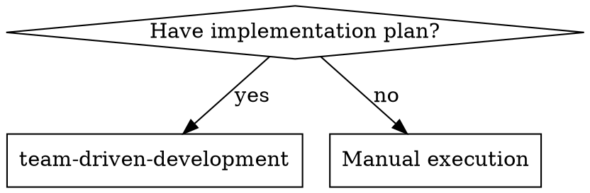
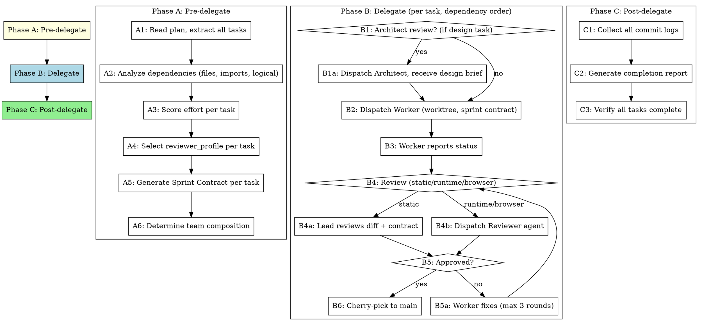

# Team-Driven Development

Execute implementation plans by orchestrating a team of specialized subagents. The Lead (you) coordinates Workers, Reviewers, and optionally an Architect — each with isolated context and clear responsibilities.

**Why teams:** Complex plans benefit from role specialization. A Worker focused purely on implementation produces better code than an agent juggling implementation, review, and architecture decisions simultaneously. Role isolation prevents context pollution and enables parallel execution of independent tasks.

**Core principle:** Dynamic team composition + Sprint Contracts + worktree isolation = high quality, fast iteration

## When to Use



**Use when:**
- You have an implementation plan to execute
- Simple plans automatically trigger a Lite Mode suggestion — no need to avoid this skill for small tasks

**Lite Mode is suggested when:**
- Plan has 1-2 tasks with ≤ 3 files total
- No design keywords or multi-domain spread

**Full Mode is used when:**
- Plan has 3+ tasks with varying complexity
- Tasks span multiple domains (frontend + backend, infra + app, etc.)
- Design decisions are needed before or during implementation
- You want parallel execution of independent tasks
- Quality gates need to vary by task type (static review vs browser testing)

## The Team

### Roles

| Role | When Summoned | Responsibility | Model |
|------|--------------|----------------|-------|
| **Lead** (you) | Always | Orchestration, dependency analysis, integration, final judgment | Current session model |
| **Worker** | Every task | Implementation + TDD + self-review in isolated worktree | Cheap for mechanical, standard for integration |
| **Reviewer** | Every task | Validates against Sprint Contract (static/runtime/browser) | Standard |
| **Architect** | Design tasks only | Upfront design decisions, API shape, data model review | Most capable |

### When to Summon the Architect

The Architect is NOT summoned for every task. Summon when:
- Task requires choosing between multiple valid approaches
- Task defines interfaces that other tasks will depend on
- Task involves data model changes or API design
- Effort score is high AND the task touches core/shared code

The Architect reviews the task spec and produces a **design brief** — a short document specifying the approach, key interfaces, and constraints. The Worker receives this brief alongside the task.

## The Process



## Phase A: Pre-delegate

**Announce:** "I'm using team-driven-development to execute this plan as a team."

### A-1: Read and Extract

Read the plan file once. Extract ALL tasks with their full text, file paths, test commands, and acceptance criteria. Never make subagents read the plan file.

### A-2: Dependency Analysis

Analyze dependencies dynamically from the plan content:

1. **File-based:** Task B creates a file that Task C imports → B before C
2. **Type-based:** Task A defines a type that Task B uses → A before B
3. **Logical:** Task A sets up infrastructure that Task B relies on → A before B
4. **Independent:** Tasks touch different directories with no shared imports → parallel candidate

Build an execution order:
```
Independent tasks: [Task 1, Task 3] → can parallelize
Sequential chain:  Task 2 → Task 4 → Task 5
Independent:       Task 6
```

### A-3: Effort Scoring

Score each task for complexity to determine model selection:

| Factor | Condition | Score |
|--------|-----------|-------|
| File count | 4+ files modified | +1 |
| Directory | core/, shared/, security/, auth/ | +1 |
| Keywords | architecture, migration, security, design, refactor | +1 |
| Cross-cutting | Task touches code other tasks also touch | +1 |
| New subsystem | Creating new module/package from scratch | +1 |

**Threshold:**
- Score 0-1 → cheap/fast model (mechanical task)
- Score 2 → standard model (integration task)
- Score 3+ → most capable model (architecture/design task)

### A-4: Reviewer Profile Selection

Automatically select review depth based on task characteristics:

| Task characteristics | Profile | What happens |
|---------------------|---------|-------------|
| 1-2 files, logic only, no UI | `static` | Lead reads diff + checks Sprint Contract |
| Tests included, multi-file, integration | `runtime` | Reviewer agent runs tests, checks integration |
| UI components, CSS, visual changes | `browser` | Reviewer agent + browser verification |

### A-5: Sprint Contract Generation

For each task, generate a Sprint Contract:

```markdown
## Sprint Contract: Task N - [Task Name]

### Success Criteria
- [ ] [Specific, verifiable condition from plan]
- [ ] [Tests pass: `exact test command`]

### Non-Goals
- [What this task explicitly does NOT do]
- [Boundaries with adjacent tasks]

### Reviewer Profile: static | runtime | browser

### Runtime Validation (if runtime/browser)
- `npm test -- --filter=relevant-tests`
- `npm run typecheck`

### Browser Validation (if browser)
- [ ] [Specific UI flow to verify]
- [ ] [Visual state to confirm]

### Effort Score: N
### Model: cheap | standard | capable
```

### A-6: Team Composition

Based on the analysis, determine the team:

```
Team for this plan:
- Lead: orchestration (this session)
- Workers: 1 (sequential) or 2 (if independent tasks exist)
- Reviewer: static for Tasks 1,3,6 / runtime for Tasks 2,4 / browser for Task 5
- Architect: summoned for Task 2 (defines shared API)
```

Report the team composition to the human before starting Phase B.

## Phase B: Delegate

Execute tasks in dependency order. For independent tasks, dispatch Workers in parallel.

### B-1: Architect Review (design tasks only)

If the task has effort score 3+ AND involves design decisions:

1. Dispatch Architect subagent with:
   - Full task text
   - Codebase context (relevant existing code)
   - Question: "What approach should the Worker take?"
2. Architect returns a **design brief** (approach, interfaces, constraints)
3. Attach design brief to Worker's prompt

Use prompt template: `./prompts/architect-prompt.md`

### B-2: Dispatch Worker

Dispatch Worker subagent with:
- Full task text (from plan, not file reference)
- Sprint Contract
- Design brief (if Architect was consulted)
- Codebase context (relevant files, patterns)
- Model selection based on effort score

**Isolation:** Worker operates in a git worktree. Changes stay isolated until APPROVE.

Use prompt template: `./prompts/worker-prompt.md`

### B-3: Handle Worker Status

Workers report one of four statuses:

**DONE:** Proceed to review.

**DONE_WITH_CONCERNS:** Read concerns before review. Address correctness/scope concerns before proceeding. Note observational concerns and proceed.

**NEEDS_CONTEXT:** Provide missing context and re-dispatch.

**BLOCKED:** Assess the blocker:
1. Context problem → provide more context, re-dispatch
2. Complexity problem → re-dispatch with more capable model
3. Task too large → break into subtasks
4. Plan is wrong → escalate to human

**Never** force retry without changes. If the Worker said it's stuck, something needs to change.

### B-4: Review

Execute review based on the Sprint Contract's reviewer_profile:

**static (Lead reviews directly):**
1. Read the Worker's diff
2. Check each Sprint Contract criterion
3. Verify non-goals were respected
4. Verdict: APPROVE or REQUEST_CHANGES with specific issues

**runtime (Reviewer agent):**
1. Dispatch Reviewer subagent with diff + Sprint Contract
2. Reviewer runs validation commands from Sprint Contract
3. Reviewer checks integration with existing code
4. Verdict: APPROVE or REQUEST_CHANGES

**browser (Reviewer agent + browser):**
1. Dispatch Reviewer subagent with diff + Sprint Contract
2. Reviewer runs tests AND browser validation items
3. Reviewer verifies UI flows from Sprint Contract
4. Verdict: APPROVE or REQUEST_CHANGES

Use prompt template: `./prompts/reviewer-prompt.md`

### Review Verdict Rules

| Severity | Impact | Definition |
|----------|--------|-----------|
| **critical** | REQUEST_CHANGES | Security vulnerabilities, data loss risk, production failure |
| **major** | REQUEST_CHANGES | Spec mismatch, test failure, existing feature breakage |
| **minor** | No impact (APPROVE) | Naming, comments, style |
| **recommendation** | No impact (APPROVE) | Best practice suggestions |

**Only critical and major findings block approval.** Minor and recommendations are noted but don't block.

### B-5: Fix Loop (max 3 rounds)

If REQUEST_CHANGES:
1. Send specific issues to Worker
2. Worker fixes in same worktree
3. Re-review (same profile)
4. Repeat until APPROVE or 3 rounds exhausted
5. After 3 rounds: escalate to human

### B-6: Cherry-pick to Main

On APPROVE:
```bash
git cherry-pick --no-commit <worktree-commit-hash>
git commit -m "<task description>"
```

Report progress:
```
Task N/Total complete — "[task name]"
```

### Parallel Execution

When dependency analysis identifies independent tasks:
- Dispatch up to 2 Workers simultaneously (each in own worktree)
- Review each independently when done
- Cherry-pick in plan order (not completion order) for clean history
- **Never** parallelize tasks that touch the same files

## Phase C: Post-delegate

### C-1: Collect Results

Gather all commit hashes, file changes, and test results.

### C-2: Completion Report

```markdown
## Completion Report

### Tasks Completed: N/N

| Task | Status | Files Changed | Reviewer Profile | Rounds |
|------|--------|--------------|-----------------|--------|
| 1    | Done   | 3            | static          | 1      |
| 2    | Done   | 7            | runtime         | 2      |
| ...  | ...    | ...          | ...             | ...    |

### Summary
- Total files changed: N
- Total commits: N
- Architect consulted: Tasks [2, 5]
- Review rounds: avg N per task

### Commit Log
- abc1234: Task 1 - [description]
- def5678: Task 2 - [description]
```

### C-3: Verify

- All tasks from plan are complete
- All tests pass on main branch
- No uncommitted changes remain

## Red Flags

**Never:**
- Start implementation on main branch without explicit user consent
- Skip review for any task (even "simple" ones)
- Let Lead write implementation code (Lead orchestrates, Workers implement)
- Dispatch Workers for tasks with unresolved dependencies
- Parallelize tasks that share files
- Ignore Worker escalations (BLOCKED/NEEDS_CONTEXT)
- Accept REQUEST_CHANGES and move on without fixes
- Skip the Sprint Contract (even for small tasks)
- Let the Architect implement (Architect advises, Workers implement)
- Cherry-pick before review is complete

**If Worker asks questions:** Answer completely before letting them proceed.

**If review finds issues:** Worker fixes, review repeats. No shortcuts.

**If Architect and Worker disagree:** Lead mediates based on plan requirements.

## Model Selection Summary

| Role | Default | Override |
|------|---------|---------|
| Lead | Current session | — |
| Worker (effort 0-1) | haiku / cheap | — |
| Worker (effort 2) | sonnet / standard | — |
| Worker (effort 3+) | opus / capable | — |
| Reviewer | sonnet / standard | — |
| Architect | opus / capable | — |

## Integration

**Works with:**
- **superpowers:writing-plans** — Creates the plans this skill executes
- **superpowers:using-git-worktrees** — Workers use worktree isolation
- **superpowers:test-driven-development** — Workers follow TDD
- **superpowers:finishing-a-development-branch** — After all tasks complete

**Alternative:**
- **superpowers:subagent-driven-development** — Simpler single-role execution without team composition
