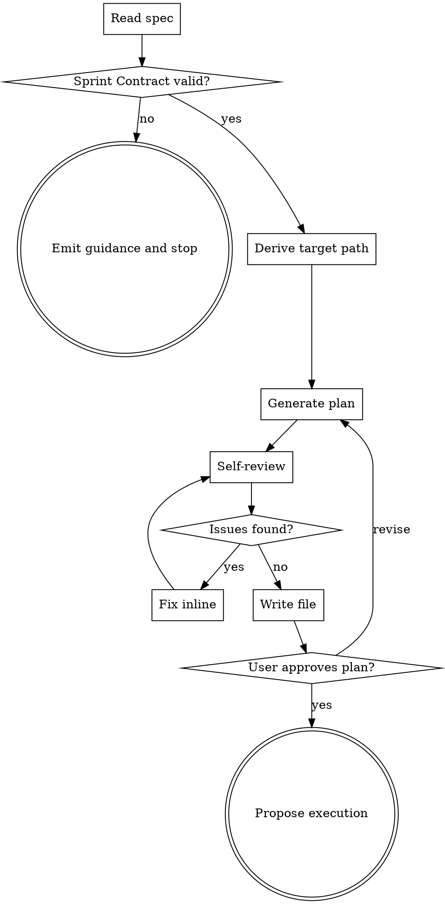

# Team Plan

Write a team-driven-development implementation plan from a spec. Replaces `superpowers:writing-plans` inside this plugin. Plans are hybrid-density (execution artifacts inline, rationale referenced) with a common Sprint Contract plus per-task deltas.

**Announce at start:** "I'm using team-plan to generate an implementation plan from the spec."

<HARD-GATE>
Do NOT write any implementation code or invoke any execution skill until the user has approved the plan. If the spec lacks a `## Sprint Contract` section, stop and emit the guidance message in Error Handling — do not create a partial plan.
</HARD-GATE>

## Checklist

1. **Read spec** — open the file at the provided path. Fail if missing.
2. **Validate Sprint Contract** — require `## Sprint Contract` with a `Profile` of `static`, `runtime`, or `browser`. Fail fast if absent or invalid.
3. **Derive target path** — topic = spec filename with the leading `YYYY-MM-DD-` prefix and trailing `-design` suffix removed. Target = `docs/team-dd/plans/YYYY-MM-DD-<topic>.md`.
4. **Generate plan** — write header, common Sprint Contract, File Structure, tasks.
5. **Self-review** — run mechanical checks; fix findings inline.
6. **Write file** — save to target path, report path to caller.
7. **User confirms plan** — wait for approval. Revise on request.
8. **Propose execution** — offer `team-driven-development` handoff.

## Process Flow



## Invocation

```
/team-driven-development:team-plan <spec-path>
```

- Single argument: absolute or repo-relative spec path.
- Supported equally: direct human invocation and handoff from `deep-brainstorm` or `quick-plan`.

## Input

- Spec markdown at the provided path.
- MUST contain `## Sprint Contract` (case-insensitive, level-2 heading).
- Inside that section, MUST contain a `Profile` field whose value is `static`, `runtime`, or `browser`.

## Output

- Single plan file at `docs/team-dd/plans/YYYY-MM-DD-<topic>.md`.
- `<topic>` = spec filename with the leading `YYYY-MM-DD-` and trailing `-design` removed.
- English only. Translation files (`docs/team-dd/plans/YYYY-MM-DD-<topic>.<lang>.md`) are created only when the user requests a translation during confirmation.

## Plan File Structure

````markdown
# <Feature> Implementation Plan

> **For agentic workers:** Use team-driven-development to execute this plan.

**Goal:** <1 sentence>
**Architecture:** <2-3 sentences>
**Tech Stack:** <key technologies>
**Spec:** <relative path to spec> (authoritative; consult for rationale/decisions)

---

## Sprint Contract (Common)

- Profile: static | runtime | browser
- Shared Criteria:
  - <criterion 1>
  - <criterion 2>

> Task-level `Sprint Contract:` sections OVERRIDE these defaults per key.

---

## File Structure

| File | Status | Responsibility |
| --- | --- | --- |
| <path> | Create / Modify | <one-line responsibility> |

---

### Task N: <name>

**Files:**
- Create: <path>
- Modify: <path>
- Test: <path>

**Spec ref:** <spec-path>#<section-heading>

**Sprint Contract:** <task-level delta, one line per overridden key; omit the section entirely when no delta>

- [ ] Step 1: Write the failing test
  ```<lang>
  <actual test code>
  ```
- [ ] Step 2: Run test to verify it fails
  Run: `<exact command>`
  Expected: FAIL with "<specific message>"
- [ ] Step 3: Write minimal implementation
  ```<lang>
  <actual code>
  ```
- [ ] Step 4: Run test to verify it passes
  Run: `<exact command>`
  Expected: PASS
- [ ] Step 5: Commit
  ```bash
  git add <files>
  git commit -m "<message>"
  ```
````

## Inline Content Rules

- Tests, implementation code, and shell commands are ALWAYS inlined. Workers execute from the plan alone.
- Rationale, Decision Log context, and trade-offs are NEVER inlined. Reference spec sections instead.
- `Spec ref` MUST be a heading anchor (e.g., `<spec-path>#error-handling`). Line-range refs are rejected in self-review.

## Sprint Contract Override Rules

- The common block lives once, immediately after the plan header.
- Per-task overrides list deltas only; do not restate the common block.
- Tasks with no delta omit the `Sprint Contract:` section entirely (absence means "use common as-is").

## Self-Review

Mechanical pass after plan generation, before writing the file:

1. **Placeholder scan** — reject `TBD`, `TODO`, `fill in later`, `implement later`, `handle edge cases appropriately`, or any Step that lacks concrete code/command content. Fix inline.
2. **Spec coverage** — every spec requirement maps to at least one task. Add missing tasks.
3. **Type/identifier consistency** — names, paths, and signatures match across tasks.
4. **Spec ref shape** — every `Spec ref` is a heading anchor. Convert line-range refs or remove them.
5. **Override consistency** — task-level Sprint Contract deltas do not restate the common block verbatim.
6. **Secret-like patterns** — redact matches of `AKIA[0-9A-Z]{16}`, `Bearer `, `password=`, `api[_-]?key=` with `<REDACTED>`. Emit a warning line at the top of the plan.

Fix findings inline. Do not dispatch a subagent.

## Error Handling

- **Spec file missing / unreadable:** stop. Emit `Spec file not found: <path>`. Do not create a partial plan.
- **`## Sprint Contract` section missing:** stop before any write. Emit `Sprint Contract section not found in <path>. Either (1) regenerate the spec via deep-brainstorm, (2) add a "## Sprint Contract" section manually, or (3) wait for the sprint-master follow-up skill.`
- **`Profile` value not `static`/`runtime`/`browser`:** stop. Emit `Invalid Profile: <value>. Allowed: static, runtime, browser.`
- **Unfixable contradiction** (task references an identifier no task defines): stop. Report the contradiction; do not write a partial plan.
- **Secrets detected:** redact in the plan and emit a warning line in the plan header. Do not abort. Do not modify the spec.
