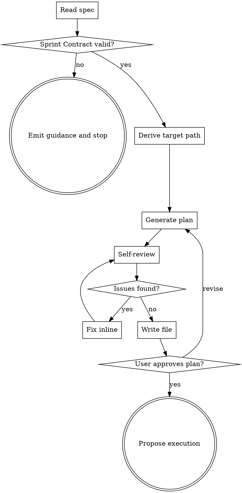

# Team Plan

Write a team-driven-development implementation plan from a spec. Replaces `superpowers:writing-plans` inside this plugin. Plans are hybrid-density (execution artifacts inline, rationale referenced) with a common Sprint Contract plus per-task deltas.

**Announce at start:** "I'm using team-plan to generate an implementation plan from the spec."

<HARD-GATE>
Do NOT write any implementation code or invoke any execution skill until the user has approved the plan. If the spec lacks a `## Sprint Contract` section, stop and emit the guidance message in Error Handling — do not create a partial plan.
</HARD-GATE>

## Checklist

1. **Read spec** — open the file at the provided path. Fail if missing.
2. **Validate Sprint Contract** — require `## Sprint Contract` with a `Profile` of `static`, `runtime`, or `browser`. Fail fast if absent or invalid.
3. **Derive target path** — topic = spec filename with the leading `YYYY-MM-DD-` prefix and trailing `-design` suffix removed. Target = `docs/team-dd/plans/YYYY-MM-DD-<topic>.md`.
4. **Generate plan** — write header, common Sprint Contract, File Structure, tasks.
5. **Self-review** — run mechanical checks; fix findings inline.
6. **Write file** — save to target path, report path to caller.
7. **User confirms plan** — wait for approval. Revise on request.
8. **Propose execution** — offer `team-driven-development` handoff.

## Process Flow

