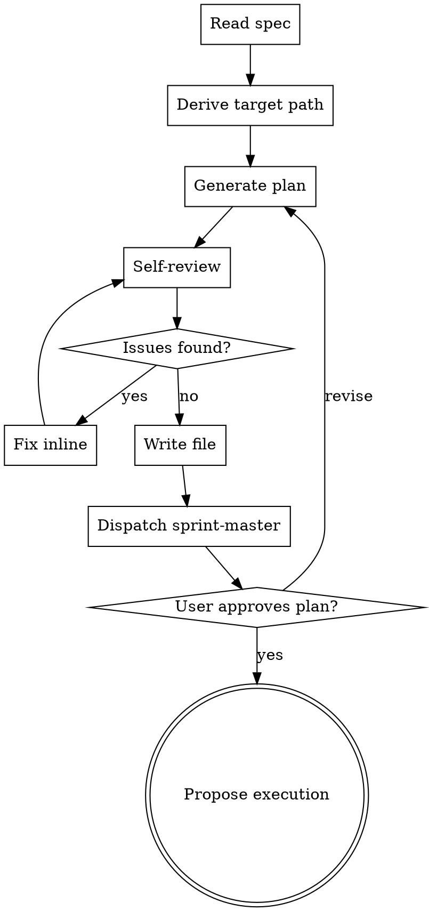

# Team Plan

Write a team-driven-development implementation plan from a spec. Replaces `superpowers:writing-plans` inside this plugin. Plans are hybrid-density (execution artifacts inline, rationale referenced); Sprint Contract files live separately under `sprints/<topic>/`, generated by `sprint-master` after the plan is written.

**Announce at start:** "I'm using team-plan to generate an implementation plan from the spec."

<HARD-GATE>
Do NOT write any implementation code or invoke any execution skill until the user has approved the plan. If the spec or plan cannot be parsed, stop and emit the matching error in Error Handling.
</HARD-GATE>

## Language Policy

Render user-facing prose (announce, gates, status, errors) in the user's language; explicit user request overrides. Keep literal: commands, paths, `<placeholders>`, backtick-wrapped identifiers (e.g., `PASS`, `DONE`), severity/disposition labels, status markers (📌🔍❓⚠), Markdown structure (headings, table column headers). Default to match recent user input; English if no signal.

Files written to disk (specs, plans, contracts, source code) stay English regardless of conversation language. Apply Token Economy to their contents:

- Omit what the LLM can infer from context or adjacent sections.
- Prefer shortest unambiguous phrasing. Tables/lists beat prose for enumerations.
- No filler transitions ("Next,", "In summary,", "It's important to note that").
- No rationale unless it changes behavior in edge cases.
- Don't restate the same rule twice within one file.

When the user explicitly requests a translation of a generated document, write the English file first, then additionally write a sibling file with an ISO 639-1 language suffix (e.g., `<name>.ja.md` for Japanese, `<name>.fr.md` for French). The English original must always exist; translations are additive, never replacements. Applies to narrative documents (specs, plans, contracts, READMEs); source code stays English (comments included).

## Checklist

1. **Read spec** — open the file at the provided path. Fail if missing.
2. **Derive target path** — topic = spec filename with the leading `YYYY-MM-DD-` prefix and trailing `-design` suffix removed. Target = `docs/team-dd/plans/YYYY-MM-DD-<topic>.md`.
3. **Generate plan** — write header, File Structure, tasks.
4. **Self-review** — run mechanical checks; fix findings inline.
5. **Write file** — save to target path, report path to caller.
6. **Dispatch sprint-master** — call the `Agent` tool with `subagent_type: "team-driven-development:sprint-master"`, passing `<spec-path>` and `<plan-path>` in the prompt. The agent returns to team-plan on completion. On failure, surface the error plus the re-run command `/team-driven-development:sprint-master <spec-path> <plan-path>`.
7. **User confirms plan** — wait for approval. Revise on request.
8. **Propose execution** — offer `team-driven-development` handoff.

## Process Flow



## Invocation

```
/team-driven-development:team-plan <spec-path>
```

- Single argument: absolute or repo-relative spec path.
- Supported equally: direct human invocation and handoff from `deep-brainstorm` or `quick-brainstorm`.

## Input

- Spec markdown at the provided path.
- Spec and plan paths are the sole validation surface; Sprint Contract content is owned by `sprint-master` and lives under `sprints/<topic>/`.

## Output

- Single plan file at `docs/team-dd/plans/YYYY-MM-DD-<topic>.md`.
- `<topic>` = spec filename with the leading `YYYY-MM-DD-` and trailing `-design` removed.
- English only. Translation files (`docs/team-dd/plans/YYYY-MM-DD-<topic>.<lang>.md`) are created only when the user requests a translation during confirmation.

## Plan File Structure

````markdown
# <Feature> Implementation Plan

> **For agentic workers:** Use team-driven-development to execute this plan.

**Goal:** <1 sentence>
**Architecture:** <2-3 sentences>
**Tech Stack:** <key technologies>
**Spec:** <relative path to spec> (authoritative; consult for rationale/decisions)
**Sprints:** sprints/<topic>/ (Sprint Contract files, generated by sprint-master)

---

## File Structure

| File | Status | Responsibility |
| --- | --- | --- |
| <path> | Create / Modify | <one-line responsibility> |

---

### Task N: <name>

**Files:**
- Create: <path>
- Modify: <path>
- Test: <path>

**Spec ref:** <spec-path>#<section-heading>

- [ ] Step 1: Write the failing test
  ```<lang>
  <actual test code>
  ```
- [ ] Step 2: Run test to verify it fails
  Run: `<exact command>`
  Expected: FAIL with "<specific message>"
- [ ] Step 3: Write minimal implementation
  ```<lang>
  <actual code>
  ```
- [ ] Step 4: Run test to verify it passes
  Run: `<exact command>`
  Expected: PASS
- [ ] Step 5: Commit
  ```bash
  git add <files>
  git commit -m "<message>"
  ```
````

## Inline Content Rules

- Tests, implementation code, and shell commands are ALWAYS inlined. Workers execute from the plan alone.
- Rationale, Decision Log context, and trade-offs are NEVER inlined. Reference spec sections instead.
- `Spec ref` MUST be a heading anchor (e.g., `<spec-path>#error-handling`). Line-range refs are rejected in self-review.

## Self-Review

Mechanical pass after plan generation, before writing the file:

1. **Placeholder scan** — reject `TBD`, `TODO`, `fill in later`, `implement later`, `handle edge cases appropriately`, or any Step that lacks concrete code/command content. Fix inline.
2. **Spec coverage** — every spec requirement maps to at least one task. Add missing tasks.
3. **Type/identifier consistency** — names, paths, and signatures match across tasks.
4. **Spec ref shape** — every `Spec ref` is a heading anchor. Convert line-range refs or remove them.
5. **Secret-like patterns** — redact matches of `AKIA[0-9A-Z]{16}`, `Bearer `, `password=`, `api[_-]?key=` with `<REDACTED>`. Emit a warning line at the top of the plan.

Fix findings inline. Do not dispatch a subagent.

## Error Handling

- **Spec file missing / unreadable:** stop. Emit `Spec file not found: <path>`. Do not create a partial plan.
- **Unfixable contradiction** (task references an identifier no task defines): stop. Report the contradiction; do not write a partial plan.
- **Secrets detected:** redact in the plan and emit a warning line in the plan header. Do not abort. Do not modify the spec.
- **sprint-master failure:** surface the error and the re-run command `/team-driven-development:sprint-master <spec-path> <plan-path>`. The plan file stays in place; the user can retry sprint-master manually.

## User Plan Gate

Ask `Plan saved to <path>. Any changes before we proceed?`. Revise on request.

## Execution Handoff

After approval, ask `Execute with team-driven-development? [yes/no]`. On yes, invoke `team-driven-development`. Do NOT invoke any superpowers skill.
